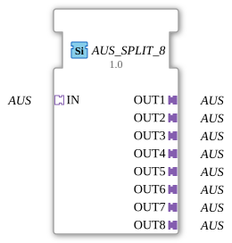

# OFF_SPLIT_8

* * * * * * * * * *
## Introduction
The **OFF_SPLIT_8** is a generic function block for distributing an incoming OFF signal to up to eight separate outputs. It serves as a simple "splitter" for signals of the type **adapter::types::unidirectional::OFF** and enables the parallel control of multiple devices or subsequent function blocks.
## Interface Structure

### **Event Inputs**
No event inputs available.

### **Event Outputs**
No event outputs available.

### **Data Inputs**
No data inputs available.

### **Data Outputs**
No data outputs available.

### **Adapter**

| Interface | Type | Direction | Description |

|---|---|---|---|
| **IN** | `adapter::types::unidirectional::AUS` | Socket | Input – receives the OFF signal to be distributed |

| **OUT1** | `adapter::types::unidirectional::AUS` | Plug | Output 1 – forwards the incoming signal |

| **OUT2** | `adapter::types::unidirectional::AUS` | Plug | Output 2 – forwards the incoming signal |

| **OUT3** | `adapter::types::unidirectional::AUS` | Plug | Output 3 – forwards the incoming signal |

| **OUT4** | `adapter::types::unidirectional::AUS` | Plug | Output 4 – forwards the incoming signal |

| **OUT5** | `adapter::types::unidirectional::AUS` | Plug | Output 5 – forwards the incoming signal |

| **OUT6** | `adapter::types::unidirectional::AUS` | Plug | Output 6 – forwards the incoming signal |

| **OUT7** | `adapter::types::unidirectional::AUS` | Plug | Output 7 – forwards the incoming signal |

| **OUT8** | `adapter::types::unidirectional::AUS` | Plug | Output 8 – forwards the incoming signal |

## Functionality

This function block forwards the OFF signal present at socket **IN** unchanged to all eight plugs **OUT1** to **OUT8**. No delay, filtering, or logical processing takes place. The signal is available on all outputs simultaneously. The function corresponds to a 1:8 distribution.

## Technical Features
- **Generic Function Block**: The function block is executed as a generic type (`GEN_AUS_SPLIT`). The specific type is determined at runtime via the attribute `eclipse4diac::core::GenericClassName`.
- **No State Machine**: Since the function block only performs direct signal forwarding without logic, it does not have its own execution control (ECC). Signal transmission occurs solely via the adapter interfaces.
- **Adapter Type**: All interfaces use the unidirectional `AUS` adapter type, which enables standardized signal transmission.

## State Overview

The function block does not have a state machine. There are no internal states or transitions.

## Application Scenarios
- **Distributing a Central Control Signal**: A single "off" signal (e.g., a switch-off command) is passed on to multiple actuators or sub-functions.
- **Parallel Control of Loads**: In agricultural or industrial control systems, when a signal needs to control multiple valves, motors, or lights simultaneously.
- **Splitting Bus Signals**: When an adapter-based signal path needs to be branched into multiple parallel paths.

## Comparison with Similar Function Blocks
- **AUS_SPLIT_4**: Distributes a signal to four outputs. The AUS_SPLIT_8 offers higher fan-out capacity with eight outputs.
- **AUS_MERGE / AUS_JOIN**: Combine multiple signals – functionally the opposite.
- **AUS_ROUTER**: Can selectively route a signal to one of several outputs, while the splitter always activates all outputs.

## Conclusion

The **AUS_SPLIT_8** is a simple yet useful function block for multiplying an OFF signal. Its lack of logic and states makes it efficient and easy to understand. It is particularly suitable for applications where a control signal needs to be distributed to multiple receivers without requiring selection or processing.

**AUS_MERGE / AUS_JOIN** ---

### 🌐 Related topic subpages on ms-muc-docs.de
* [🌐 Eclipse 4diac IDE & Color Reference on ms-muc-docs.de](https://www.ms-muc-docs.de/iec-61499/eclipse-4diac/)
* [🌐 Total resistance in series & parallel circuits on ms-muc-docs.de](https://www.ms-muc-docs.de/elektrotechnik/elektrik/widerstand/widerstand-theorie/gesamtwiderstand-reihen-parallelschaltung/)

]
