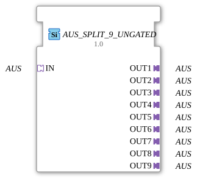

# OFF_SPLIT_9

> ℹ️ **UNGATED variant:** This block is the ungated version of [`AUS_SPLIT_9`](AUS_SPLIT_9.md). It suppresses **no** unchanged repeats – every newly computed result is forwarded unconditionally, even without a value change. This matters for consumers that need a periodic cadence regardless of value change (e.g. derivative/frequency calculations that would otherwise fail to decay toward zero). Any change-detection/gating statements further down this page do **not** apply to this block.

* * * * * * * * * *

## Introduction

The **OFF_SPLIT_9** function block is a generic component that distributes an incoming OFF signal to nine separate outputs. It serves as a fan-out for unidirectional adapter connections and is particularly suitable for applications where a signal needs to be forwarded to multiple receivers in parallel.

## Interface Structure

### **Event Inputs**

None.

### **Event Outputs**

None.

### **Data Inputs**

None.

### **Data Outputs**

None.

### **Adapter**

| Direction | Name | Type | Description |
| ---------- | ----- | ----- | -------------- |
| SOCKET | IN | `adapter::types::unidirectional::AUS` | Incoming OFF signal |
| PLUG | OUT1 … OUT9 | `adapter::types::unidirectional::AUS` | Nine outgoing OFF signals |

## Functionality

This function block forwards the OFF signal arriving at the SOCKET *IN* unchanged to all nine PLUG outputs *OUT1* to *OUT9*. The forwarding occurs continuously without any additional logic or delay. Since this is a generic function block, the specific data format of the OFF adapter type is not defined – it can be Boolean values, scalars, or complex structures, depending on the adapter definition used.

## Technical Features

- **Generic Function Block**: The function block is declared as generic by the attribute `GenericClassName` (`GEN_AUS_SPLIT`) and can be parameterized for various OFF adapter instances.
- **Adapter-Based**: Communication occurs exclusively via adapters (sockets/plugs) – no event or data inputs are required.
- **Unidirectional**: The adapter type used, `adapter::types::unidirectional::AUS`, supports only one direction of data flow (from the socket to the plugs).

## State Overview

The function block does not have its own states or event flow control (ECC). Signal transmission is purely data-driven via the adapter connections.

## Application Scenarios

- **Signal Distribution**: A central control signal (e.g., "OFF" for a machine) is to be sent to multiple actuators or subsystems simultaneously.
- **Redundancy**: Parallel outputs for redundant control paths.
- **Test and Simulation Setups**: A simulation signal is distributed across multiple observers or logging blocks.

## Comparison with Similar Function Blocks

| Function Block | Type | Outputs | Special Feature |
| ---------- | ----- | ----------- | -------------- |
| OFF_SPLIT_9 | Adapter | 9 | Generic, for unidirectional OFF adapters |
| OFF_SPLIT_4 | Adapter | 4 | Fewer outputs |
| SPLIT_1_2 (e.g., for data) | Data | any | Works with Data-Event Combinations |

Unlike data-based split blocks, AUS_SPLIT_9_UNGATED does not require event control, as the adapter connection handles data transmission implicitly.

## Change Detection

This block performs **no** change detection. Every newly computed result is written to the output and its adapter event fired unconditionally, regardless of whether the value differs from the previous run.

## Conclusion

The **AUS_SPLIT_9_UNGATED** is a simple yet effective function block for splitting a single OFF signal into nine parallel paths. Its generic nature and pure adapter interface make it flexible for use in IEC 61499-based control applications that require unidirectional signal duplication.
