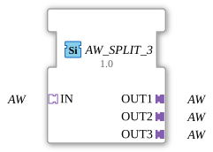

# AW_SPLIT_3

* * * * * * * * * *
## Introduction
The function block **AW_SPLIT_3** serves as a generic distributor for a unidirectional adapter of type `AW`. It accepts a single adapter connection (socket `IN`) and provides it identically to three outputs (plugs `OUT1`, `OUT2`, `OUT3`). The block is designed as a generic function block (Generic FB), so the specific data type of the adapter `AW` can be defined at runtime. Its application lies in signal coupling or command forwarding to multiple downstream components.

## Interface Structure

### **Event Inputs**
None.

### **Event Outputs**
None.

### **Data Inputs**
None.

### **Data Outputs**
None.

#### **Adapters**

| Direction | Name | Type | Description |

|----------|------|-----|--------------|

| Socket | `IN` | `adapter::types::unidirectional::AW` | Input adapter – Source of the signal to be distributed. |

| Plug | `OUT1` | `adapter::types::unidirectional::AW` | First output – Identical signal to `IN`. |

| Plug | `OUT2` | `adapter::types::unidirectional::AW` | Second output – identical signal to `IN`. |

| Plug | `OUT3` | `adapter::types::unidirectional::AW` | Third output – identical signal to `IN`. |

## Functionality

The module operates without its own internal state machine or data processing. It represents a passive distribution structure: The adapter connection arriving at socket `IN` is routed to the three plugs `OUT1`, `OUT2`, and `OUT3`. All outgoing adapters are logically and temporally identical to the incoming signal. No delay, buffering, or transformation occurs.

Since this is a generic function block, the adapter type `AW` must be parameterized with a specific, compatible type (e.g., `Analogwert` or `Steuerbefehl`) before commissioning. This is done by specifying the attribute `eclipse4diac::core::GenericClassName`. Type resolution occurs either at design time (IDE) or at system runtime.

## Technical Features
- **Generic Approach**: The function block is implemented as a *Generic FB* (`GenericClassName` = `'GEN_AW_SPLIT'`). This allows the same function block to be used for different adapter types without having to create a separate FB for each type.
- **Unidirectional**: The adapters are declared as `unidirectional`. This means that data flow is only from the socket to the plugs. Feedback from the outputs to the input is not provided.
- **No Runtime Logic**: The function block is purely structural (passive) – no events, states, or calculations are executed. This reduces resource consumption in real-time systems.
- **Use of the Eclipse 4diac Environment**: The function block relies on the mechanisms provided by 4diac for generic types and adapters.

## State Overview

The function block does not have its own state machine (ECC). It is a pure connection block without any time-based behavior or state changes. Its functionality is limited to the static forwarding of the adapter.

## Application Scenarios
- **Signal Fan-out in Controllers**: A measured value (e.g., temperature, pressure) should be sent in parallel to several controllers or monitoring units.
- **Distributing Control Commands**: A central command is passed on to multiple actuators or subsystems simultaneously.
- **Redundant Signal Paths**: In safety-critical applications, the same signal can be split across multiple paths to enable independent evaluation.
- **Prototype Development**: The generic nature of the function block allows for early implementation and later specification of the specific adapter type.

## Comparison with Similar Function Blocks
- **AW_MERGE_3** (hypothetical): A merger of three AW inputs into one output. AW_SPLIT_3 is the logical inverse.
- **SPLIT_ALL_2**: A non-generic splitter for two outputs that uses specific data types. AW_SPLIT_3 offers greater flexibility due to its generic nature.
- **REPEATER**: A simple amplifier or repeater for adapters with only one output. AW_SPLIT_3 extends this to three parallel outputs.

## Conclusion

The **AW_SPLIT_3** is a fundamental yet flexible distribution block in Eclipse 4diac. Its generic design makes it universally applicable to all unidirectional adapter types. The clear, passive structure without additional logic allows for efficient and reliable signal distribution in automation solutions. Especially when combined with the type variability and 4diac adapter mechanics, it represents a valuable tool for modular and reusable control architectures.

---

### 🌐 Related topic subpages on ms-muc-docs.de
* [🌐 Eclipse 4diac IDE & Color Reference on ms-muc-docs.de](https://www.ms-muc-docs.de/iec-61499/eclipse-4diac/)

]
