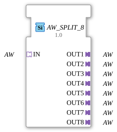

# AW_SPLIT_8

* * * * * * * * * *
## Introduction

The function block **AW_SPLIT_8** is a generic block that splits an incoming unidirectional AW adapter signal into eight identical output signals. The block is implemented as a generic FB and can be assigned a specific type name and type check code at runtime. It serves as a 1:8 distributor for AW data streams and is typically used in automation technology when a signal needs to be forwarded to multiple sinks simultaneously.
## Interface Structure

### **Event Inputs**

No event inputs are available. Communication occurs exclusively via the adapter interfaces.

### **Event Outputs**

No event outputs are available. Data is passed via the adapter plugs.

### **Data Inputs**

No data inputs are available. All input data is provided via the socket adapter `IN`.

### **Data Outputs**

No data outputs are available. Output data is provided via the plug adapters `OUT1` to `OUT8`.

### **Adapters**

| Type | Name | Direction | Description |
|------|------|----------|--------------|
| `adapter::types::unidirectional::AW` | `IN` | Socket (Input) | Source adapter that provides the signal to be split |
| `adapter::types::unidirectional::AW` | `OUT1` | Plug (Output) | First output, identical to the IN signal |
| adapter::types::unidirectional::AW` | `OUT2` | Plug (Output) | Second output |
| adapter::types::unidirectional::AW` | `OUT3` | Plug (Output) | Third output |
| adapter::types::unidirectional::AW` | `OUT4` | Plug (Output) | Fourth output |
| adapter::types::unidirectional::AW` | `OUT5` | Plug (Output) | Fifth output |
| adapter::types::unidirectional::AW` | `OUT6` | Plug (Output) | Sixth Output |
| `adapter::types::unidirectional::AW` | `OUT7` | Plug (Output) | Seventh Output |
| `adapter::types::unidirectional::AW` | `OUT8` | Plug (Output) | Eighth Output |

## Functionality

The module behaves like a passive splitter. As soon as a valid AW adapter signal is present at socket `IN` (e.g., due to an event from the adapter protocol), this signal is simultaneously passed on to all eight plug adapters (`OUT1`–`OUT8`). No data modification, buffering, or delay occurs. The function block is event-driven in accordance with the underlying adapter protocol: Data transmission is triggered by the adapter mechanism of IEC 61499-2.

The outputs always provide the same data content as the input. If the input does not contain valid data, the outputs will also be silent.

## Technical Features

- **Generic Function Block (FB):** The function block is declared as generic and carries the attributes `eclipse4diac::core::GenericClassName` (default: `'GEN_AW_SPLIT'`) and `eclipse4diac::core::TypeHash` (default: `''`). This allows for late binding to a specific function block type, for example, to create more type-safe instances.
- **No Own Events or Variables:** The function block has no explicit event inputs/outputs and no data inputs/outputs in the traditional sense. All communication is handled via the adapter interfaces, which reduces complexity and increases reusability.
- **Unidirectional Adapters:** Only unidirectional AW adapters are used. Feedback from the outputs to the input is not provided.

## State Overview

The function block does not have its own state machine (e.g., ECC – Execution Control Chart). Its behavior is entirely determined by the behavior of the adapter type used, `adapter::types::unidirectional::AW`. In the simplest case, there are two implicit states:

- **Idle:** No valid signal at the input. All outputs are inactive.
- **Active:** A valid signal is present at the input and is replicated to all outputs.

A more detailed state description can be derived from the adapter definitions.

## Application Scenarios

- **Parallel Supply of Multiple Consumers:** A sensor or control signal (e.g., speed setpoint) should be distributed simultaneously to multiple actuators or subsystems without requiring the programming of a separate distribution module.
- **Test and Simulation Environments:** A single test signal can be connected to multiple analysis or logging channels.
- **Data Multiplication in Hierarchical Control Systems:** In modular systems, a central control data stream can be distributed to multiple decentralized units (e.g., field devices).

## Comparison with Similar Modules

- **AW_SPLIT_2, AW_SPLIT_4:** Analogous splitters with fewer outputs (2 or 4, respectively). The number of outputs is the only difference. For applications requiring exactly 8 outputs, `AW_SPLIT_8` is the appropriate choice.
- **General Splitters (e.g., for other adapter types):** Splitters exist for various adapter data types (e.g., `BOOL_SPLIT`, `INT_SPLIT`) that have an analog structure but different adapter interfaces.
- **Multicast Blocks:** More complex blocks can additionally offer filtering, prioritization, or buffering functions; `AW_SPLIT_8` is intentionally kept minimalist to avoid unwanted side effects.

## Change Detection

Each output plug is updated independently: the incoming value is written to a given output, and its adapter event sent, only if it differs from that output's current value. Outputs that are already in sync stay quiet, while an output that was just connected (or has drifted out of sync) still receives the update it needs.

## Conclusion

The `AW_SPLIT_8` block is a simple yet useful generic 1:8 splitter for unidirectional AW adapters. It fulfills the basic requirement of distributing an incoming signal to eight outputs without delay or modification. Its generic design allows it to be used in various contexts where type-safe replication of adapter data streams is required. Strict adherence to the IEC 61499-2 standard and the use of adapters facilitate integration into existing 4diac projects.

---

### 🌐 Related topic subpages on ms-muc-docs.de

- [🌐 Eclipse 4diac IDE & Color Reference on ms-muc-docs.de](https://www.ms-muc-docs.de/iec-61499/eclipse-4diac/)

]
