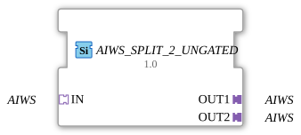

# AIWS_SPLIT_2_UNGATED

> ℹ️ **UNGATED variant:** This block is the ungated version of [`AIWS_SPLIT_2`](AIWS_SPLIT_2.md). It suppresses **no** unchanged repeats – every newly computed result is forwarded unconditionally, even without a value change. This matters for consumers that need a periodic cadence regardless of value change (e.g. derivative/frequency calculations that would otherwise fail to decay toward zero). Any change-detection/gating statements further down this page do **not** apply to this block.

* * * * * * * * * *

## Introduction

The function block **AIWS_SPLIT_2_UNGATED** is used to split an incoming AIWS adapter signal into two identical outputs. It is designed as a generic function block and allows multiple uses of an AIWS signal within the same application without requiring separate signal distribution programming.

## Interface Structure

### **Event Inputs**

No event inputs available.

### **Event Outputs**

No event outputs available.

### **Data Inputs**

No data inputs available.

### **Data Outputs**

No data outputs available.

### **Adapter**

| Direction | Name | Type | Description |
| ---------- | ------ | ----- | -------------- |
| Socket (Input) | **IN** | `adapter::types::unidirectional::AIWS` | Incoming AIWS signal, which is distributed to both outputs. |
| Plug (Output) | **OUT1** | `adapter::types::unidirectional::AIWS` | First output – identical signal to the input. |
| Plug (Output) | **OUT2** | `adapter::types::unidirectional::AIWS` | Second output – identical signal to the input. |

## Functionality

The module passes the AIWS signal present at socket **IN** unchanged to both plugs **OUT1** and **OUT2**. No logical or timing processing takes place – the distribution occurs purely passively through the wiring within the functional block. This allows two independent adapter instances to be supplied with the same data simultaneously.

## Technical Features

- **Generic Block**: The function block is declared as a generic type (`GEN_AIWS_SPLIT`), so it can be reused for different AIWS implementations.
- **Pure Adapter Logic**: Neither events nor data I/O are used; all communication takes place exclusively via the adapter interfaces.
- **No State Dependency**: The function block has no internal state machine – the output signal follows the input signal without delay or buffering.

## State Overview

The function block is stateless. There are no internal states or transitions. The outputs are a direct mapping of the input at any given time.

## Application Scenarios

- **Distributing a Sensor Signal**: A single AIWS sensor (e.g., analog value) is to be read simultaneously by two independent control or monitoring modules.
- **Redundant Processing**: In safety applications, the same signal can be passed to multiple parallel evaluation functions.
- **Logical Branching**: Splitting a data stream for different evaluations or visualizations in a 4diac application.

## Comparison with Similar Modules

- **AIWS_SPLIT_3, AIWS_SPLIT_4**: Extended versions with three or four outputs, respectively – essentially the same functionality.
- **SPLIT Modules for Other Adapter Types**: 4diac offers analog split modules for other adapters (e.g., `DINT_SPLIT`) that distribute a data signal to multiple outputs – but at the data level, not via adapters.
- **Event Split Blocks**: Blocks like `E_SPLIT` distribute events, not data streams – AIWS_SPLIT_2_UNGATED specifically addresses AIWS adapter communication.

## Change Detection

This block performs **no** change detection. Every newly computed result is written to the output and its adapter event fired unconditionally, regardless of whether the value differs from the previous run.

## Conclusion

The **AIWS_SPLIT_2_UNGATED** is a simple yet useful generic function block for duplicating an AIWS adapter signal. It reduces wiring complexity in applications that require the same analog or mixed signal multiple times and, thanks to its passive, stateless architecture, integrates seamlessly into existing workflows.

---

### 🌐 Related topic subpages on ms-muc-docs.de

- [🌐 Eclipse 4diac IDE & color reference on ms-muc-docs.de ](https://www.ms-muc-docs.de/iec-61499/eclipse-4diac/)

]
