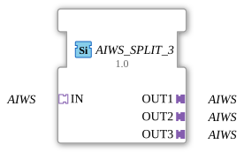

# AIWS_SPLIT_3

* * * * * * * * * *
## Introduction

The function block **AIWS_SPLIT_3** is used to split a single incoming AIWS adapter (type `adapter::types::unidirectional::AIWS`) into three identical output adapters. All data received via the input adapter is forwarded unchanged to all three outputs. The block is designed to be generic and can be used with various AIWS types.
## Interface Structure

### **Event Inputs**

None.

### **Event Outputs**

None.

### **Data Inputs**

None.

### **Data Outputs**

None.

### **Adapters**

| Direction | Name | Type | Description |
|----------|------|-----|--------------|
| Socket (Input) | IN | `adapter::types::unidirectional::AIWS` | Input adapter that receives the signal to be distributed. |
| Plug (Output) | OUT1 | `adapter::types::unidirectional::AIWS` | First output adapter. |
| Plug (Output) | OUT2 | `adapter::types::unidirectional::AIWS` | Second output adapter. |
| Plug (Output) | OUT3 | `adapter::types::unidirectional::AIWS` | Third output adapter. |

## Functionality

The internal logic of the component is remarkably simple: As soon as the socket **IN** receives data from the connected adapter, this data is simultaneously passed on to the three plugs **OUT1**, **OUT2**, and **OUT3**. No transformation, filtering, or buffering takes place. Data is passed unidirectionally and without delay.

## Technical Features

- **Generic Function Block:** The function block is implemented as a generic block (`eclipse4diac::core::GenericClassName = 'GEN_AIWS_SPLIT'`). This allows it to be used with various AIWS adapter specializations, as long as they adhere to the unidirectional communication protocol. The specific type is defined at design time in the 4diac IDE.
- **No State Automation:** The block has no events and no state machine (ECC). Data is passed purely flow-driven.
- **Scalability:** The block is specifically designed for a 1:3 split. Separate blocks (e.g., AIWS_SPLIT_2, AIWS_SPLIT_4) are available for other split ratios.

## State Overview

This function block does not have a state machine (ECC), therefore there are no states or state transitions. Its function is purely combinatorial at the adapter level.

## Application Scenarios

- **Signal Distribution:** An AIWS data stream from one source is to be forwarded in parallel to several subsequent processing blocks (e.g., monitoring, parallel filtering, or visualization).
- **Redundancy:** The same signal is used on different paths to achieve redundancy or comparability.
- **Testing and Simulation:** In test environments, the input signal can be made available to several test modules simultaneously without side effects.

## Comparison with Similar Function Blocks

- **AIWS_SPLIT_2 / AIWS_SPLIT_N:** Function blocks with the same functionality but a different number of outputs (2 or n outputs).
- **ALL_SPLIT (for data):** A generic function block for splitting data inputs/outputs, not specific to adapters. AIWS_SPLIT_3, on the other hand, is specifically optimized for the AIWS adapter type and operates at the adapter level.
- **AIWS_JOIN_3:** The inverse function block that combines three AIWS inputs into one output.

## Conclusion

The **AIWS_SPLIT_3** is a simple yet effective generic function block for duplicating an AIWS adapter signal to three parallel outputs. Thanks to its generic nature, it can be flexibly used in various automation and control applications where a data stream is required multiple times.

---

### 🌐 Related topic subpages on ms-muc-docs.de

* [🌐 Eclipse 4diac IDE & color reference on ms-muc-docs.de](https://www.ms-muc-docs.de/iec-61499/eclipse-4diac/)

]
