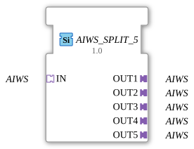

# AIWS_SPLIT_5

* * * * * * * * * *
## Introduction

The function block **AIWS_SPLIT_5** is a generic block for splitting a single **AIWS** adapter into five identical **AIWS** adapters. It allows an AIWS signal provided by a socket to be forwarded to multiple independent adapter plugs without requiring event or data processing logic. This function block is particularly suitable for signal distribution in industrial automation architectures based on the **IEC 61499** standard.
## Interface Structure

### **Event Inputs**

No event inputs are available. The block operates purely on a data-based or adapter-based basis.

### **Event Outputs**

No event outputs are available. Forwarding is implicit via the adapter interfaces.

### **Data Inputs**

No data inputs are available. All information is transmitted via the socket adapter.

### **Data Outputs**

No data outputs are available. Output is via the plug adapters.

### **Adapters**

| Type | Label | Direction | Adapter Type |
|-----|-------------|-----------|-------------|
| **Socket (Input)** | IN | Input | `adapter::types::unidirectional::AIWS` |
| **Plug (Output)** | OUT1 | Output | `adapter::types::unidirectional::AIWS` |
**Plug (Output)** | OUT2 | Output | `adapter::types::unidirectional::AIWS` |
**Plug (Output)** | OUT3 | Output | `adapter::types::unidirectional::AIWS` |
**Plug (Output)** | OUT4 | Output | `adapter::types::unidirectional::AIWS` |
**Plug (Output)** | OUT5 | Output | `adapter::types::unidirectional::AIWS` |

The function block contains a single **socket** (`IN`) and five **plugs** (`OUT1` … `OUT5`), all of the same unidirectional **AIWS adapter type**.

## Functionality

The **AIWS_SPLIT_5** forwards the adapter signal present at its socket `IN` unchanged to all five plug adapters `OUT1` to `OUT5`. No data transformation or filtering occurs – the function block acts purely as a **signal distributor** (fan-out). As soon as a connection is established via the socket, the output adapters are immediately available for communication. Event control or state-dependent logic is not required.

## Technical Features

- **Generic Design**: The function block (FB) has the attributes `eclipse4diac::core::GenericClassName` and `eclipse4diac::core::TypeHash`, which allow for subsequent configuration or type adjustment. By default, the class name is set to `'GEN_AIWS_SPLIT'`; the type hash is empty.
- **Uniform Adapter Type**: All interfaces use the same unidirectional AIWS adapter. This ensures compatibility between inputs and outputs.
- **No Data or Event Ports**: All communication takes place exclusively via the adapter interfaces, which simplifies configuration and reduces the number of connections.

## State Overview

The **AIWS_SPLIT_5** does not have an explicit state machine. Its functionality is purely combinatorial – as soon as the socket is connected, the same adapter signals are present at all outputs. Therefore, there are no internal states that influence the behavior.

## Application Scenarios

- **Signal Distribution in Modular Systems**: An AIWS signal provided by a sensor or controller must be forwarded in parallel to multiple consumers (e.g., actuators, HMI systems, higher-level controllers).
- **Test and Simulation Environments**: A single AIWS signal is distributed to various test and analysis components for monitoring or recording.
- **Redundant Processing**: In safety-critical systems, the identical signal can be routed to multiple independent logic units to enable parallel evaluation.

## Comparison with Similar Components

| Component | Number of Outputs | Type | Special Feature |
|----------|-----------------|-----|--------------|
| **AIWS_SPLIT_5** | 5 | AIWS Adapter | Generic, no events/data |
AIWS_SPLIT_2 | 2 | AIWS Adapter | Same functionality, minimal distribution |
AIWS_SPLIT_3 | 3 | AIWS Adapter | Medium number of outputs |
AIWS_SPLIT_4 | 4 | AIWS Adapter | Alternative to **5** |

All split variants are based on the same principle and differ only in the number of output adapters. The **AIWS_SPLIT_5** covers a medium distribution requirement and is particularly advantageous when exactly five parallel outputs are needed.

## Conclusion

The **AIWS_SPLIT_5** is a simple yet essential function block for duplicating AIWS adapter signals. Its generic design and the absence of events or data porting allow it to be integrated into existing IEC 61499 applications without additional configuration. Ideal for applications requiring precise distribution of an adapter across up to five independent paths.

---

### 🌐 Related topic subpages on ms-muc-docs.de

* [🌐 Eclipse 4diac IDE & Color Reference on ms-muc-docs.de](https://www.ms-muc-docs.de/iec-61499/eclipse-4diac/)

]
