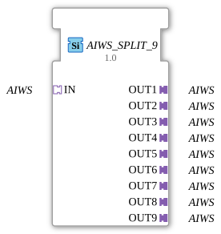

# AIWS_SPLIT_9

* * * * * * * * * *
## Introduction

The function block `AIWS_SPLIT_9` splits an incoming `AIWS` adapter signal into nine separate, identically typed outputs. It is provided as a generic function block (FB) and enables the distribution of a single adapter data stream to multiple subsequent function units. The block is unidirectional and requires no event or data inputs, as data transmission occurs exclusively via the adapter interfaces.
## Interface Structure

### **Event Inputs**

None.

#### **Event Outputs**

None.

#### **Data Inputs**

None.

#### **Data Outputs**

None.

#### **Adapters**

| Direction | Name | Type | Description |
|----------|------|-----|--------------|
| **Socket** | `IN` | `adapter::types::unidirectional::AIWS` | Incoming AIWS signal, distributed to the nine outputs. |
| **Plug** | `OUT1` | `adapter::types::unidirectional::AIWS` | First AIWS outgoing output. |
| **Plug** | `OUT2` | `adapter::types::unidirectional::AIWS` | Second AIWS outgoing output. |
| **Plug** | `OUT3` | `adapter::types::unidirectional::AIWS` | Third AIWS outgoing output. |
**Plug** | `OUT4` | `adapter::types::unidirectional::AIWS` | Fourth AIWS outgoing output. |
**Plug** | `OUT5` | `adapter::types::unidirectional::AIWS` | Fifth AIWS outgoing output. |
**Plug** | `OUT6` | `adapter::types::unidirectional::AIWS` | Sixth AIWS outgoing output. |
**Plug** | `OUT7` | `adapter::types::unidirectional::AIWS` | Seventh AIWS outgoing output. |
**Plug** | `OUT8` | `adapter::types::unidirectional::AIWS` | Eighth AIWS output. |
**Plug** | `OUT9` | `adapter::types::unidirectional::AIWS` | Ninth AIWS output. |

## Functionality

The module receives an AIWS adapter signal at socket `IN` and forwards it unchanged to all nine plugs `OUT1` to `OUT9`. No data processing, conversion, or delay takes place – it is a pure signal multiplication (fan-out). The internal logic is implemented as a generic function block, which can be parameterized at runtime by specifying a generic class name (`eclipse4diac::core::GenericClassName`).

## Technical Features

- **Generic Function Block**: The block is marked as generic `GEN_AIWS_SPLIT`. This allows it to be reused in different contexts by defining the specific adapter type at design time.
- **Unidirectionality**: Both the input and all outputs are unidirectional (`adapter::types::unidirectional::AIWS`), meaning data flows only from the socket to the plugs.
- **No Event Control**: The split block operates without events – data is passed implicitly via the adapter connections.
- **No State Machine**: There is no Execution Control Chart (ECC), therefore the block is stateless and requires no initialization.
- **Type Hash**: An optional attribute `eclipse4diac::core::TypeHash` can be set for identification and versioning purposes, but is empty in this case.

## State Overview

The function block has no internal states. It is purely combinatorial and does not execute any sequential processes.

## Application Scenarios

- **Signal Distribution in Automation Systems**: When a sensor or control signal (e.g., an AIWS-compliant temperature or pressure value) needs to be distributed to multiple independent modules.
- **Redundant Processing**: A signal is distributed to identical, parallel-operating algorithms or safety logic.
- **Test and Simulation Environments**: A single AIWS signal is to be split across multiple test or monitoring blocks.
- **Architecture Simplification**: Eliminates the need for manual wiring of multiple split blocks and reduces the complexity of the application diagram.

## Comparison with Similar Function Blocks

- **AIWS_SPLIT_n (e.g., AIWS_SPLIT_4)**: Other variants exist with a different number of outputs (e.g., 2, 4, 8). This block specializes in splitting the signal into exactly nine strands.
- **Manual Split with Multiple Function Block Instances**: Without this function block, the AIWS signal would have to be implemented by cascading several 2- or 3-way split blocks, which reduces clarity.
- **Event-Based Data Distributor**: Function blocks controlled by events require additional event wiring and are less efficient for simple data forwarding.

## Change Detection

Each output plug is updated independently: the incoming value is written to a given output, and its adapter event sent, only if it differs from that output's current value. Outputs that are already in sync stay quiet, while an output that was just connected (or has drifted out of sync) still receives the update it needs.

## Conclusion

AIWS_SPLIT_9` is a simple yet useful generic function block for multiplying a unidirectional AIWS adapter signal to nine outputs. It avoids unnecessary complexity, requires no event control, and can be used directly in IEC 61499 applications without additional configuration. Thanks to its generic nature, it is flexibly adaptable to various adapter types and is particularly suitable for signal distribution in modular automation architectures.

---

### 🌐 Related topic subpages on ms-muc-docs.de

* [🌐 Eclipse 4diac IDE & color reference on ms-muc-docs.de](https://www.ms-muc-docs.de/iec-61499/eclipse-4diac/)

]
