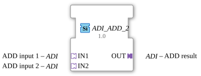

# ADI_ADD_2

*(No image available)*

* * * * * * * * * *
## Introduction
The function block `ADI_ADD_2` is a generic function block for performing arithmetic addition operations. Unlike conventional mathematical function blocks, this block uses an adapter-based interface concept (unidirectional `ADI` adapters) to transmit data and associated control signals in a bundled manner. It enables the addition of two input values to produce one output value.

## Interface Structure

### **Event Inputs**
*This function block does not have direct, dedicated event inputs. Event control is handled entirely via the adapters.*

### **Event Outputs**
*This function block does not have direct, dedicated event outputs. Event forwarding is handled entirely via the output adapter.*

### **Data Inputs**
*This function block does not have any standard, direct data inputs.*

### **Data Outputs**
*This function block does not have any standard, direct data outputs.*

### **Adapters**

#### **Sockets (Inputs)**
* **IN1**: Type `adapter::types::unidirectional::ADI`
* *Description:* First input value for mathematical addition.

* **IN2**: Type `adapter::types::unidirectional::ADI`

* *Description:* Second input value for mathematical addition.

#### **Plugs (Connectors - Outputs)**

* **OUT**: Type `adapter::types::unidirectional::ADI`

* *Description:* Output that provides the result of the addition (`IN1 + IN2`).

---

## Functionality
The function block `ADI_ADD_2` performs the arithmetic operation:

$$\text{OUT} = \text{IN1} + \text{IN2}$$

As soon as data changes at the input adapters `IN1` or `IN2`, or a corresponding transmission event is signaled via the adapter structure, the function block processes the values. The sum is calculated and forwarded to subsequent function blocks via the corresponding event/data bundle of the output adapter `OUT`.

Since this is a generic function block (`GEN_ADI_ADD`), the specific data type used depends on the specifications and instantiation of the `ADI` adapters used.

---

## Technical Features
* **Generic Type:** The function block is declared as `GEN_ADI_ADD`. This allows for flexible handling of different numeric data types, provided they are supported by the adapters used.

* **Adapter-Based Design:** By using unidirectional adapters of type `ADI`, the number of explicit connection lines (wiring overhead in the 4diac IDE's Application Editor) is drastically reduced, as data and synchronization events are encapsulated in a single connection.

* ---

## State Overview
The function block behaves like a stateless (or purely event-driven combinational) function block:

1. **Waiting for Data Update:** The function block remains in idle state until new values are signaled via `IN1` or `IN2`.

2. **Calculation:** When an event arrives at the inputs, the mathematical sum is calculated.

3. **Output:** The result is directly passed to the output adapter `OUT`, and the corresponding trigger event is triggered.

--

## Application Scenarios
* **Modular Signal Processing:** Addition of measured values (e.g., Sensor 1 + Sensor 2 to determine a total value) in systems that are consistently based on an adapter architecture.

* **Cascaded Computations:** Easy integration into complex arithmetic computation networks through clean, structured adapter connections.

---

## Comparison with Similar Components

Compared to a classic `ADD` component according to IEC 61499 (which typically has dedicated `REQ` and `CNF` event ports, as well as direct data inputs such as `IN1` and `IN2` as `ANY_NUM`), the `ADI_ADD_2` encapsulates these interfaces in adapters.

* **Standard ADD:** Requires manual wiring of a minimum of 2 events and 3 data lines (5 connections in total).

* **ADI_ADD_2:** Only requires connecting the three adapter lines (`IN1`, `IN2`, `OUT`), which significantly improves the readability of complex control diagrams.

---

## Conclusion
The `ADI_ADD_2` is a highly efficient, clear, and modern component for arithmetic addition in the 4diac IDE. It is ideally suited for demanding architectures where clarity through the use of standardized adapters is paramount.