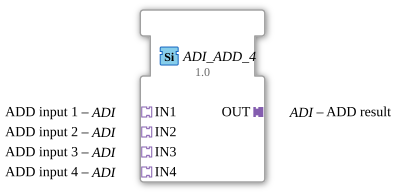

# ADI_ADD_4

*(Image of function block not available)*

* * * * * * * * * *
## Introduction

The function block `ADI_ADD_4` performs arithmetic addition of up to four values. It is a generic function block (FB) based on the unidirectional adapter type `ADI`. It enables clear and modularized addition within IEC 61499 applications in the 4diac IDE.

## Interface Structure

Since the block is entirely adapter-based, it does not have any traditional, separate event or data channels at the type's main level.

## **Event Inputs**

*No direct event inputs are available. Event control is implemented via the connected adapters.*

### **Event Outputs**

*No direct event outputs are available. Event forwarding is implemented via the output adapter.*

### **Data Inputs**

*No direct data inputs are available.*

### **Data Outputs**

*No direct data outputs are available.*

### **Adapters**

* **Sockets (Input Adapters / Jacks):**
* `IN1` (Type: `adapter::types::unidirectional::ADI`): Input for the first summand.
* `IN2` (Type: `adapter::types::unidirectional::ADI`): Input for the second summand.
* `IN3` (Type: `adapter::types::unidirectional::ADI`): Input for the third addend.
* `IN4` (Type: `adapter::types::unidirectional::ADI`): Input for the fourth addend.
* **Plugs (Output Adapters):**
* `OUT` (Type: `adapter::types::unidirectional::ADI`): Output for the calculated total result of the addition.

## Functionality

As soon as new data values or corresponding trigger events are present at the input adapters (`IN1` to `IN4`), the function block performs the addition of the values. The result is calculated using the formula:

$$\text{OUT} = \text{IN1} + \text{IN2} + \text{IN3} + \text{IN4}$$

The calculated result and the corresponding trigger event are provided directly via the output adapter `OUT`.

## Technical Features

* **Generic Module:** By assigning the attribute `GenericClassName` with the value `'GEN_ADI_ADD'`, the module is flexibly structured. Depending on the implementation of the underlying `ADI` adapter, it can be used for various numeric data types.
* **Adapter-Based Design:** Encapsulating data and events in adapters (here of type `ADI`) drastically minimizes the wiring effort in the 4diac IDE function block diagram and ensures a clean, structured application design.
* **Unidirectional Coupling:** The use of unidirectional adapters ensures that data flow is strictly sequential from inputs to output.

## State Overview

Since this is an adapter-based component for purely arithmetic data processing, the `ADI_ADD_4` does not have a complex internal state machine (ECC). Its operation is purely reactive:

* **Trigger on one of the inputs (`IN1` - `IN4`):** Calculates the sum of all four inputs and immediately forwards the result to `OUT`.

## Application Scenarios

* **Sensor Data Aggregation:** Combines up to four analog measured values (e.g., four individual flow meters or temperature sensors) into a single total value.
* **Setpoint Calculation with Offsets:** Adds a primary setpoint with up to three different correction factors or offsets in control processes.
* **Structured Signal Processing:** Use in systems where the signal processing chain is consistently based on the `ADI` adapter standard to avoid unnecessary signal unpacking and repacking.

## Comparison with Similar Function Blocks

* **Standard Adder (e.g., `F_ADD`):** A classic IEC 61131-3 adder block requires separate data lines and event connections. `ADI_ADD_4` bundles these in adapters, reducing visual complexity in the editor.
* **Dual Adder (`ADI_ADD_2`):** To add four values, three dual adders would have to be cascaded. `ADI_ADD_4` significantly saves space and execution time by combining the calculation into a single step.

## Conclusion

The `ADI_ADD_4` is a high-performance and efficient function block for adding four numeric signals. By consistently using adapters, he reduces the number of physical connections in the control program and makes a significant contribution to a clear and maintenance-friendly software architecture.