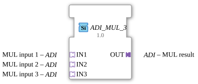

# ADI_MUL_3

*No image available*

* * * * * * * * * *
## Introduction

The `ADI_MUL_3` function block is a generic arithmetic function block for the 4diac IDE. It is used to multiply three numeric input values, which are transmitted via standardized, unidirectional adapters. By encapsulating the mathematical operation in an adapter interface, this function block is particularly suitable for modular and clean application architectures within the IEC 61499 standard.

## Interface Structure

Because it is an adapter-based function block, the `ADI_MUL_3` does not have any direct, classic event or data pins at the top level. All communication is handled via the adapter interfaces.

### **Event Inputs**

*No direct event inputs available (control is handled via the adapters).*

### **Event Outputs**

*No direct event outputs available (control is handled via the adapters).*

### **Data Inputs**

*No direct data inputs available.*

### **Data Outputs**

*No direct data outputs available.*

### **Adapters**

#### **Sockets (Input Adapters)**

* **IN1** (Type: `adapter::types::unidirectional::ADI`)
* First multiplicand for the calculation operation.
* **IN2** (Type: `adapter::types::unidirectional::ADI`)
* Second multiplicand for the calculation operation.
* **IN3** (Type: `adapter::types::unidirectional::ADI`)
* Third multiplicand for the calculation operation.

#### **Plugs (Output Adapters)**

* **OUT** (Type: `adapter::types::unidirectional::ADI`)
* Output adapter that provides the mathematical product of the three input values.

## Functionality

As soon as new values are signaled at the input adapters (`IN1`, `IN2`, `IN3`), the function block performs the multiplication. The result is calculated using the following formula:

$$\text{OUT} = \text{IN1} \times \text{IN2} \times \text{IN3}$$

The calculated result is immediately passed to the output adapter `OUT`, and a corresponding update event is forwarded via the adapter.

## Technical Features

* **Generic Type:** The function block is based on the generic class `'GEN_ADI_MUL'`. This allows for flexible handling of different numeric data types (e.g., `INT`, `UINT`, `REAL`, `LREAL`), depending on how the underlying ADI adapters are implemented.

The calculated result is immediately passed to the output adapter `OUT`, and a corresponding update event is forwarded via the adapter.

* **Generic Type:** The function block is based on the generic class `'GEN_ADI_MUL'`. This enables flexible handling of different numeric data types (e.g., `INT`, `UINT`, `REAL`, `LREAL`). * **Unidirectional Adapters:** Using the type `unidirectional::ADI` ensures a clear, one-way data flow, minimizing coupling between program components and increasing system stability.

## State Overview

The function block is designed as a purely mathematical, stateless block. It does not store any internal history values. Every update to the inputs results in a direct recalculation of the output.

## Application Scenarios

* **Volume Calculations:** Calculating the volume from three dimensions (length × width × height).
* **Three-Phase Measurements:** Power or energy calculations where several factors (e.g., current, voltage, and a scaling/correction factor) need to be multiplied together.
* **Multi-Level Scaling:** Reading a sensor value that needs to be multiplied by a calibration value and an additional gain factor.

## Comparison with Similar Blocks

Compared to classic IEC 61131-3 `MUL` blocks, the `ADI_MUL_3` offers the advantage of encapsulating events and data logically in a single connection through the use of adapters. This significantly reduces wiring effort in the 4diac IDE. Compared to a dual multiplier (`ADI_MUL_2`), this block also eliminates the need to cascade blocks, which reduces execution time and makes the application diagram clearer.

## Conclusion

The `ADI_MUL_3` is a practical auxiliary block for arithmetic calculations in IEC 61499 applications. Its consistent use of unidirectional adapters contributes to a clean, readable, and maintainable control design.