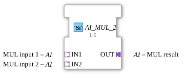

# AI_MUL_2

*(No image available)*

* * * * * * * * * *

The function block `AI_MUL_2` is a generic arithmetic function block for the 4diac IDE, compliant with the IEC 61131-3 standard. Its primary function is the multiplication of two input values provided via unidirectional adapters. The result of this multiplication is also output via a unidirectional adapter.

By using adapters instead of traditional discrete inputs and outputs, the complexity of the wiring in the control design is significantly reduced, as related data and events are bundled in a single connection.

The interface of this function block is entirely adapter-based. There are no direct, traditional event or data inputs and outputs on the block's interface.

*No direct event inputs available (control is handled via the adapters).*

*No direct event outputs available (control is handled via the adapters).*

*No direct data inputs available.*

*No direct data outputs available.*

### Data Outputs

### Data Inputs

### Event Outputs

### Event Inputs

## Interface Structure

## Introduction

### **Adapters**

| Name | Type | Direction (Mode) | Description |
| :--- | :--- | :--- | :--- |
| **IN1** | `adapter::types::unidirectional::AI` | Socket (Input) | First input value (multiplicand) for the arithmetic operation. |
| **IN2** | `adapter::types::unidirectional::AI` | Socket (Input) | Second input value (multiplier) for the arithmetic operation. |
| **OUT** | `adapter::types::unidirectional::AI` | Plug (Output) | Output for the calculated product of the two input values. |

## Functionality

The function block performs mathematical multiplication:

$$ OUT = IN1 × IN2 $$

Since the block is defined as a generic function block (`GEN_AI_MUL`), it can process different numeric data types (e.g., `REAL`, `LREAL`, `INT`, etc.) depending on the instantiation and typing of the adapters used.

As soon as an update event is received via the input adapters (`IN1` and/or `IN2`), the function block performs the multiplication internally and signals the update of the result via the output adapter `OUT`.

- **Generic Implementation:** The function block uses the class `GEN_AI_MUL`. This allows for high flexibility, as the specific data type is only determined when used in the system.
- **Unidirectional Adapters:** The interfaces use the type `adapter::types::unidirectional::AI`. This means that the information flow is strictly unidirectional, which increases system stability and performance.
- **Encapsulation:** The absence of individual signal pins keeps the application diagram clear and uncluttered, even with many mathematical operations.
- ## State Overview

The module essentially behaves in a stateless manner (exhibiting analog characteristics):

- **Initialization / Idle State:** The module waits for incoming values via the adapters `IN1` and `IN2`.
- **Calculation:** Upon arrival of a new value or trigger signal at the sockets, the product is recalculated.
- **Output:** The result is immediately passed to the plug `OUT`, triggering a corresponding output event in the adapter.
- **Scaling of Sensor Values:** Multiplication of a raw analog value (e.g., from a 4–20 mA current input) by a scaling factor to convert it into a physical quantity.
- **Scaling of Sensor Values:** * **Calculation of physical quantities:** Calculation of power ($P = U \times I$) from measured voltage and current, provided these are supplied via appropriate adapter structures.
- **Amplifiers in control loops:** Use as a proportional gain factor (P-element) in software-based control.

Compared to the standard IEC 61131-3 component `MUL`, the `AI_MUL_2` eliminates the need for manual wiring of trigger events (as with `REQ` and `CNF`) and individual data pins. While a classic `MUL` block requires separate lines for data and events for each connection, the `AI_MUL_2` bundles these using the `AI` adapters. This is particularly suitable for advanced, object-oriented, or modularized software architectures in 4diac.

The `AI_MUL_2` is a specialized, yet flexible, block for multiplying two values via adapter connections. It is ideally suited for clean, well-organized control architectures where analog signals need to be transmitted and processed in a standardized way using unidirectional adapters.
## Technical Features

## State Overview

## Application Scenarios

## Comparison with Similar Function Blocks

## Change Detection

The result is only written to the output plug (`OUT`) and its adapter event only sent if the newly computed value differs from the value currently held on `OUT`. If the result is unchanged, no adapter event is sent, avoiding redundant updates on downstream peers.

## Conclusion
