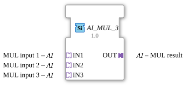

# AI_MUL_3

*(No image available)*

* * * * * * * * * *
## Introduction

The function block `AI_MUL_3` is a generic arithmetic function block designed for multiplying three input values. It conforms to the classification for standard arithmetic functions according to IEC 61131-3 and utilizes the 4diac adapter concept. Encapsulating the signals in adapters significantly reduces the visual complexity of the function block diagram.

## Interface Structure

### **Event Inputs**

*This function block does not have direct event inputs. Event control is handled internally via the adapters.*

### **Event Outputs**

*This function block does not have direct event outputs. Event control is handled internally via the adapters.*

### **Data Inputs**

*This function block has no direct data inputs. Data is transferred via the input adapters.*

### **Data Outputs**

*This function block has no direct data outputs. Data is output via the output adapter.*

### **Adapters**

#### **Sockets (Input Adapters)**

* **IN1** (Type: `adapter::types::unidirectional::AI`): The first multiplicand (input value 1).
* **IN2** (Type: `adapter::types::unidirectional::AI`): The second multiplicand (input value 2).
* **IN3** (Type: `adapter::types::unidirectional::AI`): The third multiplicand (input value 3).

#### **Plugs (Output Adapters)**

* **OUT** (Type: `adapter::types::unidirectional::AI`): The result of the multiplication.

---

## Functionality

The function block performs a continuous or event-driven arithmetic multiplication of the three values connected via the sockets.

The mathematical formula is:
$$\text{OUT} = \text{IN1} \times \text{IN2} \times \text{IN3}$$

As soon as the values at the input adapters change or a corresponding update event is triggered via the adapters, the function block calculates the product and makes it available at the output adapter `OUT`.

---

## Technical Features

* **Generic Nature:** The function block is declared as a generic type (`GenericClassName` = `'GEN_AI_MUL'`). This means it can flexibly work with various numeric data types (such as REAL, LREAL, INT), provided these are supported by the adapter type `AI`.
* **Adapter Coupling:** By using unidirectional adapters (`unidirectional::AI`), data and its validation events are combined. This drastically simplifies the wiring in the 4diac IDE, as separate event and data lines are no longer required.

--

## State Overview

The function block does not have a complex internal state diagram (stateless). It reacts purely to changes in values or trigger events at inputs `IN1`, `IN2`, and `IN3` and immediately forwards the result to `OUT`.

---

## Application Scenarios

* **Measurement Scaling:** Multiplication of an analog raw value (`IN1`) by a calibration factor (`IN2`) and a further correction factor (`IN3`).
* **Physical Calculations:** Calculation of volumes (V = l × b × h) or power, where three factors must be multiplied directly together.
* * **Cascaded Amplifications:** Signal processing chains in which a signal passes through two amplification stages sequentially.

---

## Comparison with Similar Components

* **Standard MUL Component (IEC 61131-3):** Classic multiplication components have direct data pins (e.g., `ANY_NUM`) and require explicit event connections (`REQ` / `CNF`). `AI_MUL_3` bundles this logic into adapters.
* **AI_MUL_2 (Dual Multiplier):** While multiplying three values with a standard dual multiplier requires two components cascaded, `AI_MUL_3` accomplishes this in a single step, saving resources and space in the control diagram.

---

## Conclusion

The `AI_MUL_3` function block offers an efficient, clean, and high-performance way to implement triple multiplications within a 4diac application. Through the consistent use of the adapter concept, it significantly contributes to the clarity and maintainability of control software.