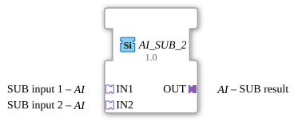

# AI_SUB_2

* * * * * * * * * *
## Introduction

The function block `AI_SUB_2` is a generic arithmetic function block for performing subtraction. It is specifically designed for use with analog interface adapters. The block calculates the difference between two analog input values and outputs the result to an analog output adapter. Using adapters keeps the interface design in the 4diac-ide clear and concise.

## Interface Structure

Since this function block is based entirely on an adapter architecture, it does not have any direct, traditional event or data channels on the block interface. All communication is handled via the adapters.

### **Event Inputs**
*No direct event inputs available (event control is encapsulated in the adapters).*

### **Event Outputs**
*No direct event outputs available (event control is encapsulated in the adapters).*

### **Data Inputs**
*No direct data inputs available.*

### **Data Outputs**
*No direct data outputs available.*

### **Adapters**

#### Sockets (Input Adapters)
* **IN1** (Type: `adapter::types::unidirectional::AI`): The first analog input value (minuend) for the subtraction operation.

* **IN2** (Type: `adapter::types::unidirectional::AI`): The second analog input value (subtrahend), which is subtracted from `IN1`.

#### Plugs (Output Adapters)
* **OUT** (Type: `adapter::types::unidirectional::AI`): The result of the subtraction (difference: `IN1 - IN2`).

## Functionality

This function block performs basic arithmetic subtraction:

$$ OUT = IN1 - IN2 $$

As soon as the input values at sockets `IN1` or `IN2` change, or a corresponding update event is received via the adapters, the function block calculates the difference internally. The result and the associated update event are immediately forwarded to output plug `OUT`.

## Technical Features

* **Generic Block Type (`GEN_AI_SUB`)**: The block is internally defined as a generic type. This allows for flexible adaptation to the analog data types used by the adapters in the system.

* **Adapter Encapsulation**: The use of unidirectional analog adapters (`unidirectional::AI`) consolidates data and event lines. This minimizes the wiring effort in the FBD (Function Block Diagram) and significantly improves clarity.

## State Overview

The block behaves like a purely functional block without internal memory (analogous to a classic combinational gate). It does not have a complex Execution Control Chart (ECC). Any activity on the input adapters directly triggers the calculation and updates the output adapter.

## Application Scenarios

* **Differential Pressure and Differential Temperature Measurement**: Calculation of physical differential values in process engineering (e.g., determining the pressure drop across a filter or the temperature difference between the flow and return lines).

* **Control Deviation**: Calculation of the control deviation ($e = w - x$) in control loops where the setpoint and actual value are available as adapter structures.

* **Zero Point Correction / Offset Subtraction**: Subtraction of a calibration or offset value from a continuous measurement signal.

## Comparison with Similar Components

Compared to standard subtraction components of IEC 61131-3 (such as a classic `SUB` component with discrete pins), the `AI_SUB_2` eliminates the need for manually wiring separate `REQ` and `CNF` event lines as well as individual analog data lines. All relevant information is cleanly transmitted in the `AI` adapters.

## Conclusion

The `AI_SUB_2` is a specialized and highly efficient component for modern, adapter-based programming in 4diac. It is ideally suited for clean software architectures in the field of analog signal preprocessing, where clarity and encapsulation are paramount.