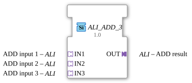

# ALI_ADD_3

*(No image available)*

* * * * * * * * * *
## Introduction

The function block `ALI_ADD_3` is a generic arithmetic block for adding three values. It is based on the IEC 61131-3 standard for arithmetic functions. Instead of classic, separate data and event connections, this block uses unidirectional adapters of type `ALI` to enable structured and clear signal transmission in 4diac-ide.

## Interface Structure

### **Event Inputs**

*No direct event inputs are available. Control and triggering are implicit via the connected adapters.*

### **Event Outputs**

*No direct event outputs are available. Events are forwarded via the output adapter.*

### **Data Inputs**

*No direct data inputs available.*

### **Data Outputs**

*No direct data outputs available.*

### **Adapters**

The module communicates exclusively via adapter interfaces:

- **Sockets (Input Interfaces):**
- `IN1` (Type: `adapter::types::unidirectional::ALI`): Interface for the first summand (input value 1).
- `IN2` (Type: `adapter::types::unidirectional::ALI`): Interface for the second summand (input value 2).
- `IN3` (Type: `adapter::types::unidirectional::ALI`): Interface for the third addend (input value 3).
- **Plugs (Output Interfaces):**
- `OUT` (Type: `adapter::types::unidirectional::ALI`): Interface for outputting the calculated result.

## Functionality

The function block `ALI_ADD_3` performs a standard arithmetic addition. As soon as new values are signaled at the input adapters (`IN1`, `IN2`, `IN3`), the function block calculates the sum using the following formula:

$$\text{OUT} = \text{IN1} + \text{IN2} + \text{IN3}$$

The result and the corresponding update event are then passed on to the subsequent function blocks via the output adapter `OUT`.

## Technical Features

- **Generic Implementation:** The function block is declared as a generic type (`GEN_ALI_ADD`). This allows for flexible adaptation to various data types supported by the `ALI` adapter.
- **Use of Adapters:** By encapsulating data and events in unidirectional adapters (`ALI`), the number of necessary connection lines in the 4diac-ide application editor is drastically reduced, resulting in improved clarity.

## State Overview

The function block operates purely stateless. There is no internal state machine (ECC). The calculation is purely data- or event-driven: An incoming event at one of the input adapters directly triggers the addition and updating of the output adapter.

## Application Scenarios

- **Measurement Summing:** Summarizing three individual analog measurements (e.g., power consumption of three phases, flow rates from three pipes) into a total value.
- **Average Preparation:** Summing three values for subsequent division by 3 in a subsequent function block.
- **Structured Signal Processing:** Used in complex projects where analog signals need to be standardized and routed clearly via adapter channels.

## Comparison with Similar Components

- **Standard ADD (IEC 61131-3):** A standard ADD component uses classic data and event connections. `ALI_ADD_3`, on the other hand, encapsulates these interfaces in adapters, reducing visual complexity in system design.
- **Cascaded Dual Adders:** To add three values with conventional dual adders, two components would have to be connected in series. `ALI_ADD_3` eliminates the need for one component as well as the intermediate instantiation and wiring.

## Change Detection

The result is only written to the output plug (`OUT`) and its adapter event only sent if the newly computed value differs from the value currently held on `OUT`. If the result is unchanged, no adapter event is sent, avoiding redundant updates on downstream peers.

## Conclusion

`ALI_ADD_3` is a compact and efficient auxiliary component for 4diac-ide. Through the consistent use of unidirectional adapters, he makes a significant contribution to the creation of clean, modularized and easily readable control code for processing analog signals.
