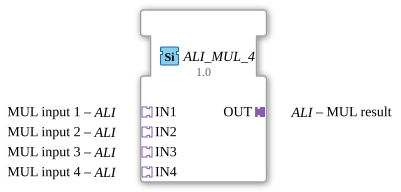

# ALI_MUL_4

*(No image available)*

* * * * * * * * * *
## Introduction
The function block `ALI_MUL_4` is used to perform an arithmetic multiplication of four input values. It is a generic function block (Generic FB) based on the use of unidirectional adapters (`ALI`). By using adapters instead of classic data and event pins, the wiring in 4diac-ide is made clearer and more modular.

## Interface Structure

### **Event Inputs**
This function block has no direct event inputs. Control and triggering are handled via the connected adapters.

### **Event Outputs**
This function block has no direct event outputs. Events are forwarded via the output adapter.

### **Data Inputs**
There are no direct data inputs. Data is transferred via the input adapters.

### **Data Outputs**
There are no direct data outputs. The result is provided via the output adapter.

### **Adapters**

#### **Sockets (Input Adapters)**
The sockets serve as inputs for the values to be multiplied.

* **IN1** (Type: `adapter::types::unidirectional::ALI`): First factor for multiplication.

* **IN2** (Type: `adapter::types::unidirectional::ALI`): Second factor for multiplication.

* **IN3** (Type: `adapter::types::unidirectional::ALI`): Third factor for multiplication.

* **IN4** (Type: `adapter::types::unidirectional::ALI`): Fourth factor for multiplication.

#### **Plugs (Output Adapters)**

The plug outputs the calculated result.

* **OUT** (Type: `adapter::types::unidirectional::ALI`): The calculated product of the four input adapters.

---

## Functionality

As soon as the input values at adapters `IN1` to `IN4` change, or a corresponding update event is triggered via the adapters, the function block internally multiplies the four values according to the following mathematical principle:

$$ OUT = \text{IN1} \times \text{IN2} \times \text{IN3} \times \text{IN4}$$

The result and the associated update event are then output via the output adapter `OUT`.

--

## Technical Features
* **Generic Function Block:** The attribute `GenericClassName` with the value `GEN_ALI_MUL` makes the function block data type-independent. Depending on the implementation of the `ALI` adapters, it can process various numeric data types (e.g., `INT`, `REAL`, `LREAL`).

* **Adapter Coupling:** By using unidirectional `ALI` adapters, clean encapsulation of data and trigger events is achieved, reducing complexity in system design.

---

## State Overview
The function block is stateless (stateless, purely combinatorial processing). There are no internal state machines (Execution Control Chart / ECC). The output values depend directly on the values applied to the input adapters.

---

## Application Scenarios

* **Scaling and Weighting:** Calculation of composite scaling factors in process automation.

* **Volume and Mass Calculation:** Continuous calculation of physical quantities (e.g., length × width × height × density).

* **Multi-Stage Gain Control:** Cascaded signal amplification in measurement and control technology.

--

## Comparison with Similar Function Blocks
Compared to a standard multiplication function block (`MUL`) according to IEC 61131-3, which typically has only two direct data inputs, `ALI_MUL_4` offers:

1. Direct multiplication of **four** factors in a single step (fewer function blocks required on the control canvas).

2. The use of adapters instead of individual wiring significantly improves the overall clarity of the program.

---

## Conclusion
The `ALI_MUL_4` is an efficient auxiliary module for arithmetic calculations in complex 4diac systems. It is particularly suitable for applications where multiple values need to be multiplied compactly and systematically without cluttering the user interface with countless connection lines.