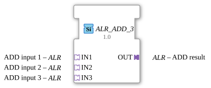

# ALR_ADD_3

*(No image available)*

* * * * * * * * * *
## Introduction

The function block `ALR_ADD_3` is a generic arithmetic block for the 4diac IDE, used to add three input values. It conforms to the standard arithmetic functions according to IEC 61131-3, but uses an adapter-based interface design. Instead of individual data and event pins, this block uses unidirectional adapters to enable clean encapsulation and clearer wiring within the application.

## Interface Structure

### **Event Inputs**

*No direct event inputs are available. Event-based control is handled internally via the adapters.*

### **Event Outputs**

*No direct event outputs are available. Event forwarding is handled via the output adapter.*

### **Data Inputs**

*No direct data inputs available.*

### **Data Outputs**

*No direct data outputs available.*

### **Adapters**

#### **Sockets (Input Interfaces)**

* **IN1** (Type: `adapter::types::unidirectional::ALR`): First addend of the addition operation.
* **IN2** (Type: `adapter::types::unidirectional::ALR`): Second addend of the addition operation.
* **IN3** (Type: `adapter::types::unidirectional::ALR`): Third addend of the addition operation.

#### **Plugs (Output Interfaces)**

* **OUT** (Type: `adapter::types::unidirectional::ALR`): Output adapter that provides the result of the addition (`IN1 + IN2 + IN3`) and the associated trigger event.

## Functionality

This function block adds the values provided via the three input adapters (`IN1`, `IN2`, and `IN3`).

As soon as a new event or value is registered at one of the input adapters, the function block performs the calculation according to the following scheme:

$$ OUT = IN1 + IN2 + IN3 $$

The result is immediately passed to the output adapter `OUT`, and a corresponding update event is triggered to initiate subsequent function blocks in the data flow.

## Technical Features

* **Generic Function Block:** The attribute `eclipse4diac::core::GenericClassName` with the value `'GEN_ALR_ADD'` makes the function block data type-independent (generic). It can therefore work flexibly with various numeric data types (e.g., INT, REAL, LREAL), provided the adapter type used, `ALR`, supports them.
* **Adapter Coupling:** Using adapters instead of traditional data and event pins drastically reduces the number of visible connection lines in the 4diac Application Editor. This significantly improves the readability of complex control diagrams.

## State Overview

Since `ALR_ADD_3` is a mathematical, data-flow-oriented function block, it does not have a complex internal state machine (ECC). Execution is purely reactive (event-driven via the input adapters).

## Application Scenarios

* **Measurement Summing:** Adding three analog partial flows to determine the total flow in an energy distribution system.
* **Mixing Calculations:** Combining three flow rates in a process plant to calculate the total inflow.
* **Setpoint Generation:** Calculating an overall setpoint from a base value, a correction value, and an offset.

## Comparison with Similar Components

* **Standard `ADD` (IEC 61131-3):** The classic `ADD` component uses separate pins for data and events (REQ/CNF). In contrast, `ALR_ADD_3` combines these signals in adapters, increasing modularity and reusability in cross-project designs.
* **`ALR_ADD_2`:** A similar adapter-based component, but it only supports two inputs. `ALR_ADD_3` eliminates cascading when adding exactly three values, thus saving additional memory and computational effort.

## Conclusion

The `ALR_ADD_3` is a flexible and high-performance component for adding three values in 4diac environments. Through its generic design and the consistent use of unidirectional adapters, it makes a significant contribution to the clarity, structuring and maintainability of modern, distributed control programs.