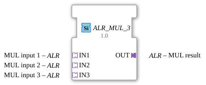

# ALR_MUL_3

*(Symbolic representation of the function block)*

* * * * * * * * * *

## Introduction

The function block `ALR_MUL_3` is a generic block from the `adapter::iec61131::arithmetic` library, designed for the arithmetic multiplication of three input values. Instead of classic, discrete data inputs, this block uses unidirectional adapters of type `ALR` to encapsulate and transmit data and control events. This enables structured, modular, and clear wiring within the 4diac IDE.

## Interface Structure

### **Event Inputs**

*No direct event inputs are available. Event-based control is handled entirely via the integrated adapters.*

### **Event Outputs**

*No direct event outputs are available. Event-based control is handled entirely via the integrated adapters.*

### **Data Inputs**

*No direct data inputs are available. The data values are encapsulated in the input adapters.*

### **Data Outputs**

*No direct data outputs are available. The result is encapsulated in the output adapter.*

### **Adapters**

#### **Sockets (Input Interfaces)**

- **IN1** (Type: `adapter::types::unidirectional::ALR`): The first factor for multiplication.
- **IN2** (Type: `adapter::types::unidirectional::ALR`): The second factor for multiplication.
- **IN3** (Type: `adapter::types::unidirectional::ALR`): The third factor for the multiplication.

#### **Plugs (Output Interfaces)**

- **OUT** (Type: `adapter::types::unidirectional::ALR`): The calculated product of the three input values.

---

## Functionality

The function block `ALR_MUL_3` performs the mathematical multiplication of three input variables. As soon as new values or trigger events are present at the sockets, the function block executes the calculation according to the following formula:

$$\text{OUT} = \text{IN1} \times \text{IN2} \times \text{IN3}$$

The result of the calculation and the corresponding update event are output via the plug `OUT`.

Since this is a generic function block (Generic class: `GEN_ALR_MUL`), the actual data type (e.g., `REAL`, `LREAL`, `INT`) depends on the definition of the `ALR` adapter used.

---

## Technical Features

- **Generic Design:** By assigning the attribute `GenericClassName = 'GEN_ALR_MUL'`, the function block can be used flexibly for various data types, provided the adapters used support them.
- **Adapter-Based Coupling:** Using adapters instead of loose event/data connections drastically reduces the wiring effort (routing) within the 4diac application and improves clarity.
- - **Unidirectionality:** The `ALR` adapters used are defined as unidirectional, ensuring a clear and feedback-free data flow from the sources (sockets) to the sink (plug).

---

## State Overview

The component does not have a complex internal state machine (ECC). It operates as a purely combinatorial/mathematical component that reacts directly to events at the input adapters and immediately forwards the result to the output.

---

## Application Scenarios

- **Sensor Scaling and Correction:** Multiplication of a raw value (IN1) by a calibration factor (IN2) and an application-specific weighting factor (IN3).
- **Three-Dimensional Calculations:** Calculation of volumes or throughputs where three physical variables need to be multiplied together.
- **Cascaded Gainers:** Calculation of combined gains in control loops.

---

## Comparison with Similar Function Blocks

- **Standard MUL Function Block (IEC 61131-3):** Classic multipliers work with direct elementary data types (e.g., `REAL`). `ALR_MUL_3`, on the other hand, bundles data and events in adapters, which improves modularity and reusability in distributed systems according to IEC 61499.
- **ALR_MUL_2 (Dual Multiplier):** For multiplying only two values, a corresponding dual function block is preferred. `ALR_MUL_3` eliminates the need to cascade two separate function blocks when multiplying three factors.

--

## Change Detection

The result is only written to the output plug (`OUT`) and its adapter event only sent if the newly computed value differs from the value currently held on `OUT`. If the result is unchanged, no adapter event is sent, avoiding redundant updates on downstream peers.

## Conclusion

The `ALR_MUL_3` function block is an efficient and clean solution for triple multiplication tasks in IEC 61499 applications. By consistently using unidirectional adapters, he promotes clean software design and ensures well-structured data flows in the 4diac IDE.
