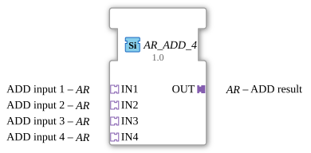

# AR_ADD_4

*Note: A graphical symbol for the function block is not available.*

* * * * * * * * * *
## Introduction

The function block **AR_ADD_4** is a generic function block for the arithmetic addition of multiple values. It is designed according to the IEC 61499-2 standard and allows the flexible processing of up to four additive operands via adapter interfaces. The function block is typically used in automation systems where numerical summation of multiple signals is required.

## Interface Structure

### **Event Inputs**

- None (The function block operates without explicit event control.)

### **Event Outputs**

- None

### **Data Inputs**

- None (All input operands are provided via adapters.)

### **Data Outputs**

- None (The result is output via an adapter.)

### **Adapter**

| Name | Type | Direction | Description |
|------|-----|----------|--------------|
| **IN1** | `adapter::types::unidirectional::AR` | Socket (Input) | First Addend of the Addition |
| **IN2** | `adapter::types::unidirectional::AR` | Socket (Input) | Second Addend |
| **IN3** | `adapter::types::unidirectional::AR` | Socket (Input) | Third Addend |
| **IN4** | `adapter::types::unidirectional::AR` | Socket (Input) | Fourth Addend |
| **OUT** | `adapter::types::unidirectional::AR` | Plug (Output) | Result of the Addition (Sum of Inputs) |

The adapters are of type `unidirectional::AR`, indicating that they provide or process an arithmetic value (e.g., a numerical value) as a directed connection.

## Functionality

The function block **AR_ADD_4** performs the summation of the four values applied to the input adapters and outputs the result to the output adapter **OUT**. The calculation is performed according to the general formula:

\[
\text{OUT} = \text{IN1} + \text{IN2} + \text{IN3} + \text{IN4}

\]

Since the function block is declared as a generic type (`eclipse4diac::core::GenericClassName = 'GEN_AR_ADD'`), the underlying data type (e.g., Integer, Real, or user-defined arithmetic types) is only determined at runtime through the specific configuration. Processing is data-driven – as soon as valid values are present at all four inputs, the sum is calculated and updated at the output.

## Technical Features

- **Generic Function Block**: The function block is marked as generic (`eclipse4diac::core::GenericClassName`). This allows the specific arithmetic data type to be defined only when used in the project, enabling high reusability.
- **Adapter-Based Communication**: Instead of classic data inputs/outputs, all values are exchanged via adapters. This allows for loose coupling with other components and promotes modular structures.
- **No Event Control**: The component has no event inputs or outputs. Calculation and data transmission occur automatically as soon as all input values are available (similar to a continuous function).
- **Typical Package Structure**: The component is organized in the package `adapter::iec61131::arithmetic`, indicating an adapter implementation close to IEC 61131.

## State Overview

Due to its purely data-driven and eventless operation, the component has **no internal states**. There are no sequential processes or state machines. The output is always the current sum of the four inputs.

## Application Scenarios

1. **Calculating the sum of multiple process values** (e.g., adding flow signals from multiple sensors).
2. **Scaling and Summation** – In combination with scalable adapters, the function block can be used for weighted summation.
3. **Calculation of total consumption or total energy** from multiple partial measurements.
4. **Generic summation in modular automation solutions** where the number of summands is fixed, but the data type is variable.

## Comparison with similar function blocks

| Function block | Number of inputs | Special feature |
|----------|----------------|--------------|
| **AR_ADD_4** | 4 | Adapter-based, generic, no events |
| **AR_ADD_2** (hypothetical) | 2 | Reduced inputs, same concept |
| **F_ADD** (from IEC 61131) | 2 | Standard data types, event-driven (via ENABLE/ENO) |
| **AR_SUM** (hypothetical) | variable | More flexible number, but more complex |

The **AR_ADD_4** function block stands out from classic IEC 61499 arithmetic function blocks due to its pure adapter communication and generic design. It is particularly suitable for systems that already rely on adapter technology and do not require explicit event control.

## Change Detection

The result is only written to the output plug (`OUT`) and its adapter event only sent if the newly computed value differs from the value currently held on `OUT`. If the result is unchanged, no adapter event is sent, avoiding redundant updates on downstream peers.

## Conclusion

The **AR_ADD_4** is a compact, generic function block for adding four values via adapter interfaces. Its simple and robust data-driven operation makes it a useful basic building block for modular automation applications. The absence of events and the generic typing enable flexible integration into heterogeneous systems. For applications with more or fewer than four addends, adapted variants or extended function blocks must be used.

---

### 🌐 Related topic subpages on ms-muc-docs.de

* [🌐 Eclipse 4diac IDE & Color Reference on ms-muc-docs.de](https://www.ms-muc-docs.de/iec-61499/eclipse-4diac/)

]
