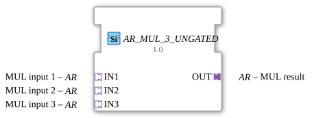

# AR_MUL_3_UNGATED

> ℹ️ **UNGATED variant:** This block is the ungated version of [`AR_MUL_3`](AR_MUL_3.md). It suppresses **no** unchanged repeats – every newly computed result is forwarded unconditionally, even without a value change. This matters for consumers that need a periodic cadence regardless of value change (e.g. derivative/frequency calculations that would otherwise fail to decay toward zero). Any change-detection/gating statements further down this page do **not** apply to this block.

*(No image available)*

* * * * * * * * * *

## Introduction

The function block `AR_MUL_3_UNGATED` is a generic arithmetic block used to multiply three input values. It is based on the use of unidirectional adapters of type `AR` (Arithmetic), which enables structured and clear signal transmission within the 4diac IDE. As it is a generic block, it can be used flexibly with various numeric data types.

## Interface Structure

The interfaces of this function block are implemented entirely via adapters. There are no directly accessible standard event or data channels.

## **Event Inputs**

*There are no direct event inputs. Event control is handled via the input adapters.*

### **Event Outputs**

*There are no direct event outputs. Event control is handled via the output adapter.*

### **Data Inputs**

*There are no direct data inputs. Data transmission occurs via the adapters.*

### **Data Outputs**

*There are no direct data outputs. Data transmission occurs via the adapters.*

### **Adapters**

- **Sockets (Input Adapters):**
- `IN1` (Type: `adapter::types::unidirectional::AR`): First multiplicand (Input 1).
- `IN2` (Type: `adapter::types::unidirectional::AR`): Second multiplicand (Input 2).
- `IN3` (Type: `adapter::types::unidirectional::AR`): Third multiplicand (Input 3).
- **Plugs (Output Adapters):**
- `OUT` (Type: `adapter::types::unidirectional::AR`): Result of the multiplication ($OUT = IN1 \cdot IN2 \cdot IN3$).

## Functionality

The function block performs a mathematical multiplication of the values present at the adapters `IN1`, `IN2`, and `IN3`:

$$ OUT = IN1 × IN2 × IN3 $$

As soon as a calculation event (e.g., a value update) is signaled at the input adapters, the function block reads the current values, calculates the product, and outputs the result along with a corresponding update event via the output adapter `OUT`.

## Technical Features

- **Generic Behavior (`GEN_AR_MUL`):** The function block is declared as a generic type. This allows it to be applied to various numeric data types (e.g., `INT`, `REAL`, `LREAL`) during development or runtime, provided the adapters used support these data types.
- **Adapter Structure:** Using `unidirectional::AR` adapters drastically reduces the number of visible connection lines in the function block diagram (FBD) because data and control events are bundled in a single connection.

## State Overview

The function block behaves purely functionally and essentially has the following logical states:

- **Waiting (Idle):** The function block waits for a trigger event via the input adapters.
- **Evaluating:** After an event arrives, the input data is read and multiplied.
- **Update:** The calculated product is applied to output `OUT`, and the output event is triggered.

## Application Scenarios

- **Volume Calculations:** Multiplying three dimensions (length × width × height) to determine a volume.
- **Scaling and Weighting:** Applying two consecutive scaling factors to a raw value (e.g., sensor value × calibration factor × unit conversion).
- **Physical Formulas:** Calculating quantities that depend directly on three variables (e.g., power $P = U × I × cos(\varphi)$ in a simplified view).

## Comparison with Similar Function Blocks

- **Standard `MUL` (IEC 61131-3):** Classic multiplication blocks operate with discrete data and event pins. `AR_MUL_3_UNGATED` uses adapters instead, which makes the design clearer.
- **`AR_MUL_2`:** Multiplies only two values. `AR_MUL_3_UNGATED` eliminates the need for an additional cascading block when three variables need to be multiplied, thus optimizing performance and clarity.

## Change Detection

This block performs **no** change detection. Every newly computed result is written to the output and its adapter event fired unconditionally, regardless of whether the value differs from the previous run.

## Conclusion

The `AR_MUL_3_UNGATED` is a practical and reusable function block for modern IEC 61499 development in 4diac. By encapsulating the mathematical logic in an adapter-based structure, it significantly contributes to the clarity of complex control applications.
