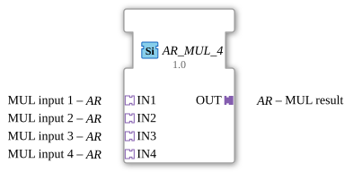

# AR_MUL_4

* * * * * * * * * *
The function block `AR_MUL_4` is a generic arithmetic block used to multiply four input values. It is based on an adapter interface that enables clean encapsulation and structuring of data and associated events. Due to its generic nature (`GEN_AR_MUL`), the block can flexibly adapt to various numeric data types.

The block does not have direct, dedicated event inputs. Synchronization and triggering of the calculation are implicit via the connected input adapters.

The block does not have direct, dedicated event outputs. Calculation and update events are forwarded via the output adapter.

There are no direct data inputs. The values for multiplication are read via the adapter interfaces.

There are no direct data outputs. The result of the multiplication is provided via the output adapter.

### Data Outputs

### Data Inputs

### Event Outputs

### Event Inputs

## Interface Structure

## Introduction

### **Adapters**

Communication with other function blocks is exclusively via adapters of type `adapter::types::unidirectional::AR`:

* **Sockets (Input Adapters):**
* `IN1`: First multiplicand (Input 1).
* `IN2`: Second multiplicand (Input 2).
* `IN3`: Third multiplicand (Input 3).
* `IN4`: Fourth multiplicand (Input 4).
* **Plugs (Output Adapters):**
* `OUT`: The calculated product of the four inputs.

## Functionality

As soon as new values and the corresponding trigger events arrive via the input adapters (`IN1` to `IN4`), the function block multiplies the values together. The mathematical behavior corresponds to the formula:

$$\text{OUT} = \text{IN1} \times \text{IN2} \times \text{IN3} \times \text{IN4}$$

The result is output via the output adapter `OUT`, along with a corresponding update event.

* **Generic Behavior:** The attribute `eclipse4diac::core::GenericClassName` with the value `GEN_AR_MUL` makes the function block data type-independent. Depending on the application, it can work with various numeric data types (e.g., `INT`, `REAL`, `LREAL`) supported by the adapter type `AR`.
* **Adapter Coupling:** The use of unidirectional adapters (`AR`) significantly reduces wiring effort in the 4diac IDE, as data and control events are bundled in a single connection.

Since this is a purely mathematical calculation function block, it is stateless. Each activation directly calculates the current product based on the input adapter values.

* **Signal Scaling:** Calibration or adjustment of sensor values where multiple factors (e.g., base value, gain, correction factor, unit conversion) need to be multiplied.
* **Physical Calculations:** Calculation of more complex quantities such as volumetric flow rates, electrical power, or energy flows, involving multiple measured variables and constant factors.
* **Cascade Avoidance:** Consolidating multiple multiplication steps into a single block to improve clarity in the application diagram.
* ## Comparison with Similar Function Blocks

Compared to conventional IEC 61131-3 `MUL` function blocks, which often only have two inputs and use direct data and event pins, the `AR_MUL_4` offers a significantly cleaner visual representation in the control program by combining four inputs and using adapters. It eliminates the need to cascade multiple multipliers.

The `AR_MUL_4` is a practical auxiliary function block for arithmetic operations in the IEC 61499 environment. Through the consistent use of adapters, it significantly contributes to the clarity and modularity of control programs, especially when processing more complex mathematical formulas.
## Technical Features

## State Overview

## Application Scenarios

## Comparison with Similar Function Blocks

## Change Detection

The result is only written to the output plug (`OUT`) and its adapter event only sent if the newly computed value differs from the value currently held on `OUT`. If the result is unchanged, no adapter event is sent, avoiding redundant updates on downstream peers.

## Conclusion