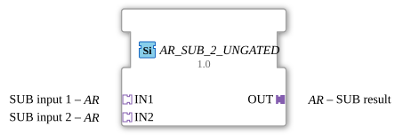

# AR_SUB_2_UNGATED

> ℹ️ **UNGATED variant:** This block is the ungated version of [`AR_SUB_2`](AR_SUB_2.md). It suppresses **no** unchanged repeats – every newly computed result is forwarded unconditionally, even without a value change. This matters for consumers that need a periodic cadence regardless of value change (e.g. derivative/frequency calculations that would otherwise fail to decay toward zero). Any change-detection/gating statements further down this page do **not** apply to this block.

* * * * * * * * * *

## Introduction

The function block `AR_SUB_2_UNGATED` is used to perform an arithmetic subtraction (subtrahend of minuend). It is a generic function block (`GEN_AR_SUB`) that does not use classic discrete inputs and outputs for the calculation, but is based entirely on an adapter-based interface structure. The values and the associated control logic are transferred via unidirectional adapters of type `AR`.

## Interface Structure

### **Event Inputs**

This function block does not have direct, discrete event inputs. Event control is implemented via the connected adapters.

### **Event Outputs**

This function block does not have direct, discrete event outputs. Event forwarding is encapsulated via the output adapter.

### **Data Inputs**

There are no direct data inputs. Input data is received via the adapter inputs.

### **Data Outputs**

There are no direct data outputs. The calculation result is provided via the adapter output.

### **Adapters**

- **Sockets (Input Adapters):**
- **IN1** (Type: `adapter::types::unidirectional::AR`): First input for subtraction (minuend).
- **IN2** (Type: `adapter::types::unidirectional::AR`): Second input for subtraction (subtrahend).
- **Plugs (Output Adapters):**
- **OUT** (Type: `adapter::types::unidirectional::AR`): Output for the result of the subtraction ($OUT = IN1 - IN2$).

## Functionality

The function block subtracts the value at adapter `IN2` from the value at adapter `IN1`. The result of this arithmetic operation is passed to the output plug `OUT`.

Since these are unidirectional adapters, incoming events on sockets `IN1` or `IN2` trigger the internal calculation. After the subtraction is complete, the corresponding update event is signaled to the subsequent function blocks via plug `OUT`.

## Technical Features

- **Generic Type (`GEN_AR_SUB`)**: The function block is implemented generically. This allows for flexible handling of various numeric data types, provided they are permitted within the definition of the `AR` adapter structure.
- **Encapsulation**: By using adapters, data and event lines are bundled. This significantly reduces the number of visible connection lines in the 4diac IDE function block diagram.

## State Overview

The function block does not have a complex internal state machine (no Execution Control Chart - ECC) because it is a purely data-flow-oriented computation block. The processing behavior is as follows:

1. **Waiting for Event**: The function block waits for an update event at `IN1` or `IN2`.
2. **Calculation**: Upon receiving an event, the current values from `IN1` and `IN2` are read and subtracted from each other.
3. **Output**: The result is written to `OUT`, and an output event is triggered at plug `OUT`.

## Application Scenarios

- **Target-Actual Value Comparison**: Calculation of the control deviation ($e = w - x$) in control loops where the signals are already available as adapter structures.
- **Offset Compensation**: Subtraction of a zero-point error or offset from an analog sensor value.
- **Structured Signal Processing**: Mathematical calculations in complex, distributed control systems to maintain a clear software architecture.

## Comparison with Similar Components

Compared to the standard subtraction block `SUB` (based on classic IEC 61131-3 elements), which uses discrete inputs like `IN1` and `IN2` as well as explicit events (`REQ` / `CNF`), `AR_SUB_2_UNGATED` offers a significantly higher level of abstraction through the use of adapters. This saves development time when coupling complex signal elements, but requires consistent use of adapters throughout the entire project.

## Change Detection

This block performs **no** change detection. Every newly computed result is written to the output and its adapter event fired unconditionally, regardless of whether the value differs from the previous run.

## Conclusion

The `AR_SUB_2_UNGATED` is a specialized and modern computing component for the 4diac IDE. It is ideally suited for service-oriented architectures within IEC 61499, where clarity and standardized adapter interfaces are paramount.
