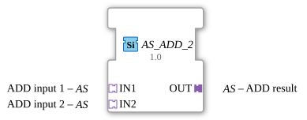

# AS_ADD_2

* * * * * * * * * *
The function block `AS_ADD_2` is a generic arithmetic block designed for adding two values. Unlike classic mathematical function blocks, this block uses an adapter-based interface concept. The use of unidirectional adapters allows data and the associated control events to be transmitted in encapsulated form, contributing to a clean and modular application design in the IEC 61499 development environment (such as 4diac IDE).

*No direct event inputs are available. Event control is integrated into the input adapters.*

*No direct event outputs are available. Event control is integrated into the output adapter.*

*No direct data inputs are available. Data transmission is encapsulated via the input adapters.*

*No direct data outputs are available. Data transmission is encapsulated via the output adapter.*

### Data Outputs

### Data Inputs

### Event Outputs

### Event Inputs

## Interface Structure

## Introduction

### **Adapters**

* **IN1 (Socket):** Type `adapter::types::unidirectional::AS`
* Interface for the first addend of the addition.
* **IN2 (Socket):** Type `adapter::types::unidirectional::AS`
* Interface for the second addend of the addition.
* **OUT (Plug):** Type `adapter::types::unidirectional::AS`
* Interface for outputting the calculated addition result.
* ## Functionality

The function block `AS_ADD_2` performs the mathematical operation:

$$ OUT = IN1 + IN2 $$

As soon as new data is signaled at the input adapters (`IN1` or `IN2`), the function block internally triggers the addition of the transmitted values. The result is then immediately calculated and passed on to the subsequent logic elements via the output adapter `OUT`, along with a corresponding update event.

Due to its generic nature (`GEN_AS_ADD`), the function block can flexibly work with various numeric data types, provided the underlying adapter type `AS` supports them.

* **Generic Implementation:** The function block is based on the generic class `GEN_AS_ADD`, making it reusable for different data types.
* **Adapter Coupling:** Encapsulating signals in adapters drastically reduces the number of visible connection lines in the function block diagram (FBD) and improves the readability of complex applications.
* **Unidirectional Data Flow:** Using the type `unidirectional::AS` ensures that the information flow is clearly defined, running from the signal sources (sockets) to the signal sink (plug).

As a purely mathematical combination block, `AS_ADD_2` does not have a complex internal state diagram (ECC). Its behavior can be divided into three cyclical steps:

1. **Waiting (Idle):** The module waits for an event at one of the input adapters (`IN1` or `IN2`).
2. **Calculate:** Upon receiving an event, the current values from both adapters are read and added together.
3. **Send:** The result of the addition is written to the output adapter `OUT`, triggering an output event.
* **Measurement Offset Calculation:** Adding a calibration or correction value (offset) to an analog sensor value within an adapter-based signal processing chain.
* **Signal Combining:** Summing two independently measured physical quantities (e.g., two partial currents to determine the total current).
* **Cascaded Calculations:** Easy expansion for more than two summands by cascading multiple `AS_ADD_2` blocks.
* **Standard ADD (e.g., F_ADD):** The classic IEC 61131-3 or IEC 61499 ADD block works with discrete variables (e.g., `ANY_NUM`) and separate event ports (`REQ` / `CNF`). `AS_ADD_2`, on the other hand, bundles these signals in adapters, which simplifies wiring but requires the use of the specific adapter type `AS`.
* **Multi-Adder (e.g., ADD_3):** Enables the addition of three or more values in a single function block, but is often more cumbersome when data structures need to be consistently transported via adapters.

The `AS_ADD_2` is a specialized auxiliary function block for modern, modular IEC 61499 control programs. Through the consistent use of adapters, it integrates seamlessly into service-oriented architectures and minimizes design and wiring effort in the 4diac IDE.
## Functionality

## Technical Features

## State Overview

## Application Scenarios

## Comparison with Similar Function Blocks

## Change Detection

The result is only written to the output plug (`OUT`) and its adapter event only sent if the newly computed value differs from the value currently held on `OUT`. If the result is unchanged, no adapter event is sent, avoiding redundant updates on downstream peers.

## Conclusion