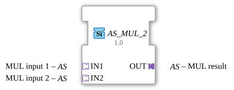

# AS_MUL_2

* * * * * * * * * *
## Introduction

The function block `AS_MUL_2` is a generic, arithmetic multiplication block for IEC 61499 applications in the 4diac IDE. It is used to multiply two input values. The special feature of this block lies in the use of adapter interfaces instead of classic, discrete event and data channels. This enables structured and clear signal transmission.

## Interface Structure

The block does not have any directly accessible standard event or data pins, but rather encapsulates these completely in adapters.

### **Event Inputs**

*No direct event inputs available (events are received via the adapters).*

### **Event Outputs**

*No direct event outputs available (events are sent via the adapters).*

### **Data Inputs**

*No direct data inputs available.*

### **Data Outputs**

*No direct data outputs available.*

### **Adapters**

- **Sockets (Input Interfaces):**
- `IN1` (Type: `adapter::types::unidirectional::AS`): The first input (multiplicand) for calculation.
- `IN2` (Type: `adapter::types::unidirectional::AS`): The second input (multiplier) for calculation.
- **Plugs (Output Interfaces):**
- `OUT` (Type: `adapter::types::unidirectional::AS`): The result of the multiplication ($OUT = IN1 × IN2$).

---

## Functionality

As soon as data and a triggering event are received via the input adapters `IN1` and `IN2`, the function block performs the multiplication. The mathematical product of the two input values is calculated and, together with the corresponding trigger event, is made available for further use in the system via the output adapter `OUT`.

Since the function block is designed generically (`GenericClassName = 'GEN_AS_MUL'`), it adapts flexibly to the underlying data types of the connected adapters (e.g., `INT`, `REAL`, `DINT`).

---

## Technical Features

- **Generic Function Block:** By defining it as `GEN_AS_MUL`, the function block is not tied to a specific data type.
- **Unidirectional Adapter Coupling:** Using the adapter type `adapter::types::unidirectional::AS` ensures a clear, directed flow of data and signals, thus preventing feedback loops.
- **Reduced Editor Complexity:** Encapsulating data and events in adapters minimizes the visual "spaghetti code" problem (too many connecting lines) in the 4diac IDE.

---

## State Overview

The function block behaves purely event-driven:

1. **Waiting State:** The function block waits for an event at sockets `IN1` or `IN2`.
2. **Calculation:** Upon receipt of an event, the current values from `IN1` and `IN2` are read and multiplied.
3. **Output:** The result is applied to `OUT`, and an output event is emitted via plug `OUT`.

---

## Application Scenarios

- **Signal Scaling:** Multiplication of analog sensor values by a scaling factor supplied via an adapter.
- **Modular Calculations:** Used in more complex mathematical computing networks where structured data streams need to be transported via adapter buses.
- **Power Calculation:** Multiplication of current and voltage values to determine electrical power in real-time systems.

---

## Comparison with Similar Components

Compared to a standard IEC 61131-3 / IEC 61499 `MUL` component, which uses individual pins for `REQ`, `CNF`, `IN1`, `IN2`, and `OUT`, `AS_MUL_2` combines these signals into a single logical channel per pin. This increases reusability and ensures a cleaner application design, but requires the definition and use of appropriate adapter types in the project.

---

## Change Detection

The result is only written to the output plug (`OUT`) and its adapter event only sent if the newly computed value differs from the value currently held on `OUT`. If the result is unchanged, no adapter event is sent, avoiding redundant updates on downstream peers.

## Conclusion

The `AS_MUL_2` is a modern and flexible function block for arithmetic operations in IEC 61499 control programs. Thanks to its generic structure and consistent use of adapters, it is ideally suited for clean, modular, and easily maintainable software architectures in industrial automation.
