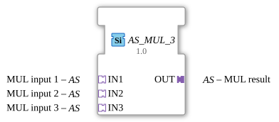

# AS_MUL_3

* * * * * * * * * *
## Introduction

The function block `AS_MUL_3` is a generic function block (FB) for the 4diac IDE, used to perform arithmetic multiplication with three input values. It is based on the use of unidirectional adapters (`adapter::types::unidirectional::AS`), which enables clean structuring and encapsulation of data and control flows in IEC 61499 applications.

## Interface Structure

### **Event Inputs**

*This function block does not have direct event inputs. Control and event processing are handled implicitly via the adapter interfaces.*

### **Event Outputs**

*This function block does not have direct event outputs. Event forwarding is implicit via the adapter interfaces.*

### **Data Inputs**

*This function block has no direct data inputs. Data is transferred via the adapter interface sockets.*

### **Data Outputs**

*This function block has no direct data outputs. Data output is via the adapter interface plug.*

### **Adapters**

All communication for this function block is handled via adapters:

- **Sockets (Input Adapters):**
- **IN1** (Type: `adapter::types::unidirectional::AS`): The first input value (multiplicand 1) for multiplication.
- **IN2** (Type: `adapter::types::unidirectional::AS`): The second input value (multiplicand 2) for multiplication.
- **IN3** (Type: `adapter::types::unidirectional::AS`): The third input value (multiplicand 3) for the multiplication.
- **Plugs (Output Adapters):**
- **OUT** (Type: `adapter::types::unidirectional::AS`): The output adapter that provides the result of the multiplication.

---

## Functionality

The function block `AS_MUL_3` multiplies the values received via the input adapters `IN1`, `IN2`, and `IN3`. As soon as values at the inputs change or a corresponding trigger event is received via the adapters, the calculation is performed and the result is passed to the output adapter `OUT`.

The mathematical formula is:

$$\text{OUT} = \text{IN1} \times \text{IN2} \times \text{IN3}$$

---

## Technical Features

- **Generic Type:** The component is defined as a generic type (`GEN_AS_MUL`). This allows for flexible adaptation to different numeric data types (e.g., `INT`, `REAL`, `LREAL`) supported by the underlying adapter type.
- **Adapter-Based Architecture:** By using unidirectional adapters (`AS`), the cabling effort in the 4diac IDE is drastically reduced, as event and data lines are bundled into a single connection.
- **Adapter-Based Architecture:** ---

## State Overview

This function block behaves like a classic stateless computation block. Execution is triggered by incoming events on the sockets (`IN1`, `IN2`, `IN3`). After successful calculation of the product, the output event is emitted directly via the plug `OUT` along with the calculated value.

--

## Application Scenarios

- **Sensor Scaling and Calibration:** Calculation of corrected measured values where a raw value must be multiplied by two different correction factors.
- **Volume Calculations:** Multiplication of three dimensions (length × width × height) to determine a volume in process engineering.
- **Multi-Stage Gain Control:** Cascaded signal amplification in control engineering.

---

## Comparison with Similar Function Blocks

Compared to standard multiplication function blocks (such as `MUL`), which use separate event and data lines (e.g., `REQ`/`CNF` and standard data types), `AS_MUL_3`, thanks to its encapsulation in adapters, offers a significantly cleaner visual representation in the 4diac IDE's Application Editor. Manually linking "With" connections between events and data is no longer necessary.

--

## Change Detection

The result is only written to the output plug (`OUT`) and its adapter event only sent if the newly computed value differs from the value currently held on `OUT`. If the result is unchanged, no adapter event is sent, avoiding redundant updates on downstream peers.

## Conclusion

`AS_MUL_3` is an efficient, modular, and reusable function block for arithmetic triple multiplication. It is ideally suited for modern, adapter-based software architectures within IEC 61499 and contributes to the clarity of complex control applications.
