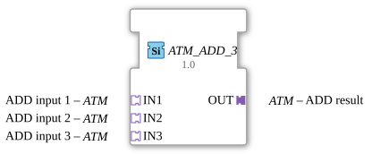

# ATM_ADD_3

* * * * * * * * * *
## Introduction

The function block **ATM_ADD_3** is used to calculate the arithmetic addition of two time values (type `TIME`). It is designed as a generic function block and implements the basic arithmetic operation via adapter interfaces. The block is platform-independent and complies with the IEC 61499 standard.
## Interface Structure

### **Event Inputs**

None

### **Event Outputs**

None

### **Data Inputs**

None

### **Data Outputs**

None

### **Adapters**

| Name | Direction | Type | Comment |
|-------------|----------|-----|-----------|
| `IN1` | Socket | `adapter::types::unidirectional::ATM` | ADD input 1 |
| `IN2` | Socket | `adapter::types::unidirectional::ATM` | ADD input 2 |
| `IN3` | Socket | `adapter::types::unidirectional::ATM` | ADD input 3 |
| `OUT` | Plug | `adapter::types::unidirectional::ATM` | ADD result |

The adapters are of type `unidirectional::ATM` and enable type-safe connections with other function blocks that support the same adapter type.

## Functionality

The function block sums the time values received via adapters `IN1` and `IN2` and provides the result at adapter `OUT`. The starting point of the summation is the identity value `TIME#0s`, so that with only one input actually connected, its value is passed through unchanged. The function block operates generically – the calculation is re-executed on every event at one of the input adapters.

## Technical Features

- **Generic Structure** – The function block uses a generic class name (`GEN_ATM_ADD`) at runtime, defined by the attribute `eclipse4diac::core::GenericClassName`. The same class covers the arities `ATM_ADD_3`, `ATM_ADD_3`, and `ATM_ADD_4` via the GenericClassName mechanism.
- **Adapter-Based** – Instead of individual data inputs and outputs, all signals are routed via unidirectional adapters.
- **Package Information** – The function block is organized in the package `adapter::iec61131::arithmetic`.
- **No State Logic** – The addition is stateless; there is no internal state machine.

## State Overview

The function block does not have a state machine. The calculation is purely event-driven – on any event at one of the input adapters, the sum is recalculated.

## Application-Specific Scenarios

- **Time accumulation** – Summing multiple delay or runtime values into a total duration.
- **Control Engineering** – Combining two dynamically determined time values, e.g., base time plus a surcharge.
- **Generic Library Function Blocks** – Use as the adapter-based counterpart to the classic `ADD` function, specialized for `TIME`.

## Comparison with Similar Function Blocks

Compared to `AR_ADD_2` (addition of two `REAL` values via adapters), `ATM_ADD_3` is specialized for the `TIME` data type. Unlike `AR_MULTIME`/`ATM_AR_MULTIME`, which multiply a time value by a numeric factor, `ATM_ADD_3` adds two values of the same kind.

## Change Detection

The result is only written to the output plug (`OUT`) and its adapter event only sent if the newly computed value differs from the value currently held on `OUT`. If the result is unchanged, no adapter event is sent, avoiding redundant updates on downstream peers.

## Conclusion

`ATM_ADD_3` is a compact, generic function block for adding two time values using adapter interfaces. It is particularly suitable for applications where multiple durations need to be combined into a total duration.
