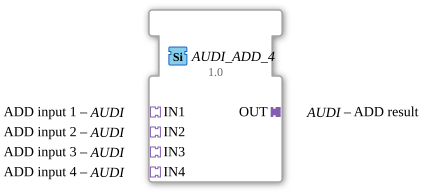

# AUDI_ADD_4

* * * * * * * * * *

## Introduction

The function block `AUDI_ADD_4` is a generic function block for calculating the arithmetic addition of four input values. It is implemented as a purely adapter-based function block without event or data interfaces. The use of adapters enables flexible coupling with other function blocks that use the same adapter type, `adapter::types::unidirectional::AUDI`.

## Interface Structure

### **Event Inputs**

None.

### **Event Outputs**

None.

### **Data Inputs**

The function block has no direct data inputs. The values to be added are provided via adapter inputs.

### **Data Outputs**

The function block has no direct data outputs. The result is passed on via an adapter output.

### **Adapter**

| Name | Direction | Type | Description |
| ------------- | ---------- | ----- | -------------- |
| `IN1` | Socket (Input) | `adapter::types::unidirectional::AUDI` | First Addend |
| `IN2` | Socket (Input) | `adapter::types::unidirectional::AUDI` | Second Addend |
| `IN3` | Socket (Input) | `adapter::types::unidirectional::AUDI` | Third Addend |
| `IN4` | Socket (Input) | `adapter::types::unidirectional::AUDI` | Fourth Addend |
| `OUT` | Plug (Output) | `adapter::types::unidirectional::AUDI` | Result of the Addition |

## Functionality

The function block waits for valid values at the adapter inputs `IN1` through `IN4`. As soon as all four inputs provide a value, the sum `IN1 + IN2 + IN3 + IN4` is calculated and output via the `OUT` adapter. The actual data type specification is defined by the generic attribute `eclipse4diac::core::GenericClassName`, which is set to `'GEN_AUDI_ADD'`. This allows the function block to be instantiated for various numeric data types (e.g., INT, REAL, LREAL), provided the adapter type used, `AUDI`, supports them.

## Technical Features

- **Pure Adapter Function Block**: The function block does not exchange events. Synchronization occurs implicitly through the connected adapter links.
- **Generic Data Type**: The specific data type is defined at runtime via the attributes `GenericClassName` and `TypeHash`. This enables a reusable implementation without changing the logic.
- **No State Machines**: The function block does not contain an ECC (Execution Control Chart) – addition is performed continuously or on demand by the data flow.

## State Overview

The function block has no explicit states. The processing is data-driven: As soon as all four input values are available, the result is calculated and output.

## Application Scenarios

- **Averaging**: In combination with a downstream division block, the sum can be used to calculate an average.
- **Summation of Measured Values**: For summing four analog input signals (e.g., temperature, pressure, flow rate) in an automation solution.
- **Cascaded Addition**: Multiple `AUDI_ADD_4` blocks can be cascaded to process a larger number of summands.

## Comparison with Similar Blocks

- **`ADD` (Standard 61499)**: A typical ADD block has event inputs and data inputs/outputs. The `AUDI_ADD_4`, on the other hand, is entirely adapter-based and has no events, which necessitates stronger coupling between function blocks via adapters.
- **`AUDI_ADD_2`**: A hypothetical function block with only two adapter inputs – `AUDI_ADD_4` extends this to four summands.
- **Generic Function Blocks**: The attribute `GenericClassName` makes this function block similar to the generic approach of IEC 61499, where the data type is only determined at runtime.

- **[`AUDI_ADD_4_UNGATED`](AUDI_ADD_4_UNGATED.md)**: Ungated variant – updates the output on every run, even without a value change.

## Change Detection

The result is only written to the output plug (`OUT`) and its adapter event only sent if the newly computed value differs from the value currently held on `OUT`. If the result is unchanged, no adapter event is sent, avoiding redundant updates on downstream peers.

## Conclusion

The `AUDI_ADD_4` is a flexible, pure adapter function block for adding four values. Thanks to its generic design, it is suitable for various numeric data types and can be used in modular automation projects that rely on adapter-based communication. Eliminating events simplifies handling in data-driven systems, but requires correct adapter cabling.

---

### 🌐 Related topic subpages on ms-muc-docs.de

- [🌐 Eclipse 4diac IDE & Color Reference on ms-muc-docs.de](https://www.ms-muc-docs.de/iec-61499/eclipse-4diac/)

]
