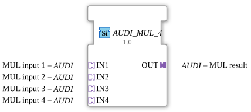

# AUDI_MUL_4

* * * * * * * * * *
## Introduction
The function block **AUDI_MUL_4** performs an arithmetic multiplication based on four input values. It is a generic function block (FB) that operates via adapter interfaces with a unidirectional data structure of type `adapter::types::unidirectional::AUDI`. The block is specified according to IEC 61499-2 and is used particularly in automation solutions where scalable multiplication of multiple input variables is required.
## Interface Structure
### **Event Inputs**
None

### **Event Outputs**
None

### **Data Inputs**
The block does not have any traditional data inputs. All input values are provided via adapter interfaces.

### **Data Outputs**

This function block does not have traditional data outputs. The multiplication result is output via an adapter plug.

### **Adapter**

| Type | Name | Direction | Comment |

|------|------|----------|-----------|

| `adapter::types::unidirectional::AUDI` | IN1 | Input (Socket) | MUL input 1 |

| `adapter::types::unidirectional::AUDI` | IN2 | Input (Socket) | MUL input 2 |

| `adapter::types::unidirectional::AUDI` | IN3 | Input (Socket) | MUL input 3 |

| `adapter::types::unidirectional::AUDI` | IN4 | Input (Socket) | MUL input 4 |

| `adapter::types::unidirectional::AUDI` | OUT | Output (Plug) | MUL result |

The adapter `AUDI` is defined as a unidirectional data type and transports the respective numerical values as well as the result.

## Functionality
The function block (FB) multiplies the values applied to the four adapters **IN1**, **IN2**, **IN3**, and **IN4** and provides the product at the output adapter **OUT**. Processing is asynchronous, occurring as soon as all required input data is available. The function block is designed as a generic FB, meaning the data type used can be specified at runtime or during deployment via the attribute `eclipse4diac::core::GenericClassName`. By default, the name `'GEN_AUDI_MUL'` is used.

## Technical Features
- **Generic Implementation**: The function block (FB) is generic and can be adapted to various numeric data types (e.g., INT, REAL, LREAL). Specific implementation is achieved via the class attribute.
- **Adapter-Based Communication**: Adapters are used instead of direct inputs/outputs. This allows for flexible data encapsulation and enables reuse in different contexts.
- **Type Hash**: The attribute value `eclipse4diac::core::TypeHash` is empty and can be supplemented at runtime with the actual hash of the data type used.
- **No State Machines**: The FB does not have an event-driven state machine (ECM), as multiplication is purely data-driven.

## State Overview

Not applicable – the function block operates without a state machine. Multiplication is triggered by the availability of input data.

## Application Scenarios
- **Process Automation**: Multiplication of four analog measurements (e.g., flow rate, pressure, temperature, density) to calculate a mass flow correction.
- **Machine Control**: Calculation of total loads or torques from multiple individual variables.
- **Data Preprocessing**: Scaling or weighting of sensor data in a higher-level control system.
- **Image Processing**: Combination of multiple channels (e.g., red, green, blue, intensity) through multiplication.

## Comparison with Similar Function Blocks
Unlike classic IEC 61131 multiplication function blocks (e.g., `MUL` with fixed data types), `AUDI_MUL_4` offers a generic, adapter-based interface that enables flexible reuse. Other multipliers, such as `MUL_2` or `AUDI_MUL_2`, process only two inputs, while `AUDI_MUL_4` multiplies four inputs simultaneously. Function blocks with event-driven processing (e.g., `MUL_E`) require additional triggers, whereas this function block operates purely data-driven.

## Conclusion
The function block **AUDI_MUL_4** is a specialized, generic multiplication block for four input values. Its use of adapters and generic design make it particularly suitable for modular, reusable automation solutions where flexibility and scalability are paramount. The simple, event-free interface facilitates integration into data-driven architectures.

# Conclusion ---

### 🌐 Related topic subpages on ms-muc-docs.de
* [🌐 Eclipse 4diac IDE & Color Reference on ms-muc-docs.de](https://www.ms-muc-docs.de/iec-61499/eclipse-4diac/)

]
