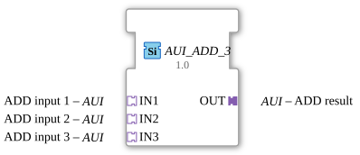

# AUI_ADD_3

* * * * * * * * * *
## Introduction

The function block `AUI_ADD_3` is a generic arithmetic function block for the IEC 61499 development environment (4diac-ide). Its primary function is to add three input values, which are passed via standardized, unidirectional adapter interfaces. The result of the addition is also output via a corresponding adapter. By encapsulating data and control events in adapters, wiring in the application editor is significantly simplified, and the clarity of the system design is improved.

## Interface Structure

The interfaces of `AUI_ADD_3` are based entirely on adapters to ensure a clean signal structure.

### **Event Inputs**

*No direct event inputs are defined.* Event control is handled implicitly via the input adapters (sockets).

### **Event Outputs**

*No direct event outputs are defined.* Event forwarding is handled implicitly via the output adapter (plug).

### **Data Inputs**

*No direct data inputs are defined.* Data is provided via the input adapters.

### **Data Outputs**

*No direct data outputs are defined.* The result is provided via the output adapter.

### **Adapters**

#### Sockets (Input Adapters)

- **IN1** (Type: `adapter::types::unidirectional::AUI`): First input value (addend 1) for arithmetic addition.
- **IN2** (Type: `adapter::types::unidirectional::AUI`): Second input value (addend 2) for arithmetic addition.
- **IN3** (Type: `adapter::types::unidirectional::AUI`): Third input value (addend 3) for arithmetic addition.

#### Plugs (Output Adapters)

- **OUT** (Type: `adapter::types::unidirectional::AUI`): Output for the calculated result (sum of `IN1 + IN2 + IN3`).

---

## Functionality

The function block performs three-digit addition according to the following mathematical formula:

$$\text{OUT} = \text{IN1} + \text{IN2} + \text{IN3}$$

As soon as an update event arrives at one of the input adapters (`IN1`, `IN2`, or `IN3`), the function block reads the current values of all three inputs. It then calculates the sum and provides the result at the output adapter `OUT`. Simultaneously, the corresponding update event is passed on via the `OUT` adapter to inform subsequent function blocks of the new value.

 Since this is a generic function block (`GEN_AUI_ADD`), the supported data type (e.g., `INT`, `REAL`, `LREAL`) depends on the specific implementation and definition of the adapter type used, `AUI`.

---

## Technical Features

- **Generic Function Block:** The attribute `eclipse4diac::core::GenericClassName = 'GEN_AUI_ADD'` allows the function block to be used flexibly for various numeric data types, provided the adapters used support this.
- **Compact Design:** By using adapters instead of separate event and data ports, the visual "spaghetti code" problem in 4diac systems is minimized.

---

- **Generic Function Block:** * **Unidirectional Communication:** The use of unidirectional adapters (`unidirectional::AUI`) ensures that the data flow is clearly defined from the inputs to the output.

---

## State Overview

The function block operates in an event-driven and stateless (i.e., purely reactive) manner:

1. **Wait State:** The function block waits for a trigger event at one of the sockets (`IN1`, `IN2`, `IN3`).
2. **Calculation:** Upon receiving an event, the data values are read and added.
3. **Output:** The calculated value is written to the plug `OUT`, and the trigger event is fired.
4. **Return:** The block immediately returns to standby mode.

---

## Application Scenarios

- **Sensor Value Aggregation:** Addition of three analog measured values (e.g., three temperature sensors to determine total heat or three flow meters).
- **Setpoint Generation:** Combining the base setpoint, manual offset, and automatic correction value in process engineering.
- **Power Calculation:** Summing the active power of three individual phases of an electrical network to obtain a total power value.

---

## Comparison with Similar Blocks

- **Standard ADD Block (IEC 61131-3):** A classic `ADD` block has discrete inputs for data and events. `AUI_ADD_3` logically groups these in adapters, which increases reusability and clarity.
- **AUI_ADD_2 (Dual Adder):** While a dual adder would require cascading two function blocks to sum three values, `AUI_ADD_3` accomplishes this in a single step. This saves resources and reduces system latency.

---

## Change Detection

The result is only written to the output plug (`OUT`) and its adapter event only sent if the newly computed value differs from the value currently held on `OUT`. If the result is unchanged, no adapter event is sent, avoiding redundant updates on downstream peers.

## Conclusion

The `AUI_ADD_3` is an efficient auxiliary function block for arithmetic operations in modern IEC 61499 control applications. Its consistent use of the adapter concept allows it to integrate seamlessly into service-oriented and modular software architectures, contributing to reduced complexity in graphical programming.
