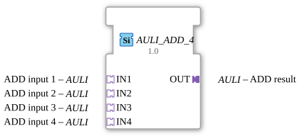

# AULI_ADD_4

*(No image available)*

* * * * * * * * * *
## Introduction

The function block `AULI_ADD_4` is a generic function block (FB) designed for the mathematical addition of four values. The unique feature of this block lies in its use of adapters of type `AULI` (unidirectional). By encapsulating data and event transmission within adapters, the block enables clear and modular wiring within IEC 61499 applications in the 4diac IDE.

## Interface Structure

### **Event Inputs**

*There are no direct event inputs. Event control is implicit via the connected adapter sockets.*

### **Event Outputs**

*There are no direct event outputs. Event control is implicit via the connected adapter plug.*

### **Data Inputs**

*There are no direct data inputs. Data is transferred via the input adapters.*

### **Data Outputs**

*There are no direct data outputs. Data is output via the output adapter.*

### **Adapters**

#### **Sockets (Input Adapters)**

* **IN1** (Type: `adapter::types::unidirectional::AULI`): First addend for the addition operation.
* **IN2** (Type: `adapter::types::unidirectional::AULI`): Second addend for the addition operation.
* **IN3** (Type: `adapter::types::unidirectional::AULI`): Third addend for the addition operation.
* **IN4** (Type: `adapter::types::unidirectional::AULI`): Fourth addend for the addition operation.

#### **Plugs (Output Adapters)**

* **OUT** (Type: `adapter::types::unidirectional::AULI`): Contains the result of the addition (`IN1 + IN2 + IN3 + IN4`) and the corresponding output event.

## Functionality

As soon as a new value event is signaled at one or more of the input adapters (`IN1` to `IN4`), the function block reads the current values from all four adapters. These values are added mathematically:

$$\text{Result} = \text{Value}_{IN1} + \text{Value}_{IN2} + \text{Value}_{IN3} + \text{Value}_{IN4}$$

The calculated result is passed to the output adapter `OUT`, and simultaneously, the corresponding event is triggered at the output plug to inform subsequent function blocks about the value update.

## Technical Features

* **Generic Function Block:** The function block is based on the generic class `GEN_AULI_ADD`. This means that it can flexibly respond to different data types within the `AULI` adapter structure.
* **Unidirectional Adapters:** Unidirectional adapters (`unidirectional::AULI`) are used. This simplifies data flow, as information and events flow exclusively in one direction (from inputs to output).
* **Reduced wiring effort:** By using adapters, event and data lines do not need to be run separately. A single adapter channel bundles all relevant signals.

## State overview

The function block behaves in an event-driven and stateless manner (i.e., it has no internal memory for historical values):

1. **Wait state:** The function block waits for an event at one of the inputs (`IN1` to `IN4`).
2. **Calculation:** When an event arrives, the data from all four inputs are summed.
3. **Output:** The calculated value is applied to `OUT`, and the output event is triggered. The function block immediately returns to the wait state.

## Application Scenarios

* **Measurement Summing:** Summarizing four individual sensor values (e.g., energy measurements from four consumers, flow rates from four pipes) into a single total value.
* **Average Preparation:** Pre-summing four data points before subsequent division to calculate the average.
* **Modular Control Architectures:** Use in complex systems where signals are already standardized as `AULI` adapters.

## Comparison with Similar Function Blocks

* **Standard ADD Function Blocks (e.g., `ADD` from IEC 61131-3):** These use direct data and event ports (such as `REQ`, `CNF`, `IN1`, `IN2`). `AULI_ADD_4`, on the other hand, completely encapsulates these interfaces in adapters, resulting in a cleaner control flow diagram.
* **AULI_ADD_2:** A similar function block, but with only two inputs. `AULI_ADD_4` eliminates the need to cascade multiple individual addition function blocks when adding four values.

## Conclusion

The `AULI_ADD_4` function block is a highly efficient, clear, and modern block for arithmetic operations in IEC 61499. Through the consistent use of the `AULI` adapter structure, it significantly reduces the number of connection lines in the 4diac IDE application editor and is ideally suited for modular automation solutions.