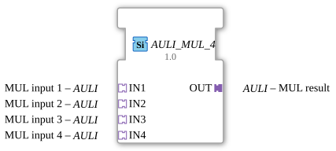

# AULI_MUL_4

*(No image available)*

* * * * * * * * * *
The function block `AULI_MUL_4` is a generic arithmetic block for the 4diac-ide. It is used to multiply four input values. The block uses an adapter-based interface concept to minimize the number of individual event and data connections in the application diagram and to ensure clean encapsulation.

*There are no direct event inputs. Event control is handled entirely via the adapters.*

*There are no direct event outputs. Event control is handled entirely via the adapters.*

*There are no direct data inputs. Data transmission is encapsulated via the input adapters.*

*There are no direct data outputs. Data transmission is encapsulated via the output adapter.*

### Data Outputs
### Data Inputs
### Event Outputs
### Event Inputs
## Interface Structure
## Introduction
### **Adapters**

#### **Sockets (Input Adapters)**

* **IN1** (Type: `adapter::types::unidirectional::AULI`): First multiplicand.

* **IN2** (Type: `adapter::types::unidirectional::AULI`): Second multiplicand.

* **IN3** (Type: `adapter::types::unidirectional::AULI`): Third multiplicand.

* **IN4** (Type: `adapter::types::unidirectional::AULI`): Fourth multiplicand.

#### **Plugs (Output Adapters)**

* **OUT** (Type: `adapter::types::unidirectional::AULI`): Result of the multiplication.

## Functionality
As soon as new values are signaled at the input adapters (`IN1` to `IN4`), the module performs the multiplication of the four values.

The mathematical formula is:
$$\text{OUT} = \text{IN1} \times \text{IN2} \times \text{IN3} \times \text{IN4}$$

The result and the associated processing event are then output via the output adapter `OUT`. Since these are unidirectional adapters of type `AULI`, data and trigger signals flow directly from the sockets to the plug.

* **Generic Block:** The block is declared as a generic type (`GenericClassName = 'GEN_AULI_MUL'`). This allows for flexible adaptation to different numeric data types supported by the underlying `AULI` adapter type.

* **Adapter Encapsulation:** Using adapters instead of standard event/data pins greatly simplifies the system design (avoiding "spaghetti wiring" in the control flow).

The function block is essentially stateless. Computation is purely reactive, based on the values and events present at the input adapters. No internal historical states are stored.

* ## Application Scenarios

* **Sensor Value Scaling:** Calculation of corrected measured values where a raw value must be multiplied by several calibration, correction, or conversion factors.

* **Volume and Mass Calculation:** Physical calculations in process engineering that require the product of several variables (e.g., $V = l \times b \times h$ taking into account an additional density factor).

* **Structured Signal Processing:** Use in more complex control applications where data is distributed modularly via adapter structures.

* **Structured Signal Processing:** Use in more complex control applications where data is distributed modularly via adapter structures. ## Comparison with Similar Components

* **Standard MUL Component (IEC 61131-3 / IEC 61499):** Standard multipliers typically have dedicated pins, such as `REQ`, `CNF`, as well as standard data inputs (e.g., `IN1`, `IN2`). `AULI_MUL_4` significantly simplifies interface design through the use of adapters.

* **Cascaded Dual Multipliers:** To multiply four values using standard components, three conventional `MUL` components would need to be cascaded. `AULI_MUL_4` consolidates this logic into a single function block, saving resources and improving clarity.

The `AULI_MUL_4` is a practical and modern function block for multiplying four numeric values using the IEC 61499 adapter concept. It is ideally suited for cleanly structured, readable, and maintainable control applications in the 4diac IDE.
## Technical Features
## State Overview
## Application Scenarios
## Comparison with Similar Function Blocks
## Conclusion