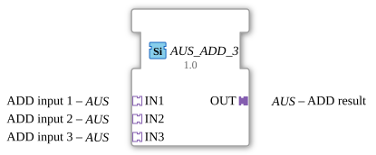

# AUS_ADD_3

*(No image available)*

* * * * * * * * * *

## Introduction

The function block `AUS_ADD_3` is a generic arithmetic addition block for the 4diac IDE. It is used to add the values from three input adapters (`IN1`, `IN2`, and `IN3`) and output the result via an output adapter (`OUT`). The block uses unidirectional adapters of type `AUS` for this purpose.

## Interface Structure

### **Event Inputs**

*No direct event inputs are available. Control and triggering are handled via the adapter interfaces.*

### **Event Outputs**

*No direct event outputs are available. Event forwarding is handled via the adapter interfaces.*

### **Data Inputs**

*No direct data inputs are available.*

### **Data Outputs**

*No direct data outputs are available.*

### **Adapters**

The module communicates exclusively via adapter interfaces:

**Sockets (Input Adapters):**

- **IN1** (Type: `adapter::types::unidirectional::AUS`): First addend for addition.
- **IN2** (Type: `adapter::types::unidirectional::AUS`): Second addend for addition.
- **IN3** (Type: `adapter::types::unidirectional::AUS`): Third addend for addition.

**Plugs (Output Adapters):**

- **OUT** (Type: `adapter::types::unidirectional::AUS`): Output adapter that carries the result of the addition (`IN1 + IN2 + IN3`).

## Functionality

As soon as a new event or a changed data value is signaled at one of the input adapters (`IN1`, `IN2`, or `IN3`), the function block internally performs an addition of the values.

The calculation follows the mathematical formula:

$$\text{OUT} = \text{IN1} + \text{IN2} + \text{IN3}$$

After successful calculation, the result and the associated update event are forwarded to subsequent function blocks via the output adapter `OUT`.

## Technical Features

- **Generic Function Block:** The function block is based on the generic class `GEN_AUS_ADD` (attribute `eclipse4diac::core::GenericClassName`). This allows for flexible adaptation to different data types within the `AUS` adapter.
- **Adapter-Based Architecture:** By using adapters instead of standard event/data connections, the wiring effort in the function block diagram is drastically reduced, as events and data are bundled in a single channel (the adapter).
- **Unidirectional Data Flow:** The adapters used are unidirectional, which defines a clear direction of data processing from inputs to output.

## State Overview

Since it is a combinational (or stateless) function block, `AUS_ADD_3` has no complex internal states (no state machine). The processing is purely event-driven:

1. **Wait State:** The function block waits for an event at one of the inputs (`IN1`, `IN2`, `IN3`).
2. **Calculation:** Upon arrival of an event, the data is read and summed.
3. **Update:** The result is written to `OUT`, and the corresponding output event is triggered on the adapter.

## Application Scenarios

- **Measurement Unit:** Combining and summing three analog sensor values (e.g., three flow meters, temperature sensors, or current consumers) distributed throughout the system via adapter interfaces.
- **Setpoint Generation:** Adding base setpoints, correction values, and offsets in control systems.

## Comparison with Similar Function Blocks

- **Standard ADD (IEC 61131-3):** Classic `ADD` function blocks use dedicated event and data lines. `AUS_ADD_3`, on the other hand, encapsulates these in adapters, resulting in cleaner software architectures.
- **OFF_ADD_2 / OFF_ADD_4:** Compared to variants with two or four inputs, this function block is specifically optimized for exactly three input channels to avoid unused interfaces in the program code.

## Change Detection

The result is only written to the output plug (`OUT`) and its adapter event only sent if the newly computed value differs from the value currently held on `OUT`. If the result is unchanged, no adapter event is sent, avoiding redundant updates on downstream peers.

## Conclusion

The `AUS_ADD_3` is an efficient and reusable function block for adding three signals. Through the consistent use of unidirectional adapters, it promotes a modular, clear, and maintainable application design within the IEC 61499 development environment.
