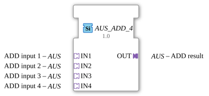

# AUS_ADD_4

        +-----------------------------------------+
        |                AUS_ADD_4                |
  IN1 ==# (Socket)                          (Plug) #== OUT
  IN2 ==# (Socket)                                |
  IN3 ==# (Socket)                                |
  IN4 ==# (Socket)                                |
        +-----------------------------------------+

* * * * * * * * * *
The function block `AUS_ADD_4` performs the arithmetic addition of four input values. It is a generic function block (FB) specifically designed for use with unidirectional adapters. By encapsulating the signals within adapters, the block enables a clean and clear structuring of data flows within IEC 61499 applications.

*This function block does not have direct, traditional event inputs. Event control is handled implicitly via the adapter interfaces.*

*This function block does not have direct, traditional event outputs. Event forwarding occurs via the adapter interfaces.*

*There are no direct data inputs. Data transmission occurs exclusively via the assigned adapters.*

*There are no direct data outputs. The result is provided via the output adapter.*

### Data Outputs
### Data Inputs
### Event Outputs
### Event Inputs
## Interface Structure
## Introduction
### **Adapters**

#### **Sockets (Input Adapters)**
* **IN1** (Type: `adapter::types::unidirectional::AUS`): First addend of the addition.

* **IN2** (Type: `adapter::types::unidirectional::AUS`): Second addend of the addition.

* **IN3** (Type: `adapter::types::unidirectional::AUS`): Third addend of the addition.

* **IN4** (Type: `adapter::types::unidirectional::AUS`): Fourth addend of the addition.

#### **Plugs (Output Adapters)**

* **OUT** (Type: `adapter::types::unidirectional::AUS`): Interface for outputting the calculated addition result.

## Functionality
The function block `AUS_ADD_4` receives numerical values continuously or event-driven via its four input adapters (`IN1` to `IN4`). As soon as data is present at the sockets or an update event arrives, the function block performs the arithmetic addition of the four values:

$$\text{OUT} = \text{IN1} + \text{IN2} + \text{IN3} + \text{IN4}$$

The result of this calculation is immediately passed to the output plug `OUT` and made available for subsequent program components. Since these are unidirectional connections, data flows strictly in a directed direction from the inputs to the output.

* **Generic Block:** By being assigned to the generic class `GEN_AUS_ADD`, the block is highly reusable and adapts flexibly to the underlying data types of the adapters.

* **Reduced Routing Complexity:** By using adapters instead of individual event and data lines, the number of connection lines in the 4diac IDE is drastically reduced, which significantly improves the readability of large application diagrams.

* **Compiler Membership:** The block is organized in the package `adapter::iec61131::arithmetic`.

The block behaves like a combinational component (or a stateless function block). It does not store historical values between calculation cycles. Each update to one of the input adapters directly triggers the calculation and updates the output.

* **Signal Summation:** Combining and adding four analog sensor values (e.g., determining the total flow rate from four individual flow meters or the total power consumption of four electrical devices).

* **Average Preparation:** Summing four measurement points as a preparatory step for subsequent division to calculate the average.

* **Combinatorial Control Logic:** Aggregating weighted control signals in more complex distributed systems.

* ## Comparison with Similar Function Blocks

Compared to a standard adder (e.g., the classic `ADD` function block from the IEC 61131-3 library), which works directly with elementary data types (such as `REAL` or `INT`), `AUS_ADD_4` relies entirely on adapter coupling. This saves time during instantiation and wiring, but requires that the source and destination signals are encapsulated in the adapter type `AUS`.

The `AUS_ADD_4` is a specialized and efficient auxiliary function block for structured application development in 4diac. It is ideally suited for cleanly structured control applications where signal processing is to be consistently implemented via adapter pipelines.
## Technical Features
## State Overview
## Application Scenarios
## Comparison with Similar Function Blocks
## Conclusion