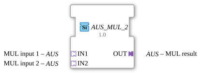

# AUS_MUL_2

*(No image available)*

* * * * * * * * * *

## Introduction

The function block `AUS_MUL_2` is a generic arithmetic block for the 4diac IDE, used for multiplying two values. Unlike classic mathematical function blocks, this block uses an adapter-based concept for data transmission. This enables structured, modular, and clear signal wiring in complex IEC 61499 applications.

## Interface Structure

### **Event Inputs**

*This function block does not have direct event inputs. Event control is handled via the connected adapters.*

### **Event Outputs**

*This function block does not have direct event outputs. Event forwarding is handled via the output adapter.*

### **Data Inputs**

*This function block has no direct data inputs.*

### **Data Outputs**

*This function block has no direct data outputs.*

### **Adapters**

All communication (data and associated trigger events) is implemented via unidirectional adapters of type `AUS`.

#### **Sockets (Input Adapters)**

- **IN1** (Type: `adapter::types::unidirectional::AUS`): The first multiplicand (input 1).
- **IN2** (Type: `adapter::types::unidirectional::AUS`): The second multiplicand (input 2).

#### **Plugs (Output Adapters)**

- **OUT** (Type: `adapter::types::unidirectional::AUS`): The result of the multiplication ($IN1 × IN2$).

--

## Functionality

As soon as a new event indicating new data is signaled at the input adapters `IN1` or `IN2`, the function block internally performs the multiplication:

$$OUT = \text{IN1} × \text{IN2}$$

The result of the calculation and the corresponding confirmation event are then passed on to subsequent function blocks via the output plug `OUT`. Since this is a generic function block (`GEN_AUS_MUL`), the internal processing adapts flexibly to the data type defined in the adapter.

---

## Technical Features

- **Generic Nature:** The function block is declared as a generic type (`GenericClassName = 'GEN_AUS_MUL'`). This allows for flexible handling of various numeric data types (e.g., `INT`, `REAL`, `LREAL`) defined by the adapter structure.
- **Adapter Focus:** Reducing the number of traditional pins to adapters significantly minimizes the wiring effort in the function block diagram and ensures a clean, object-oriented design.

- ---

## State Overview

The function block operates in an event-driven manner based on the state changes of the adapters:

1. **IDLE (Standby):** The function block waits for incoming values/events at sockets `IN1` and `IN2`.
2. **CALCULATION:** Upon receiving a trigger, the data values contained in the adapters are multiplied.
3. **OUTPUT:** The product is written to adapter `OUT`, and a send event is triggered. The function block returns to the *IDLE* state.

--

## Application Scenarios

- **Measurement Scaling:** Multiplication of a raw value (e.g., from a sensor adapter) by a calibration factor.
- **Power Calculation:** Multiplication of current and voltage values read in via standardized adapter interfaces.
- **Modular Signal Processing:** Use in complex control loops where signal chains are neatly encapsulated by adapters to maintain clarity in the control diagram.

---

## Comparison with Similar Components

Compared to the standard IEC 61131-3 multiplication component (`MUL`), which uses individual pins for `REQ`, `CNF`, and direct data inputs and outputs, `AUS_MUL_2` bundles all these signals into adapters. This prevents "cable clutter" in the function block diagram but requires that the connected signals are already in the `AUS` adapter format.

---

## Change Detection

The result is only written to the output plug (`OUT`) and its adapter event only sent if the newly computed value differs from the value currently held on `OUT`. If the result is unchanged, no adapter event is sent, avoiding redundant updates on downstream peers.

## Conclusion

The `AUS_MUL_2` is a modern, robust, and reusable function block for multiplication in the 4diac IDE. Its consistent use of unidirectional adapters makes it ideally suited for service-oriented architectures and structured application designs in industrial environments.
