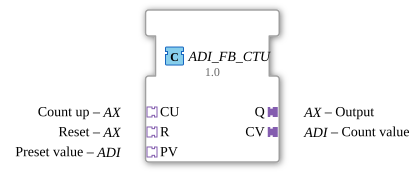

# ADI_FB_CTU

* * * * * * * * * *
## Introduction
The ADI_FB_CTU is an up-counter for DINT integers, whose inputs and outputs are provided via standardized adapters (AX and ADI). It encapsulates the standard function block `FB_CTU_DINT` and enables its integration into modular, adapter-based systems. This function block is suitable for general counting tasks in automation technology.
## Interface Structure
The function block does not have direct event or data interfaces, but only adapters for connection. The following table explains the available adapters, their type, and their function.

| Direction | Name | Adapter Type | Description |
|----------|------|-------------|--------------|
**Input (Socket)** | `CU` | `AX` | Count pulse input (event + data) |
**Input (Socket)** | `R` | `AX` | Reset input (event + data) |
**Input (Socket)** | `PV` | `ADI` | Preset value for comparison |
**Output (Plug)** | `Q` | `AX` | Output signal – active when meter reading ≥ PV |
**Output (Plug)** | `CV` | `ADI` | Current meter reading |

The adapters `AX` (event adapter) and `ADI` (data adapter) are unidirectional. Both events and their associated data values are transmitted via these adapters.

### **Event Inputs**
No direct event inputs. Events are supplied via the adapters `CU` and `R` (of type `AX`).

### **Event Outputs**
A direct event output, `CNF`, signals confirmation of processing. Additionally, an output event is sent via the adapter `Q` (type `AX`) with each update.

### **Data Inputs**
No direct data inputs. The default value is provided via the adapter `PV` (type `ADI`).

### **Data Outputs**
No direct data outputs. The current counter reading is output via the adapter `CV` (type `ADI`).

### **Adapters**
The function block uses three sockets (input adapters) and two plugs (output adapters):

- **`CU` (socket, `AX`)**: Count pulse – the internal counter is incremented with each event.
- **`R` (socket, `AX`)**: Reset – resets the counter to zero.
- **`PV` (Socket, `ADI`)**: Preset Value – sets the threshold at which output `Q` becomes active.
- **`Q` (Plug, `AX`)**: Output – becomes active as soon as the counter value reaches or exceeds the value of `PV`.
- **`CV` (Plug, `ADI`)**: Current counter value – can be read by downstream function blocks.

## Functionality
The ADI_FB_CTU implements a simple increment counter with preset value comparison.

- Each event at input `CU` increments the internal counter by 1.

An event at input `R` resets the counter to 0.

The default value `PV` is updated when an event arrives at input `PV`.

After each processing operation (regardless of whether it was triggered by `CU`, `R`, or `PV`), the acknowledgment event `CNF` is output. Simultaneously, output adapter `Q` is also updated with an event, and the current counter value is provided via adapter `CV`.

Internally, a standard function block `FB_CTU_DINT` is used, with its inputs and outputs wired via the adapters. The counter value is of type `DINT` (32-bit integer).

## Technical Features
- **Adapter-based interface** – enables loose coupling and easy integration into adapter-based architectures (e.g., according to IEC 61499).

`` - **Unidirectional Adapters** – the adapters `AX` and `ADI` each transmit in only one direction.

- **Acknowledgement Event `CNF`** – any event at an input triggers an immediate acknowledgement.
- **No Edge Detection** – the function block reacts to any event, not to the rising or falling edges of a digital signal.
- **Note in Source Code** – the frequent output of the `Q.E1` event can lead to unnecessary load in time-critical applications; filtering may be necessary.

## State Overview
The function block has only one internal state: the current counter value (initial value = 0). Depending on the incoming events, the following state transitions occur:

| Event | Condition | New State (Counter) | Output |
| Event | Condition | New State (Counter) | Output |
** ... |----------|-----------|------------------------|---------|
| `CU` | – | Counter + 1 | `CNF`, `Q.E1`, `CV` |
| `R` | – | 0 | `CNF`, `Q.E1`, `CV` |
| `PV` | – | unchanged | `CNF`, `Q.E1`, `CV` (PV value is stored internally) |

Output `Q` (via the adapter) is set as soon as `Zähler ≥ PV` is reached. The current value of `Q` is included with every output.

## Application Scenarios
- **Event Counting** – Counting pulses, e.g., part passage, machine cycles.
- **Fill Level Monitoring** – Recording the number of containers or batches.
- **Production Control** – Triggering an action when a specific quantity is reached.
- **Time Measurement** – In combination with a pulse generator, the number of pulses can be used as a measure of time.
- **Adapter-based automation systems** – wherever a standardized adapter interface is required.

## Comparison with similar components

| Component | Properties |
|----------|---------------|
| `CTU` (Standard, without adapter) | Same counting function, but with direct event and data inputs/outputs. Easier to use in classic IEC 61499 networks. |
| `ADI_FB_CTUD` | Up/down counter, also adapter-based. Additionally offers a down count input. |
| `FB_CTU_DINT`(Internal) | Same counting logic, but without adapter encapsulation. The adapter version offers a uniform, modular interface. |
| `CTU` with AX filter | If edge detection is required, pure change detection can be achieved by preceding it with an AX_D_FF. |

The ADI_FB_CTU is designed as a wrapper for the standard counter and facilitates reuse in adapter-based frameworks.

## Conclusion
The ADI_FB_CTU is a flexible, adapter-based increment counter for DINT values. It encapsulates the proven counting logic of `FB_CTU_DINT` and makes it available via standardized adapters (AX and ADI). The fact that output events are generated with each update should be considered during system design. The function block is ideally suited for modular, expandable automation solutions that require a uniform adapter interface.
