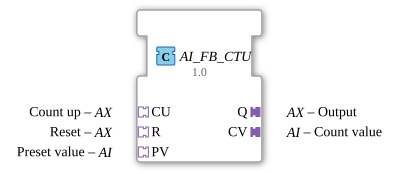

# AI_FB_CTU

* * * * * * * * * *
## Introduction
The **AI_FB_CTU** is an up counter for integers (INT) that encapsulates the IEC 61131-3 functionality of a CTU (Counter Up) in an adapter-based form factor. It is specifically designed for use in the 4diac IDE and allows for modular connection via unidirectional adapter interfaces. The block fires an acknowledgment event with each update of its inputs (CU, R, PV), making it suitable for time-controlled or event-driven counting tasks.
## Interface Structure
### **Event Inputs**
The block does not have direct event inputs. Event control is handled exclusively via the adapter sockets **CU**, **R**, and **PV**. Each of these sockets provides an event (E1) that triggers the internal process.

- **CU.E1** – Counting pulse (event from the counting-up adapter)
- **R.E1** – Reset (event from the reset adapter)
- **PV.E1** – Set preset value (event from the preset-value adapter)

### **Event Outputs**
- **CNF** (Type: Event) – Confirmation event triggered after each successful processing of all three possible events.

The output adapters **Q** and **CV** are also served with the same event:

- **Q.E1** – Event for the output adapter (counter reading reaches or exceeds the preset value)
- **CV.E1** – Event for the current count value

### **Data Inputs**
All data inputs are provided via the adapter sockets:

| Adapter | Data Input | Type | Description |
|---------|---------------|-----|--------------|
| CU.D1 | CU | INT | Count Up – Count pulse (increments with each event) |
| R.D1 | R | INT | Reset – Value to which the counter is reset (typically 0) |
| PV.D1 | PV | INT | Preset Value – Threshold at which output Q becomes active |

### **Data Outputs**
- **Q.D1** (via adapter Q, type AX) – Output signal (BOOL), becomes TRUE when the counter value is ≥ PV.
- **CV.D1** (via adapter CV, type AI) – Current counter value (INT).

### **Adapters**

| Name | Type | Direction | Description |
|------|-----|----------|--------------|
| CU | adapter::types::unidirectional::AX | Socket (Input) | Event and data adapter for the counter pulse |
| R | adapter::types::unidirectional::AX | Socket (Input) | Event and data adapter for the reset |
| PV | adapter::types::unidirectional::AI | Socket (Input) | Data adapter (value only, no event) for the preset value |
| Q | adapter::types::unidirectional::AX | Plug (Output) | Event and data adapter for the counter output |
| CV | adapter::types::unidirectional::AI | Plug (Output) | Data adapter (value only) for the current counter reading |

## Functionality

The **AI_FB_CTU** internally uses a standardized IEC 61131-3 CTU block (`iec61131::counters::FB_CTU`). Upon each incoming event (CU.E1, R.E1, or PV.E1), the internal CTU is processed by calling its REQ input. The data from the adapters (CU.D1, R.D1, PV.D1) is forwarded directly to the corresponding inputs of the internal CTU.

After processing, the result (current counter reading CV and output Q) is sent to the output adapters, and the acknowledgment event CNF is triggered simultaneously. Important: **The block performs a complete pass for each of the three events**, meaning that CU, R, and PV are always evaluated together. This behavior can lead to unexpected counting pulses if not all inputs are relevant at the same time. For change-only triggering, the use of an AX_D_FF (D flip-flop) as a filter is recommended.

## Technical Features
- **Adapter-Based Interface**: All inputs and outputs are implemented as adapters, enabling flexible interconnection in composite function blocks or sub-applications.
- **IEC 61131-3 Encapsulation**: The module encapsulates the proven counter logic from IEC 61131-3 in a 4diac-compliant component.
- **Simultaneous Triggering**: Every event (CU, R, PV) triggers a complete recalculation – even if only one parameter has changed.
- **License**: Released under the Eclipse Public License 2.0.

## State Overview
The internal state is determined by the IEC 61131-3 CTU:

- **CV** (Current Meter Reading) – Integer value that is incremented with each CU event (unless a reset occurs).
- **Q** (Output) – Boolean value that becomes TRUE as soon as CV >= PV.
- On a **Reset** (R), CV is set to the value of R.D1 (usually 0) and Q is reset.
- On a new **PV**, only the threshold is updated; Q can change immediately if CV >= new PV.

The function block has no sequential states beyond these data dependencies.

## Application Scenarios
- **Production Counting**: Recording of workpieces on a conveyor belt (CU = pulse generator, PV = batch size, Q = batch end).
- **Event Counter**: Counting sensor signals in combination with time-based evaluation.
- **Batch Processes**: Control of dosing or filling processes with an adjustable setpoint (PV).
- **Modular Automation**: Integration into larger function blocks via standardized adapter interfaces (AX/AI).

## Comparison with Similar Function Blocks

| Function Block | Properties |
|----------|---------------|
**AI_FB_CTU** | Adapter-based, uses IEC 61131-3 CTU, triggers on every input |
**Standard CTU (IEC 61131)** | Inputs as events + data, no adapter concept, often directly bound to hardware |
**CTUD (Up/Down Counter)** | Offers additional down counting, has a more complex interface |
**AX_CTU** (hypothetical) | Could offer optimized event triggering (only on change) |

The **AI_FB_CTU** impresses with its simple adapter connection, but may require an external filter to avoid unnecessary calls.

## Conclusion
The **AI_FB_CTU** is a practical counter module for adapter-based automation with 4diac. It combines proven IEC 61131-3 logic with modern, modular interface technology. Its simple structure and clear functionality make it the first choice for all incrementing tasks where loose coupling via adapters is desired. Users should, however, be aware of the triggering on each event and implement differential filtering if necessary.

---

### 🌐 Related topic subpages on ms-muc-docs.de
* [🌐 Eclipse 4diac IDE & Color Reference on ms-muc-docs.de](https://www.ms-muc-docs.de/iec-61499/eclipse-4diac/)
