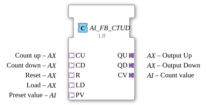

# AI_FB_CTUD

* * * * * * * * * *
## Introduction
The function block **AI_FB_CTUD** implements an up/down counter of data type **INT** in an adapter-based variant. It encapsulates the IEC 61131-3 standard function block `FB_CTUD` and makes its functionality available to the 4diac IDE via the adapter interfaces (`AX` and `AI`). The function block is particularly suitable for use in industrial control systems that rely on event-driven communication.
## Interface Structure
### **Event Inputs**
The function block does not have separate event inputs in the traditional sense. Instead, events are received via the **Sockets** (adapters):

- **CU** (AX) – Count Up event
- **CD** (AX) – Count Down event
- **R** (AX) – Reset
- **LD** (AX) – Load preset value
- **PV** (AI) – Pass preset value

Each incoming event triggers an update of the internal counter.

### **Event Outputs**
- **CNF** – Execution Confirmation, output with each update.
- **QU** (AX) – Up counter output
- **QD** (AX) – Down counter output
- **CV** (AI) – Current count value output

### **Data Inputs**
All data is provided via the **sockets**:

- **CU.D** (BOOL) – Up counter pulse
- **CD.D** (BOOL) – Down counter pulse
- **R.D** (BOOL) – Reset signal
- **LD.D** (BOOL) – Enable preset value loading
- **PV.D** (INT) – Preset value

### **Data Outputs**
- **QU.D** (BOOL) – Up counter flag (TRUE when counter reaches PV value)
- **QD.D** (BOOL) – Down counter flag (TRUE when counter reaches PV value) (has reached the value 0)
- **CV.D** (INT) – Current counter reading

### **Adapters**
- **Sockets (Inputs):**
- `CU` (Type `adapter::types::unidirectional::AX`)
- `CD` (Type `adapter::types::unidirectional::AX`)
- `R` (Type `adapter::types::unidirectional::AX`)
- `LD` (Type `adapter::types::unidirectional::AX`)
- `PV` (Type `adapter::types::unidirectional::AI`)
- **Plugs (Outputs):**
- `QU` (Type `adapter::types::unidirectional::AX`)
- `QD` (Type `adapter::types::unidirectional::AX`)
- `CV` (Type `adapter::types::unidirectional::AI`)

## Functionality
This function block operates as a pure **adapter wrapper** for the internal IEC 61131-3 FB `FB_CTUD`. Incoming adapter events (via the sockets) are aggregated at the event input `FB_CTUD.REQ`, while the corresponding data values (e.g., `CU.D`, `PV.D`) are forwarded to the corresponding inputs of the internal counter. During each execution of the internal function block, its outputs (`CV`, `QU`, `QD`) are read and output via the adapter plugs. Simultaneously, the event `CNF` is generated.

The internal counter behaves like a classic IEC 61131-3 up-down counter:

- A rising edge at `CU` increments the counter value by 1.
- A rising edge at `CD` decrements the counter value by 1.
- A rising edge at `R` resets the counter value to 0.

The internal counter behaves like a classic IEC 61131-3 up-down counter:

- A rising edge at `CU` increments the counter value by 1.
- A rising edge at `R` resets the counter value to 0. - The combination of `LD = TRUE` and an event at `PV` loads the current counter value to the value of `PV`.
- `QU` becomes TRUE when the counter value reaches or exceeds the preset value.
- `QD` becomes TRUE when the counter value reaches or falls below 0.

## Technical Features
- **No Change Detection:** The function block outputs `CNF`, `QU`, `QD`, and `CV` **for every received event** (regardless of an actual value change). If a behavior is desired where the outputs only fire upon a change, a preceding **AX_D_FF** (differentiator/filter) should be used. This is also explicitly recommended in the function block's source code.
- **Adapter Usage:** All communication takes place via unidirectional adapters (`AX` for Boolean events, `AI` for analog values). This enables loose coupling and reusability in different system topologies.
- **Unified Triggering:** All five event sources (CU, CD, R, LD, PV) trigger the execution of the internal counter via the common `REQ` input – there is no separate processing logic for each event.

## State Overview

The component itself does not have an explicit state machine, but rather reflects the state of the internal `FB_CTUD`:

- **Counter Reading (INT):** Initial 0, changes via CU, CD, R, or LD.
- **Flags:** `QU` and `QD` are set based on a comparison of the counter reading and the preset value (or 0).
- **Preset Value:** Stored via the `PV` adapter and loaded with each `LD` event.

A detailed state machine description of the IEC 61131-3 counter can be found in the corresponding standard.

## Application Scenarios
- **Bidirectional Event Counting:** E.g., detecting workpieces on a conveyor belt using sensors for infeed (CU) and outfeed (CD).
- **Inventory Management:** Adding and removing materials from a buffer.
- **Preset Positioning:** A system can be set to a predefined position (PV) and then tracked using CU/CD.
- **Resets After Cycle End:** Resetting the counter after reaching a specific quantity.

## Comparison with Similar Function Blocks
- **FB_CTUD (Standard IEC 61131-3):** The `AI_FB_CTUD` is an **adapter version** of the same logic block. While the standard FB uses classic input/output pins, the adapter version communicates via event and data adapters. This simplifies integration into 4diac systems with adapter-based communication.
- **AI_FB_CTU / AI_FB_CTD:** Simple up and down counters without reverse direction. `AI_FB_CTUD` offers both counting directions in a single block.
- **AX_D_FF:** A differentiator/filter that fires only on changes. Can be used as a pre-function block to optimize the output behavior of `AI_FB_CTUD`.

## Conclusion
The `AI_FB_CTUD` is a powerful, adapter-based up/down counter that transfers the established IEC 61131-3 functionality into the event-driven world of 4diac. Its clean encapsulation and use of unidirectional adapters make it flexible and easy to integrate into modular automation solutions. The explicit recommendation to use a `AX_D_FF`For change-driven output, this shows that the component was deliberately kept simple – a strength for transparent and predictable systems.

---

### 🌐 Related topic subpages on ms-muc-docs.de
* [🌐 Eclipse 4diac IDE & Color Reference on ms-muc-docs.de](https://www.ms-muc-docs.de/iec-61499/eclipse-4diac/)

]
