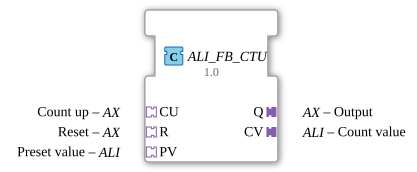

# ALI_FB_CTU

* * * * * * * * * *
## Introduction
The **ALI_FB_CTU** is a 64-bit integer counter (LINT). It serves as an adapter wrapper for the IEC 61131 counter module *FB_CTU_LINT* and provides all input and output signals via standardized adapter interfaces (AX and ALI). This ensures a clear separation of event and data flows and facilitates reuse in different project environments.
## Interface Structure
### **Event Inputs**
The module does not have separate, discrete event inputs. The triggering events are received via the adapters **CU**, **R**, and **PV**. Each of these adapters provides an event (E1) and a corresponding data value (D1). An incoming event at any of these adapters initiates processing.

### **Event Outputs**
- **CNF** (Execution Confirmation): Outputs after each complete processing run, regardless of whether the CU, R, or PV triggered the event.
- **Q** (Adapter AX): Provides the output event (E1), which is output in parallel with the CNF event.
- **CV** (Adapter ALI): Also outputs an event (E1), synchronized with the CNF event.

### **Data Inputs**
The module does not have separate, discrete data inputs. All input data is provided via the adapter interfaces:

- **CU.D1** – Count-Up Signal (BOOL)
- **R.D1** – Reset Signal (BOOL)
- **PV.D1** – Preset Value (LINT)

### **Data Outputs**
The module does not have separate, discrete data outputs. The output data is provided via the adapter interfaces:

- **Q.D1** – Counter Output (BOOL): becomes TRUE as soon as the current counter reading is ≥ PV.
- **CV.D1** – Current Counter Reading (LINT)

### **Adapters**

| Direction | Name | Type | Description |

|----------|------|-----|--------------|

| **Sockets** (Inputs) | CU | AX | Count-Up: Event + BOOL signal |

| | R | AX | Reset: Event + BOOL signal |

| | PV | ALI | Preset value: Event + LINT value |

| **Plugs** (Outputs) | Q | AX | Output signal: Event + BOOL value |

| | CV | ALI | Counter reading: Event + LINT value |

## Functionality
The **ALI_FB_CTU** encapsulates an internal *FB_CTU_LINT*. Every incoming event at one of the three adapters **CU**, **R**, or **PV** is forwarded to the REQ event of the internal block. Simultaneously, the respective data values are passed to the corresponding inputs (*CU*, *R*, *PV*). The internal counter operates according to the IEC 61131 definition of a CTU:

- **On event at CU**: The counter reading is incremented by 1, provided the corresponding data bit is TRUE.
- **On event at R**: The counter reading is reset to 0.
- **On event at PV**: The passed value is stored as the new preset value.

After each processing operation, the internal block outputs a CNF event. This is passed to all three output adapters (CNF, Q, CV) so that all outputs are updated synchronously. The output **Q** becomes TRUE if and only if the current counter reading is greater than or equal to the preset value. The current counter reading can be read at any time via **CV**.

## Technical Features
- **Adapter-based interface**: All signals are exchanged via standardized adapters (AX for binary, ALI for numeric values). This simplifies integration with heterogeneous systems and promotes reusability.
- **64-bit resolution**: The counter uses the LINT (Signed 64-bit Integer) data type, enabling very large counting ranges.
- **Shared trigger**: CU, R, and PV all trigger the same internal REQ. If multiple adapters are active simultaneously, all associated data values are processed in one step – the internal block evaluates the signals in parallel.
- **Note on output behavior**: The block fires the AX output event (Q.E1) with *every* update – even if the output state remains unchanged. If only "on-change" triggering is required, an AX_D_FF (turn-on delay/event filter) must be connected to the output.

## State Overview
The internal state is determined by the counter reading (64-bit integer) and the Boolean output Q. There is no explicit state machine; the function block operates in an event-driven manner:

| State Component | Possible Values | Description |

|--------------------|----------------|--------------|

| Counter Reading (CV) | 0 … 2⁶³‑1 | Current Count Value |

| Output Q | FALSE / TRUE | TRUE if CV ≥ PV |

## Application Scenarios
- **Event Counting**: Counting pulses in production facilities, conveyor belts, or energy meters.
- **Quantity Monitoring**: Recording the number of units produced and triggering a signal when a threshold is reached.
- **Reset-controlled counters**: Resetting the counter to zero after a manual or automatic reset.
- **Preset-based control**: Dynamically changing the setpoint during operation (e.g., batch changes).

## Comparison with similar function blocks
- **Compared to a direct FB_CTU_LINT**: The ALI_FB_CTU abstracts the interfaces at the adapter level. This allows the signals to be connected to other function blocks that also use AX/ALI adapters, regardless of the specific implementation.
- **Compared to a standard CTU with BOOL inputs**: The ALI_FB_CTU allows the connection of adapters that bundle both events and data. This reduces the number of separate lines and makes the design clearer.
- **Compared to a CTU with INT/DINT**: The use of LINT covers a significantly larger value range, which is advantageous for high-resolution counting tasks or long-term monitoring.

## Conclusion

The **ALI_FB_CTU** is a powerful, adapter-based up-counter for industrial automation environments. It combines proven IEC 61131 counter logic with modern adapter interfaces and offers simple, readable connectivity to other components. Its 64-bit resolution, shared event processing of all inputs, and the ability to dynamically set thresholds make it a flexible solution for a wide range of counting and monitoring tasks.