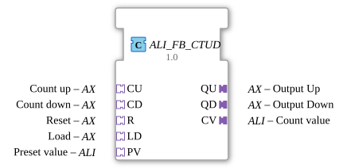

# ALI_FB_CTUD

* * * * * * * * * *
## Introduction
The function block **ALI_FB_CTUD** implements an up/down counter with a value range of type **LINT** (64-bit integer). It is specifically designed for use with **ALI adapters** and encapsulates a standard-compliant counter according to IEC 61131-3 (FB_CTUD_LINT). Control and output are exclusively via adapter interfaces, allowing for flexible integration into adapter-based architectures.
## Interface Structure
### **Event Inputs**
The function block does not have direct event inputs. All control events are received via the **sockets** (adapters):

- **CU.E1** – Count Up event
- **CD.E1** – Count Down event
- **R.E1** – Reset event
- **LD.E1** – Load preset value event
- **PV.E1** – Apply preset value event

*Note*: All five events trigger a common internal processing cycle.

*Note*: All five events trigger a common internal processing cycle.

*Note: **CU.E1** – Count Up event
*Note: **CU.E1** – Count Down event
*Note: **CU.E1** – Count Down event
*Note: **CU.E1** – Count Down event
*Note: **CU.E1** – Count Down event
*Note: **CU.E1** – Count Down event
*Note: **CU.E1** – Count Down event
*Note: **CU.E1** – Count Down event
*Note: **CU.E1** – Count Down event
*Note: **CU.E1** – Count Down event
*Note: **CU.E1** – Count Down event
*Note: **CU.E1** – Count Down event
*Note: **CU.E1** – Count Down event
*Note: **CU.E1** – Count Down event
*CT ... ### **Event Outputs**

- **CNF** (Event) – Execution Confirmation

Additionally, the following events are output via the **Plugs** (Output Adapters):

- **QU.E1** – Event when the counter value increases (Output Up)
- **QD.E1** – Event when the counter value decreases (Output Down)
- **CV.E1** – Event when the counter value changes (Count Value)

*Special Note*: These events are triggered with **every** update (regardless of the input event). For change-triggered triggering, it is recommended to use an AX_D_FF block beforehand.

### **Data Inputs**
The data values are provided via the **sockets**:

- **CU.D1** (BOOL) – Count Up Enable
- **CD.D1** (BOOL) – Count Down Enable
- **R.D1** (BOOL) – Reset Signal
- **LD.D1** (BOOL) – Load Signal
- **PV.D1** (LINT) – Preset Value

### **Data Outputs**
The results data are provided via the **plugs**:

- **QU.D1** (BOOL) – Signal: Counter value > 0 (e.g., for the "Up" output)
- **QD.D1** (BOOL) – Signal: Counter value < 0 (für „Down“‑Ausgang, abhängig von interner Logik)
- **CV.D1** (LINT) – aktueller Zählerwert

### **Adapter**

| Typ | Richtung | Adapter-Typ | Beschreibung |
|------|----------|-------------|--------------|
| **CU** | Socket | `adapter::types::unidirectional::AX` | Aufwärtszähl‑Eingang (Ereignis+BOOL) |
| **CD** | Socket | `adapter::types::unidirectional::AX` | Abwärtszähl‑Eingang (Ereignis+BOOL) |
| **R**  | Socket | `adapter::types::unidirectional::AX` | Reset‑Eingang (Ereignis+BOOL) |
| **LD** | Socket | `adapter::types::unidirectional::AX` | Load‑Eingang (Ereignis+BOOL) |
| **PV** | Socket | `adapter::types::unidirectional::ALI` | Preset‑Wert‑Eingang (Ereignis+LINT) |
| **QU** | Plug   | `adapter::types::unidirectional::AX` | Aufwärts‑Ausgang (Ereignis+BOOL) |
| **QD** | Plug   | `adapter::types::unidirectional::AX` | Abwärts‑Ausgang (Ereignis+BOOL) |
| **CV** | Plug   | `adapter::types::unidirectional::ALI` | Zählerwert‑Ausgang (Ereignis+LINT) |

## Funktionsweise
Der Baustein enthält einen internen Funktionsblock **FB_CTUD_LINT**, der die eigentliche Zählerlogik nach IEC 61131‑3 implementiert. Jedes Ereignis an einem der fünf Sockets (CU.E1, CD.E1, R.E1, LD.E1, PV.E1) löst eine Verarbeitung aus: Die zugehörigen booleschen Daten (CU.D1, CD.D1, R.D1, LD.D1) und der Preset‑Wert (PV.D1) werden an den internen Baustein weitergeleitet und dort synchron ausgewertet. Der interne Baustein berechnet daraufhin den neuen Zählerstand und die Ausgangssignale QU, QD und CV. Nach Abschluss der Berechnung wird das Ausgangsereignis **CNF** gesendet und gleichzeitig werden die Ereignisse **QU.E1**, **QD.E1** und **CV.E1** auf den entsprechenden Plugs ausgegeben.

Die Verwendung von Adaptern ermöglicht eine lose Kopplung: Die eigentlichen Signalquellen (z. B. Sensoren oder Bedienelemente) und -senken (z. B. Aktoren oder Anzeigen) werden über Adapterverbindungen angebunden, ohne dass die internen Daten‑ und Ereignisleitungen direkt sichtbar sind.

## Technische Besonderheiten
- **Datenbereich**: 64‑Bit vorzeichenbehaftete Ganzzahl (LINT), geeignet für große Zählerstände.
- **Adapter‑getriebene Schnittstelle**: Keine direkten Ereignis‑ oder Dateneingänge; alle Steuerungen erfolgen über AX‑ und ALI‑Adapter.
- **Immerwährende Ereignisausgabe**: Die Ausgangsereignisse (QU.E1, QD.E1, CV.E1) werden bei **jedem** Verarbeitungszyklus ausgegeben, unabhängig davon, ob sich der Zählerstand tatsächlich geändert hat. Dieses Verhalten ist im Quellcode explizit dokumentiert – für eine änderungsbasierte Auslösung wird die Verwendung eines AX_D_FF‑Filters empfohlen.
- **Interner Standard‑Baustein**: Der FB_CTUD_LINT entspricht der IEC 61131‑3‑Definition eines Auf‑/Abwärtszählers.

## Zustandsübersicht
Eine formale Zustandsmaschine ist nicht extern sichtbar. Der interne Zustand besteht aus dem aktuellen **Zählerwert** (CV) und den internen Flags **QU** (z. B. „Wert > 0") and **QD** (e.g., "Value < 0"). The state is updated with each input event according to the following priority:

1. **Reset (R)**: sets CV to 0.

2. **Load (LD)**: adopts PV as the new CV.

3. **Count Up (CU)**: increments CV by 1 if CU.D1 = TRUE.

4. **Count Down (CD)**: decrements CV by 1 if CD.D1 = TRUE.

The flags QU and QD are then calculated from the new CV.

## Application Scenarios
- **Production Counting**: Recording workpieces or cycles – counting up on entry, counting down on exit.
- **Position Monitoring**: Counting up/down steps in a linear drive.
- **Inventory Management**: Counting storage units with manual correction via Load/Reset.
- **Adapter-based control systems**: Integration into architectures that rely on unidirectional adapters (AX/ALI), e.g., distributed automation nodes.

## Comparison with similar function blocks

The standard IEC 61131-3 function block **CTUD** (e.g., `FB_CTUD_INT`) typically works with smaller data types (INT, DINT) and offers direct event and data inputs. The **ALI_FB_CTUD** extends this concept with:

- **LINT data type** for very large counter ranges.
- **Adapter interfaces** (AX/ALI) instead of free inputs/outputs.
- **Continuous event output** as opposed to purely change-driven output.

## Conclusion

The **ALI_FB_CTUD** is a powerful up/down counter for 64-bit numbers that integrates seamlessly into adapter-based automation environments. Its structure allows for a clear separation of control and data flows and facilitates reuse in modular control systems. The continuous event output should be considered during project planning – a downstream filter block may be required to prevent unwanted edge counts.