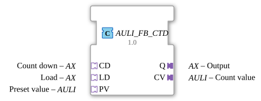

# AULI_FB_CTD

* * * * * * * * * *
## Introduction

The function block **AULI_FB_CTD** implements a **down counter** based on the data type `ULINT` (unsigned long integer). It is implemented as an **adapter version** and encapsulates the standard function block `FB_CTD_ULINT` from the IEC 61131-3 library. The block allows modular connection via the adapter interfaces CD (Count Down), LD (Load), and PV (Preset Value), as well as the output of the current count value (CV) and a binary signal (Q) via corresponding plug adapters.
## Interface Structure

### **Event Inputs**

The function block has **no direct event inputs**. Triggering occurs exclusively via the **event channels of the socket adapters**:

| Adapter | Event Port | Description |
|-----------|------------|-------------------------------------|
| **CD** | CD.E1 | Count Down Pulse |
| **LD** | LD.E1 | Load Preset Value Pulse |
| **PV** | PV.E1 | Preset Value Update |

> **Note:** Each of these events triggers processing of the internal counter. The counter is always recalculated – regardless of whether the value actually changes.

### **Event Outputs**

| Name | Description |
|------|----------------------------------------------------|
| CNF | Confirmation after each processing |

Additionally, the plug adapters provide **two event outputs**:

| Adapter | Event Port | Description |
|---------|------------|--------------------------------------------------|
| **Q** | Q.E1 | Outputs with every processing |
| **CV** | CV.E1 | Outputs with every processing |

> **Note:** Since the events fire with every update (CD, LD, PV), it is recommended to filter a change edge with a `AX_D_FF` if necessary (see Technical Specifications).

### **Data Inputs**

Data is also provided via the **socket adapters**:

| Adapter | Data Port | Data Type | Description |
|---------|------------|----------|-------------------------------------------|
| **CD** | CD.D1 | `BOOL` | Count pulse (rising edge) |
| **LD** | LD.D1 | `BOOL` | Load command (rising edge) |
| **PV** | PV.D1 | `ULINT` | Preset value (loaded during LD or PV update) |

### **Data Outputs**

Data is output via the **Plug Adapters**:

| Adapter | Data Port | Data Type | Description |
|---------|------------|----------|-------------------------------------------|
| **Q** | Q.D1 | `BOOL` | Counter reading = 0 (output signal) |
| **CV** | CV.D1 | `ULINT` | Current counter reading |

### **Adapter**

| Direction | Adapter type | Short description |
|----------|-----------------------|--------------------------------------|
| Socket | `AX` (bidirectional) | Countdown control (Event + BOOL) |
| Socket | `AX` (bidirectional) | Load Control (Event + BOOL) |
Socket | `AULI` (bidirectional) | Preset Value (Event + ULINT) |
Plug | `AX` (bidirectional) | Output Q (Event + BOOL) |
Plug | `AULI` (bidirectional) | Counter Value Output (Event + ULINT) |

## Functionality

This function block encapsulates the IEC 61131-3 function `FB_CTD_ULINT`. The internal logic is triggered by events from the three socket adapters:

1. **CD Event (Count Down):**

On a rising edge of `CD.D1` and a simultaneous event on `CD.E1`, the counter value is decremented by 1 (provided it is > 0). The new value is output at plug `CV`.

2. **LD Event (Load):**

On a rising edge of `LD.D1` and an event on `LD.E1`, the current preset value (`PV.D1`) is loaded into the counter. The counter value is then set to the preset value.

3. **PV Event (Preset Value Update):**

An event on `PV.E1` updates the internally stored preset value (without changing the counter). This is useful for dynamically changing the preset during operation.

After each processing operation, the confirmation event `CNF` is sent, along with the events on the plug adapters `Q.E1` and `CV.E1`. The data `Q.D1` and `CV.D1` are updated accordingly.

## Technical Features

- **ULINT Data Type:**

The module uses unsigned 64-bit integers (ULINT), enabling counting ranges from 0 to 2⁶⁴‑1 – suitable for very large counting tasks.

- **Adapter-Based Connection:**

All inputs and outputs are via adapters (`AX` for binary signals, `AULI` for ULINT values). This allows for clean encapsulation and modular wiring in the 4diac IDE.

- **Event Output on Every Update:**

The module fires the output events on every incoming event (CD, LD, PV) – even if the counter reading or output value does not change. This creates **permanent triggering** of the downstream network.

→ **Recommendation:** Use a `AX_D_FF` (differentiator/filter) at the outputs if you only want to react to value changes.

- **No internal state machine:**

The function block itself does not have its own state machine; the state logic (e.g., rising edge detection) is handled by the internal `FB_CTD_ULINT`.

## State Overview

Internally, the function block only manages the **counter value** (CV) and the **current preset value** (PV). There is no explicit state machine. The possible actions are:

| State / Action | Trigger | Result |
|------------------|---------------------------|---------------------------------------------------------|
| Count Down | CD Event & CD.D1=TRUE | CV := CV - 1 (if CV>0) |
| Load | LD event & LD.D1=TRUE | CV := PV (current preset) |
| Preset Update | PV event | PV is overwritten (CV remains unchanged) |

The output `Q` is set to `TRUE` when `CV = 0` is present; otherwise, it is `FALSE`..

## Application Scenarios

- **Large-Range Piece Counter:**

Detection of production quantities with a value range > 32 bits (e.g., 10 billion pieces).

- **Preselection or Sequence Control:**

Used as a downward counter in a sequence where a signal is triggered upon reaching the value 0 (e.g., batch end).

- **Dynamic Preset Values:**

Changing the end-of-count value during operation via the PV event, without affecting the current counter reading.

- **Modular Systems:**

Integration into larger control architectures that rely entirely on adapter communication (e.g., via the Eclipse 4diac adapter mechanism).

## Comparison with Similar Components

| Component | Data Type | Interface | Special Feature |
|----------------------|----------|-----------------------|------------------------------------------------|
| `FB_CTD_ULINT` | ULINT | Standard I/O | Basic down counter without adapter |
| **AULI_FB_CTD** | ULINT | Adapter (AX, AULI) | Adapter-encapsulated, all events result in an update|
| `FB_CTD` (Standard) | INT/UINT | Standard I/O | Usually 16-bit or 32-bit, fixed event logic |

The **AULI_FB_CTD** offers more flexible integration into complex networks due to its adapter coupling, but has the "side effect" that output events are sent even if the values remain unchanged. For applications that should only fire upon a value change, the basic function block `FB_CTD_ULINT` or a combination with an edge detector (`AX_D_FF`) is preferable.

## Conclusion

The **AULI_FB_CTD** is a powerful down counter for 64-bit values that is integrated into 4diac projects via adapter interfaces. It is particularly suitable for large counting ranges and modular control topologies. The continuous event output requires careful handling of the downstream network, but this can be mitigated by suitable filter blocks (e.g., `AX_D_FF`). Thanks to the encapsulation of the proven `FB_CTD_ULINT`, its operation is robust and standards-compliant.

---

### 🌐 Related topic subpages on ms-muc-docs.de

* [🌐 Eclipse 4diac IDE & Color Reference on ms-muc-docs.de](https://www.ms-muc-docs.de/iec-61499/eclipse-4diac/)

]
