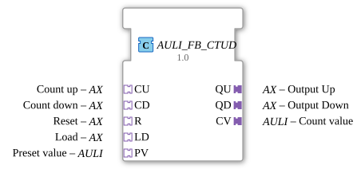

# AULI_FB_CTUD

* * * * * * * * * *
## Introduction
The function block **AULI_FB_CTUD** implements an up/down counter for unsigned 64-bit integers (ULINT). It exclusively uses adapter interfaces according to the IEC 61499-2 standard for event and data connections. The block encapsulates the standard FB `FB_CTUD_ULINT` and extends its inputs and outputs with adapter-based connections, enabling flexible and standardized integration into adapter-oriented architectures.
## Interface Structure

### **Event Inputs**

The block does not have any traditional event inputs. Instead, the counter events are transmitted via the **adapter sockets**:

- **CU** (Count Up) – Event via `CU.E1`
- **CD** (Count Down) – Event via `CD.E1`
- **R** (Reset) – Event via `R.E1`
- **LD** (Load) – Event via `LD.E1`
- **PV** (Preset Value) – Event via `PV.E1`

### **Event Outputs**
- **CNF** – Standard event output, triggered with every counter update.

Additionally, events are output via the **adapter plugs**:

- **QU.E1** – Counter overflow event (maximum value reached)
- **QD.E1** – Counter underflow event (value 0)
- **CV.E1** – Update the current counter reading

### **Data Inputs**

The block does not have separate data inputs. All input data is provided via the adapter sockets:

- **CU.D1** (BOOL) – Enables increment (TRUE increments the counter at CU.E1)
- **CD.D1** (BOOL) – Enables decrement
- **R.D1** (BOOL) – Enables reset
- **LD.D1** (BOOL) – Enables load
- **PV.D1** (ULINT) – Value for the load operation

### **Data Outputs**

There are no separate data outputs. The output data is sent via the adapter plugs:

- **QU.D1** (BOOL) – Signals reaching the maximum value
- **QD.D1** (BOOL) – Signals reaching 0
- **CV.D1** (ULINT) – Current counter reading

### **Adapter**

| Adapter | Direction | Type | Purpose |

|---------|----------|-------|-------|

| **CU** | Socket | AX | Count Up – Event + Boolean enable |

| **CD** | Socket | AX | Count Down – Event + Boolean enable |

| **R** | Socket | AX | Reset – Event + Boolean enable |

| **LD** | Socket | AX | Load – Event + Boolean enable |

| **PV** | Socket | AULI | Preset Value – Event + ULINT value |

| **QU** | Plug | AX | Output Up – Event + Boolean State |

| **QD** | Plug | AX | Output Down – Event + Boolean State |

| **CV** | Plug | AULI | Current Value – Event + ULINT Counter Value |

## Functionality

The function block reacts to events at the input adapters (`CU.E1`, `CD.E1`, `R.E1`, `LD.E1`, `PV.E1`). For each event, the corresponding data value (`DX.D1`) is evaluated:

- **CU**: When `CU.E1` and `CU.D1 = TRUE` occur, the counter is incremented.
- **CD**: When `CD.E1` and `CD.D1 = TRUE` are encountered, the counter is decremented.
- **R**: When `R.E1` and `R.D1 = TRUE` are encountered, the counter is reset to 0.
- **LD**: When `LD.E1` and `LD.D1 = TRUE` are encountered, the counter is set to the value of `PV.D1`.

After each processing operation, the event `CNF` is output. Simultaneously, the output adapters are updated:

- `QU.D1` becomes `TRUE` when the counter reaches its maximum value (`2^64 - 1`).
- `QD.D1` becomes `TRUE` when the counter value is 0.
- `CV.D1` provides the current counter value.

The entire process is synchronous – each incoming event triggers a calculation and subsequently the output of the results.

## Technical Features
- **Adapter-based communication**: All inputs and outputs are handled via adapters (sockets/plugs). This enables a decoupled connection between components and simplifies reuse in different contexts.
- **Unidirectional Adapters**: The adapters used (AX, AULI) are unidirectional – sockets receive, plugs send.
- **Trigger Behavior**: The function block fires the output events (`QU.E1`, `QD.E1`, `CV.E1`) on **every** counter update (including reset or load). For change-based triggering, an AX_D_FF (differentiator) must be used.
- **Value Range**: The counter operates in the range 0 … 2^64‑1 (ULINT). Overflows are signaled by `QU`, underflows by `QD`.

## State Overview

The function block does not have an explicit state machine; The counter behavior is implemented by the internal function `FB_CTUD_ULINT`. Essentially, three states are distinguished:

1. **Normal Operation** – The counter value is between 1 and `2^64‑2`. Neither `QU` nor `QD` are active.

2. **Overflow** – The counter has reached its maximum value. `QU.D1 = TRUE`.

3. **Underflow** – The counter reading is 0. `QD.D1 = TRUE`.

After a reset (`R`) or load (`LD`), the counter can immediately jump to one of these states.

## Application Scenarios
- **Industrial Piece Counters**: Recording production quantities with up-and-down counting (e.g., good/bad parts).
- **Pallet or Workpiece Tracking**: Counting inputs and outputs in a buffer memory.
- **Event-Driven Systems**: Combination with sensors (light barriers, proximity switches) via the adapter interfaces.
- **Adapter-Based Control Architectures**: Seamless integration into projects that utilize the socket/plug concept of IEC 61499-2.

## Comparison with Similar Components

| Component | Properties |

|----------|---------------|

| `FB_CTUD_ULINT` | Same counter logic, but with separate event and data inputs/outputs (no adapters). |

AULI_FB_CTU` | Up counter only, as an adapter version. |

AULI_FB_CTD` | Down counter only, as an adapter version. |

CTUD` (Standard IEC 61499) | Similar functionality, but usually with different data types (e.g., INT) and without an adapter. |

The `AULI_FB_CTUD` combines up and down counting in one block and offers particularly flexible integration with other adapter-based components via its adapter interfaces.

## Conclusion

The `AULI_FB_CTUD`This is a high-performance up/down counter for ULINT values, distinguished by its complete adapter interface. It combines proven counting logic with the flexibility of the IEC 61499-2 adapter concept. Thanks to its standardized event and data transmission via plugs and sockets, it is particularly suitable for modular, reusable control applications. Its ease of use and integrated overflow/underflow detection make it a reliable building block in many industrial counting tasks.
