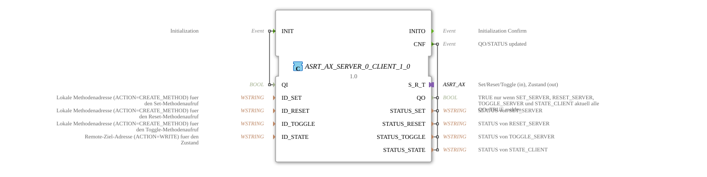

# ASRT_AX_SERVER_0_CLIENT_1_0

* * * * * * * * * *

## Introduction

The **ASRT_AX_SERVER_0_CLIENT_1_0** function block is a composite function block that receives three independent remote OPC UA **method calls** (Set, Reset, and Toggle), each via its own `SERVER_0` block, and writes the resulting state back to a remote node via `CLIENT_1_0` – all behind a single bidirectional **ASRT_AX adapter plug**. It is the server-side counterpart to [ASRT_AX_CLIENT_0_SUBSCRIBE_1](ASRT_AX_CLIENT_0_SUBSCRIBE_1.md).

## Interface Structure

### **Event Inputs**

- **INIT** (EInit): Initialization event, associated with `QI`

### **Event Outputs**

- **INITO** (EInit): Initialization confirmation, associated with `QO`, `STATUS_SET`, `STATUS_RESET`, `STATUS_TOGGLE`, and `STATUS_STATE`
- **CNF** (Event): `QO`/`STATUS` updated, associated with the same variables

### **Data Inputs**

- **QI** (BOOL): Qualifier input for all four internal connections
- **ID_SET** (WSTRING): Local method address (ACTION=CREATE_METHOD) for the Set method call
- **ID_RESET** (WSTRING): Local method address (ACTION=CREATE_METHOD) for the Reset method call
- **ID_TOGGLE** (WSTRING): Local method address (ACTION=CREATE_METHOD) for the Toggle method call
- **ID_STATE** (WSTRING): Remote target address (ACTION=WRITE) for the state

### **Data Outputs**

- **QO** (BOOL): TRUE only if `SET_SERVER`, `RESET_SERVER`, `TOGGLE_SERVER`, and `STATE_CLIENT` currently all report `QO = TRUE`
- **STATUS_SET** (WSTRING): Status information from `SET_SERVER`
- **STATUS_RESET** (WSTRING): Status information from `RESET_SERVER`
- **STATUS_TOGGLE** (WSTRING): Status information from `TOGGLE_SERVER`
- **STATUS_STATE** (WSTRING): Status information from `STATE_CLIENT`

### **Adapter**

| Adapter | Type | Direction | Description |
|---------|------|-----------|--------------|
| S_R_T | adapter::types::bidirectional::ASRT_AX | Plug – Set/Reset/Toggle (input), state (output) | Received Set/Reset/Toggle, state out |

## Functionality

1. Via the `INIT` event, `SET_SERVER`, `RESET_SERVER`, `TOGGLE_SERVER`, and `STATE_CLIENT` are initialized one after another. After all four have confirmed, `INITO` is reported externally.
2. A remote Set, Reset, or Toggle call on the respective `SERVER_0` block triggers `S_R_T.SET`, `S_R_T.RESET`, or `S_R_T.TOGGLE` – all three are thus reported inward via the adapter.
3. As soon as the downstream logic delivers a feedback event `S_R_T.EI1` with data `S_R_T.DI1` via the adapter, this clocks the internal **E_D_FF** flip-flop, which captures and holds the value stably.
4. The flip-flop's output `EO` triggers `STATE_CLIENT.REQ`; the buffered value is sent as an OPC UA write to the remote node configured in `ID_STATE`.
5. `AND_QO` (AND_BOOL_4) ANDs the `QO` outputs of all four internal blocks; every confirmation additionally triggers `CNF` externally.

## Technical Features

- **Four network connections behind one adapter**: Three `SERVER_0` instances (Set, Reset, Toggle) and one `CLIENT_1_0` (state) are combined into a single bidirectional ASRT_AX interface.
- **Buffering with D flip-flop**: The feedback value reported via the adapter is stabilized via an internal `iec61499::events::E_D_FF` before being sent via `CLIENT_1_0`.
- **Sequential initialization**: `SET_SERVER` → `RESET_SERVER` → `TOGGLE_SERVER` → `STATE_CLIENT` (composite FBTypes chain `INIT`/`INITO` serially through each instance).
- **Encapsulation**: Only the ASRT_AX adapter interface is visible externally.

## State Overview

1. **Not Initialized**: The block is waiting for the `INIT` event.
2. **Initialized**: All four connections (Set, Reset, Toggle server, state client) are established.
3. **Receive Active**: A remote Set, Reset, or Toggle call is reported to the internal logic via the adapter.
4. **State Write**: A feedback value from the internal logic is buffered and sent via remote write to the configured target node.

## Application Scenarios

- Receiving remote Set/Reset/Toggle calls while simultaneously writing the resulting state back to a different remote node over a single adapter connection
- Server-side counterpart to [ASRT_AX_CLIENT_0_SUBSCRIBE_1](ASRT_AX_CLIENT_0_SUBSCRIBE_1.md) in distributed control architectures

## Comparison with Similar Function Blocks

- **[ASRT_AX_CLIENT_0_SUBSCRIBE_1](ASRT_AX_CLIENT_0_SUBSCRIBE_1.md)**: The client/calling counterpart.
- **[ASR_AX_SERVER_0_CLIENT_1_0](ASR_AX_SERVER_0_CLIENT_1_0.md)**: The same pattern with only two receiving servers (no Toggle).

## Conclusion

**ASRT_AX_SERVER_0_CLIENT_1_0** bundles three receiving servers (Set/Reset/Toggle) and a state-writing client behind a single bidirectional ASRT_AX adapter, forming the server-side counterpart to [ASRT_AX_CLIENT_0_SUBSCRIBE_1](ASRT_AX_CLIENT_0_SUBSCRIBE_1.md).
