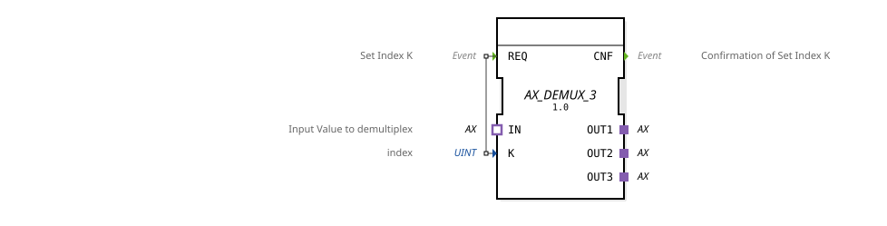

# AX_DEMUX_3

* * * * * * * * * *
## Introduction
The AX_DEMUX_3 is a generic demultiplexer function block that distributes input data to one of three possible outputs based on an index value. This function block is used for the selective routing of data streams in distributed automation systems.

## Interface Structure

### **Event Inputs**
- **REQ**: Sets the index K and initiates the demultiplexing operation

### **Event Outputs**
- **CNF**: Confirms index setting and successful demultiplexing operation

### **Data Inputs**

- **K** (UINT): Index value for selecting the target output (0, 1, or 2)

### **Data Outputs**
*No direct data outputs available*

### **Adapters**

#### **Sockets**

- **IN** (adapter::types::unidirectional::AX): Input value for the demultiplexing operation

#### **Plugs**

- **OUT1** (adapter::types::unidirectional::AX): First output channel
- **OUT2** (adapter::types::unidirectional::AX): Second Output Channel
- **OUT3** (adapter::types::unidirectional::AX): Third Output Channel

## Functionality
The AX_DEMUX_3 receives a data value via the IN adapter and forwards it to one of the three output adapters based on the index value K. When the REQ event is activated, the current K value is evaluated, and the input value is forwarded to the corresponding output channel (OUT1, OUT2, or OUT3). A CNF event is triggered after successful operation.

## Technical Features
- Generic implementation for flexible reuse
- Unidirectional adapter interfaces for clear data flow direction
- Index-based selection with UINT data type
- Three fixed output channels

## State Overview
The function block operates statelessly—each REQ request is processed independently and acknowledged with CNF. The internal state is limited to the temporary storage of the index value K during processing.

## Application Scenarios

- Distribution of sensor data to different processing units
- Load balancing in parallel processing paths
- Selective activation of subsystems based on operating states
- Routing of control commands to different actuators

## ⚖️ Comparison with similar components
Compared to simple demultiplexers, AX_DEMUX_3 offers:

- Standardized adapter interfaces for better integration
- Three output channels instead of two for increased flexibility
- Explicit acknowledgment events for reliable operations
- Generic implementation for type independence

Comparison with [E_DEMUX](../../../../../StandardLibraries/events/E_DEMUX.md)]

## 🛠️ Related Exercises

* [Exercise_103](../../../../../../Uebungen/test_B/Uebungen_doc/Uebung_103.md)]

* [Exercise_103c](../../../../../../Uebungen/test_AX/Uebungen_doc/Uebung_103c.md)]

* [Exercise_103c2](../../../../../../Uebungen/test_AX/Uebungen_doc/Uebung_103c2.md)

## Conclusion
The AX_DEMUX_3 is a robust and flexible demultiplexer for distributed automation systems. Its use of standardized adapters and clear event-driven control make it particularly suitable for complex data flow control in industrial applications.