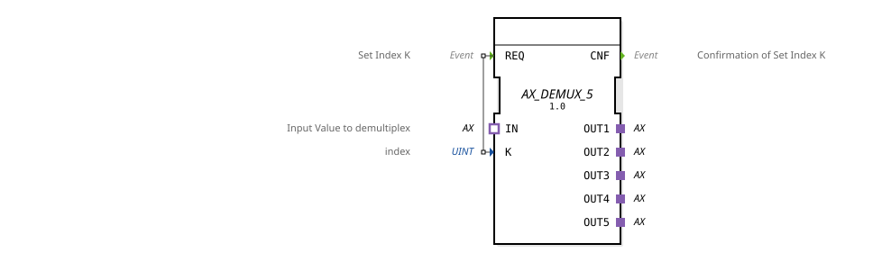

# AX_DEMUX_5

* * * * * * * * * *
## Introduction
The AX_DEMUX_5 is a generic demultiplexer function block that distributes incoming AX signals to one of five outputs. The block is used for the targeted routing of data streams based on an index value.

## Interface Structure

### **Event Inputs**

- **REQ**: Sets the index K and initiates the demultiplexing process

### **Event Outputs**

- **CNF**: Confirms successful setting of index K

### **Data Inputs**

- **K** (UINT): Index value for selecting the desired output

### **Data Outputs**
*No direct data outputs available*

### **Adapters**

**Sockets:**

- **IN**: AX input adapter for the value to be demultiplexed

**Plugs:**

- **OUT1**: AX output adapter 1
- **OUT2**: AX output adapter 2
- **OUT3**: AX output adapter 3
- **OUT4**: AX output adapter 4
- **OUT5**: AX Output Adapter 5

## Functionality
The AX_DEMUX_5 selectively distributes incoming AX signals via the IN adapter to one of the five OUT adapters. The index K determines which output is activated. Upon arrival of the REQ event, the current K value is evaluated, and the corresponding output channel is configured for data forwarding. The CNF event signals the completion of this operation.

## Technical Features
- Generic function block with type-hash functionality
- Uses unidirectional AX adapters for inputs and outputs
- Supports five independent output channels
- Index-based selection with UINT data type

## State Overview
The function block operates statelessly—each REQ pulse results in immediate processing and output of the CNF signal after successful configuration.

## Application Scenarios

- Distribution of control signals in automation systems
- Selection of actuator channels in mechanical systems
- Routing of data streams in distributed control architectures
- Multiplexer/demultiplexer circuits in industrial applications

## ⚖️ Comparison with similar components
Compared to simpler demultiplexers, the AX_DEMUX_5 offers five output channels and is specifically optimized for AX adapters. Its generic implementation allows for flexible reuse in various contexts.

Comparison with [E_DEMUX](../../../../../StandardLibraries/events/E_DEMUX.md)]

## Conclusion
The AX_DEMUX_5 is an efficient and flexible demultiplexer for AX-based communication systems. Its five output channels and simple index control offer diverse application possibilities in industrial automation solutions.