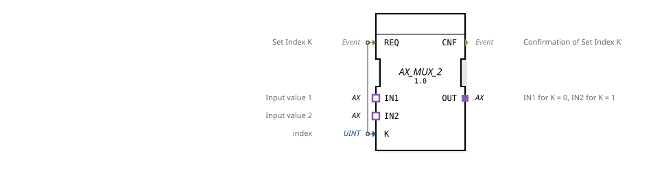

# AX_MUX_2

* * * * * * * * * *
## Introduction

The AX_MUX_2 is a generic multiplexer function block that selects two input signals via an index value and routes them to an output. This function block is used for dynamic selection between two different input signals based on a control index.

## Interface Structure

### **Event Inputs**

- **REQ**: Sets the index value K and starts the multiplexing process

### **Event Outputs**

- **CNF**: Confirms the successful setting of index K

### **Data Inputs**

- **K** (UINT): Index value for selecting the input signal (0 or 1)

### **Data Outputs**

*No direct data outputs available*

### **Adapters**

- **IN1** (Socket): Input value 1 (selected when K=0)
- **IN2** (Socket): Input value 2 (selected when K=1)
- **OUT** (Plug): Output signal (passes on the selected input)

## Functionality

The AX_MUX_2 operates as a 2:1 multiplexer. Upon receiving a REQ event, the corresponding index value K is evaluated:

- If K=0, input IN1 is forwarded to output OUT.
- If K=1, input IN2 is forwarded to output OUT.

After successful processing, a CNF event is generated.

## Technical Features

- Uses unidirectional AX adapters for signal transmission
- Supports the generic function block mechanism
- Works with the UINT data type for the index parameter
- Provides clear event acknowledgment via CNF output

## State Overview

The function block features a simple state machine:

1. Waiting state for REQ event
2. Processing state during index evaluation and signal forwarding
3. Acknowledgement state with CNF output

## Application Scenarios

- Signal routing in control systems
- Switching between different sensor inputs
- Dynamic selection of actuator controls
- Modular system architectures with configurable signal paths

## ⚖️ Comparison with Similar Blocks

Compared to simple multiplexers, AX_MUX_2 offers:

- Adapter-based interfaces for improved modularity
- Event-driven processing with an acknowledgment mechanism
- Generic implementation for reusability

Comparison with [F_MUX_2](../../../../../StandardLibraries/iec61131-3/selection/F_MUX_2.md)

## 🛠️ Related Exercises

* [Exercise_090a1_AX](../../../../../../Uebungen/test_AX/Uebungen_doc/Uebung_090a1_AX.md)

## Conclusion

The AX_MUX_2 is an efficient and flexible multiplexer module, ideally suited for modular control systems. Its adapter-based architecture allows for easy integration into existing systems, while the event mechanism ensures reliable and traceable signal processing.
