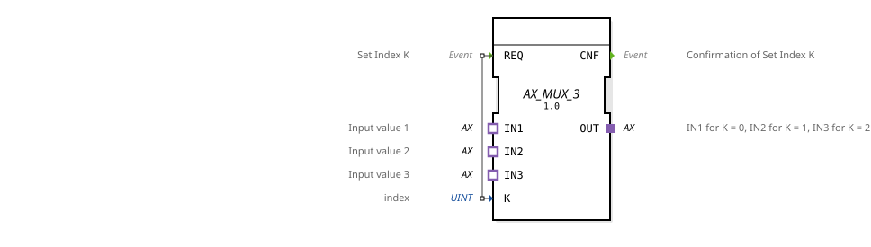

# AX_MUX_3

* * * * * * * * * *
## Introduction
The AX_MUX_3 is a generic multiplexer function block that can switch three input signals to one output. The block allows the selection of one of three input signals based on an index value and forwards the corresponding signal.

## Interface Structure

### **Event Inputs**
- **REQ**: Sets the index K and starts the multiplexing process

### **Event Outputs**
- **CNF**: Confirms the successful setting of index K

### **Data Inputs**
- **K** (UINT): Index value for selecting the input signal (0, 1, or 2)

### **Data Outputs**
- No direct data outputs available

### **Adapters**
- **IN1**: Input value 1 (selected when K=0)
- **IN2**: Input value 2 (selected when K=1)
- **IN3**: Input value 3 (selected when K=2)
- **OUT**: Output signal (unidirectional AX adapter)

## Functionality
The AX_MUX_3 operates as 3:1 multiplexer. Upon receiving a REQ event, the index value K is evaluated and connected to the output OUT of one of the three inputs (IN1, IN2, or IN3):

- K=0: Connection IN1 → OUT
- K=1: Connection IN2 → OUT
- K=2: Connection IN3 → OUT

A CNF event is output after successful switching.

K=1: Connection IN2 → OUT

K=2: Connection IN3 → OUT

A CNF event is output after successful switching.
## Technical Features
- Uses unidirectional AX adapters for signal transmission
- Supports the UINT data type for the index
- Generic implementation for flexible reuse

## State Overview
1. **Ready**: Waits for REQ event

2. **Processing**: Evaluates index K and switches accordingly
3. **Acknowledge**: Sends CNF event after successful switching

## Application Scenarios
- Signal routing in control systems
- Selection between different sensor inputs
- Switching between operating modes
- Redundant systems with multiple input sources

## ⚖️ Comparison with Similar Devices
Compared to simpler multiplexers, the AX_MUX_3 offers three inputs instead of the usual two and uses adapter-based interfaces for standardized signal transmission. The unidirectional AX adapter interface ensures a clear signal flow direction.

Comparison with [F_MUX_3](../../../../../StandardLibraries/iec61131-3/selection/F_MUX_3.md)]

## 🛠️ Related Exercises
* [Exercise_090a2_AX](../../../../../../Uebungen/test_AX/Uebungen_doc/Uebung_090a2_AX.md)]
* [Exercise_103](../../../../../../Uebungen/test_B/Uebungen_doc/Uebung_103.md)]
* [Exercise_103c](../../../../../../Uebungen/test_AX/Uebungen_doc/Uebung_103c.md)]
* [Exercise_103c2](../../../../../../Uebungen/test_AX/Uebungen_doc/Uebung_103c2.md)]

## Conclusion
The AX_MUX_3 is a versatile and reliable multiplexer IC for control applications. Its three inputs and standardized adapter interfaces allow for flexible signal selection. Clear event handling and confirmation mechanisms make it particularly suitable for safety-critical applications.
