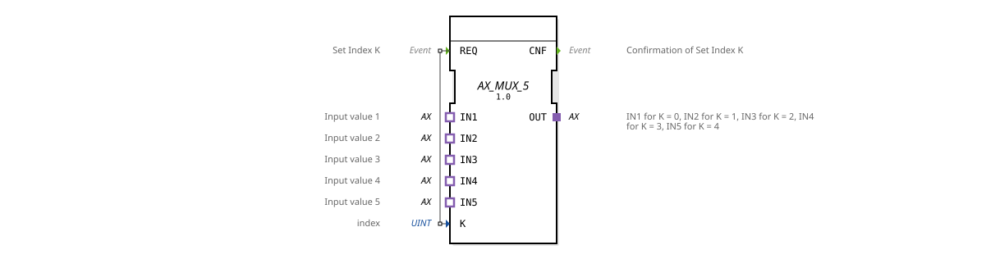

# AX_MUX_5

* * * * * * * * * *
## Introduction

The function block `AX_MUX_5` is a generic multiplexer for adapters of type `AX`. It selects one of five unidirectional input adapters (`IN1`–`IN5`) based on the index `K` and forwards its data to the output adapter `OUT`. The block is controlled by the event `REQ`.
## Interface Structure

### **Event Inputs**

| Name | Type | Description |
|------|-------|-------------------|
| REQ | Event | Trigger for selecting index `K` |

### **Event Outputs**

| Name | Type | Description |
|------|-------|---------------------------|
| CNF | Event | Confirmation of successful switching |

### **Data Inputs**

| Name | Type | Description |
|------|------|-------------------------------------------------|
| K | UINT | Index (0–4) of the input adapter to be selected |

### **Data Outputs**

No independent data outputs – output is via the adapter `OUT`.

### **Adapters**

| Name | Type | Direction | Description |
|------|-------------------------------------|----------|------------------------------------------------------------------|
| IN1 | `adapter::types::unidirectional::AX` | SOCKET | 1st input value (activated at `K = 0`) |
| IN2 | `adapter::types::unidirectional::AX` | SOCKET | 2nd input value (activated at `K = 1`) |
| IN3 | `adapter::types::unidirectional::AX` | SOCKET | 3rd input value (activated at `K = 2`) |
| IN4 | `adapter::types::unidirectional::AX` | SOCKET | 4. Input value (activated at `K = 3`) |
| IN5 | `adapter::types::unidirectional::AX` | SOCKET | 5. Input value (activated at `K = 4`) |
| OUT | `adapter::types::unidirectional::AX` | PLUG | Output that provides the data of the input selected by `K` |

## Functionality

The module operates on the principle of a 5-to-1 adapter multiplexer. When the event `REQ` is triggered, the current value of input `K` is read. The connection path is then dynamically switched from one of the sockets `IN1`–`IN5` to the plug `OUT`:

- `K = 0` → `IN1` is connected to `OUT`.
- `K = 1` → `IN2` is connected to `OUT`.
- `K = 2` → `IN3` is connected to `OUT`.
- `K = 3` → `IN4` is connected to `OUT`.
- `K = 4` → `IN5` is connected to `OUT`.

After the switchover, the confirmation event `CNF` is output. The data from the selected adapter is transferred to the output adapter without delay.

## Technical Features

- **Generic Function Block**: The function block is declared as a generic type (`GEN_AX_MUX`). The specific adapter implementation of `AX` is determined at runtime.
- **Unidirectional Adapters**: Both the inputs and the output are defined as unidirectional interfaces – data flows in only one direction (from the socket to the plug).
- **Index Range**: The index `K` is declared as `UINT`. Values outside the range 0..4 result in undefined behavior; this must be ensured by the application.
- **No Caching**: The switching occurs directly upon processing the `REQ` event, without buffering the adapter data.

## State Overview

The function block has no visible states; the logic is limited to event-driven switching. The following table shows the behavior depending on `K`:

| Trigger | Condition | Action | Output |
| |----------|-----------|----------------------------|---------|
| `REQ` | `K = 0` | Connect `IN1` → `OUT` | `CNF` |
| `REQ` | `K = 1` | Connect `IN2` → `OUT` | `CNF` |
| `REQ` | `K = 2` | Connect `IN3` → `OUT` | `CNF` |
| `REQ` | `K = 3` | Connect `IN4` → `OUT` | `CNF` |
| `REQ` | `K = 4` | Connect `IN5` → `OUT` | `CNF` |
| Other | `K > 4` | No valid connection | undefined |

## Application Scenarios

- **Sensor Selection**: In a machine control system, five different sensor values (e.g., temperature, pressure, position) can be provided via standardized AX adapters. The multiplexer selects the current sensor depending on the operating mode.
- **Signal Routing**: In a test environment, multiple test signals are required at a central output. By switching the index, different test sources can be routed to the measuring device.
- **Configurable Actuator Control**: Five actuators share a single control line. The function block allows one of the actuators to be selected sequentially and supplied with control data.

## Comparison with Similar Function Blocks

| Function Block | Number of Inputs | Output | Special Feature |
-------------------|-----------------|------------------|----------------------------------------------|
| AX_MUX_2 | 2 | 1 (AX adapter) | Dual multiplexer |
| AX_MUX_5 | 5 | 1 (AX adapter) | Five-way multiplexer (this module) |
| AX_MUX_N (generic) | any | 1 (AX adapter) | Configurable number (if available) |

Compared to a hard-wired selection module, `AX_MUX_5` offers flexible, event-driven switching and is specifically optimized for use with unidirectional AX adapters.

## Change Detection

The selected output plug (`OUT`) is only written and its adapter event only sent if the incoming value differs from the value currently held on `OUT`. If the value is unchanged, no adapter event is sent, avoiding redundant updates on downstream peers.

## Conclusion

The `AX_MUX_5` is a compact, generic multiplexer for up to five AX adapter inputs. It is particularly suitable for applications where multiple similar data sources need to be dynamically selected. Its clear event interface and simple index control allow for easy integration into larger control architectures. The lack of a range check for `K` necessitates correct indexing by the calling logic.
