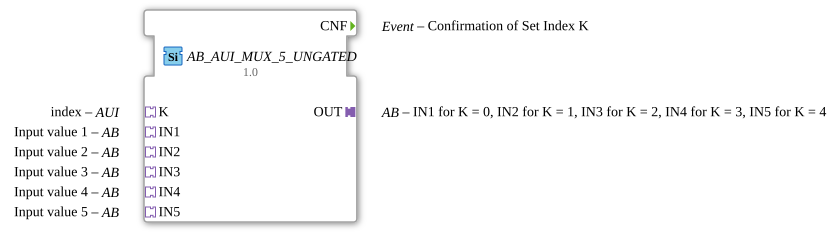

# AB_AUI_MUX_5_UNGATED

> ℹ️ **UNGATED variant:** This block is the ungated version of [`AB_AUI_MUX_5`](AB_AUI_MUX_5.md). It suppresses **no** unchanged repeats – every newly computed result is forwarded unconditionally, even without a value change. This matters for consumers that need a periodic cadence regardless of value change (e.g. derivative/frequency calculations that would otherwise fail to decay toward zero). Any change-detection/gating statements further down this page do **not** apply to this block.

* * * * * * * * * *

## Introduction

`AB_AUI_MUX_5_UNGATED` is the adapter-based variant of the generic multiplexer for data type `BYTE`. Unlike `AB_MUX_5`, it does not receive the selection index through a REQ event with an associated K data input, but through its own adapter socket **K** of type `AUI` ("Adapter Unidirectional Interface"). This lets the index be fed directly from another block with a matching `AUI` plug, without wiring a separate event and data line for it.

## Interface Structure

### **Event Inputs**

- No explicit event inputs on the block itself. The index is received exclusively through the adapter socket **K**: as soon as the `AUI` plug connected there fires its internal event `E1` carrying the data value `D1`, `AB_AUI_MUX_5_UNGATED` evaluates the index internally and triggers processing.

### **Event Outputs**

- **CNF**: Always sent once an event from the selector adapter `K` has been processed -- regardless of whether the output value changed.

### **Data Inputs**

- No direct data inputs. The index (`UINT`, 0-based) arrives exclusively as the `D1` value of the `AUI` adapter connected to socket **K**.

### **Data Outputs**

- No direct data outputs.

### **Adapters**

- **K** (Socket, type `AUI`): index input -- selects the active input/output through the adapter's own `E1`/`D1` event.
- **IN1** (Socket): input adapter 1 of 5, passed through to `OUT` when the index is `K = 0` (AB adapter type).
- **IN2** (Socket): input adapter 2 of 5, passed through to `OUT` when the index is `K = 1` (AB adapter type).
- **IN3** (Socket): input adapter 3 of 5, passed through to `OUT` when the index is `K = 2` (AB adapter type).
- **IN4** (Socket): input adapter 4 of 5, passed through to `OUT` when the index is `K = 3` (AB adapter type).
- **IN5** (Socket): input adapter 5 of 5, passed through to `OUT` when the index is `K = 4` (AB adapter type).
- **OUT** (Plug): output adapter, forwards whichever input the index selected (AB adapter type).

## Functionality

The function block re-evaluates the current value of **K** on every incoming event -- both on an event from the selector adapter `K` (type `AUI`) and on an event from one of the input adapters `IN1`…`IN5`:

1. The current value of `K.D1` determines which of the 5 input adapters (`IN1` … `IN5`) is currently selected.
2. The data value of that selected input is compared against the value currently held on `OUT`. Only on an actual change is `OUT` rewritten and its adapter event sent (see "Change Detection" below).
3. If the triggering event comes from the selector adapter `K`, the `CNF` event is additionally always sent -- regardless of whether `OUT` changed -- to confirm that the index update was processed.

As a result, a pure change of `K` alone also propagates to the output immediately, even if the data value of the newly selected input hasn't changed since its own last event.

## Technical Details

- Adapter-based index input instead of the classic REQ/K input pair -- reduces wiring when the index is already available as an `AUI` adapter.
- Generic implementation (`GEN_AB_AUI_MUX`) -- shared across all port counts of this block family (AB_AUI_MUX_2 … AB_AUI_MUX_5_UNGATED).
- **Change detection**: the written output plug is only updated -- and its adapter event only sent -- when the new value differs from the value currently held on that plug. If the value is unchanged, no adapter event is sent, avoiding redundant updates for downstream peers.

## State Overview

The function block has no explicit state machine; instead it re-evaluates the current value of `K.D1` on every incoming event:

- **Any event** (selector adapter `K` or `IN1`…`IN5`) → read the currently selected input, update `OUT` on a value change and send its adapter event.
- **Additionally on an event from `K`** → `CNF` is always sent, regardless of whether `OUT` changed.

## Application Scenarios

- Choosing between up to 5 byte value (8-bit bit pattern) sources through a centrally managed adapter index
- Replacing a REQ/K input pair with a single AUI adapter link when the index is already provided as an adapter by another block
- Building selection networks in which several MUX blocks share the same index adapter

## ⚖️ Comparison with Similar Blocks

Compare with `AB_MUX_5` (same selection logic, but the index arrives through a classic **REQ** event plus **K** data input instead of an adapter).

No purely data-based `F_MUX` counterpart exists for this input count in the `iec61131-3` library.

- **[`AB_AUI_MUX_5`](AB_AUI_MUX_5.md)**: The gated variant – updates the output only on an actual value change.

## Conclusion

`AB_AUI_MUX_5_UNGATED` carries the multiplexer logic of the `AB_MUX_5` family over to a purely adapter-based index supply. This makes it the right choice whenever the selection index is already available as an `AUI` adapter from another block and no additional event/data wiring for the index is wanted.
