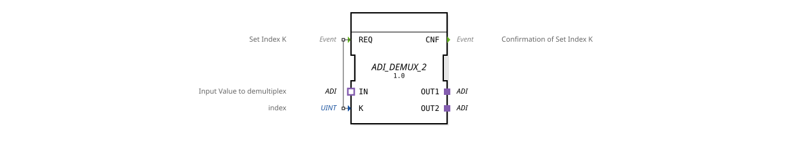

# ADI_DEMUX_2

* * * * * * * * * *
## Introduction
The ADI_DEMUX_2 is a generic demultiplexer function block that switches a data signal arriving via an ADI adapter (unidirectional) to one of two output adapters. The target output is selected using an index.

## Interface Structure
### **Event Inputs**

| Event | Description |

|----------|--------------|

| REQ | Trigger to set index K; initiates the switching |

### **Event Outputs**

| Event | Description |

|----------|--------------|

| CNF | Confirmation of successful index selection and forwarding |

### **Data Inputs**

| Variable | Type | Description |

|----------|------|----------------------|

| K | UINT | Index (1 or 2) for selecting the destination output |

### **Data Outputs**
No data outputs – output is exclusively via the adapters.

### **Adapters**

| Direction | Name | Type | Description |

|----------|------|-----------------------------------------------|---------------------------------------------|

| Socket | IN | adapter::types::unidirectional::ADI | Input signal to be demultiplexed |

| Plug | OUT1 | adapter::types::unidirectional::ADI | First output channel |

| Plug | OUT2 | adapter::types::unidirectional::ADI | Second Output Channel |

## Functionality
The function block operates according to the following principle:

1. An incoming REQ event activates processing.

2. The current value of input K (integer, UINT) is read.

3. Depending on K, a connection is established between the input adapter `IN` and one of the two output adapters:

- For `K = 1`, `IN` is forwarded to `OUT1`.

- For `K = 2`, `IN` is forwarded to `OUT2`.

- Other values of K result in no connection or remain undefined (depending on the implementation).

4. After switching, the event `CNF` is output to confirm the operation.

Data is transmitted unidirectionally via the ADI adapter – data flows only from the input to the selected output.

## Technical Features

- **Generic Function Block**: The ADI_DEMUX_2 is implemented as a generic function block (GenericClassName: `GEN_ADI_DEMUX`). This allows the internal type to be customized via a type hash attribute.

- **Adapter-Based**: All data communication takes place via ADI adapters, not via individual data ports. This simplifies integration into complex adapter structures.

- **Unidirectional**: All ADI adapters used are unidirectional, meaning data flows only in one direction – from the socket (IN) to the plugs (OUT).

- **No Data Outputs**: Output is exclusively via the output adapters, so no additional data variables are required.

## State Overview
Since the function block does not derive an explicit ECC (Execution Control Chart) from the XML, its behavior is event-driven:

- **Idle State**: The function block waits for a `REQ` event.

- **Selection State**: Upon receiving `REQ`, index K is processed and the corresponding connection is established.

- **Acknowledgement State**: After successful switching, `CNF` is sent, and the function block returns to the idle state.

## Application Scenarios

- **Automation Technology**: Distribution of a sensor signal to various actuators or control channels.

- **Signal Routing**: Switching between multiple target devices or subsystems in industrial control systems.

- **Test and Simulation Systems**: Targeted routing of test data to different devices under test.

- **Data Preprocessing**: Selective feeding of data to different processing paths.

## Comparison with Similar Function Blocks

- **ADI_MUX** (Multiplexer): Combines multiple inputs into one output – the reverse function.

- **ADI_DEMUX_3 / ADI_DEMUX_N**: Extended versions with more than two outputs; ADI_DEMUX_2 is limited to two channels.

- **DEMUX with Individual Data Ports**: Conventional demultiplexers work with individual input and output variables; ADI_DEMUX_2, on the other hand, uses adapters for structured data transmission.

## Conclusion
The ADI_DEMUX_2 is a specialized, generic function block for routing ADI data streams. It offers simple, event-driven switching between two output adapters and is particularly suitable for modular automation solutions based on adapters. Its generic design allows it to be flexibly adapted to different data types.