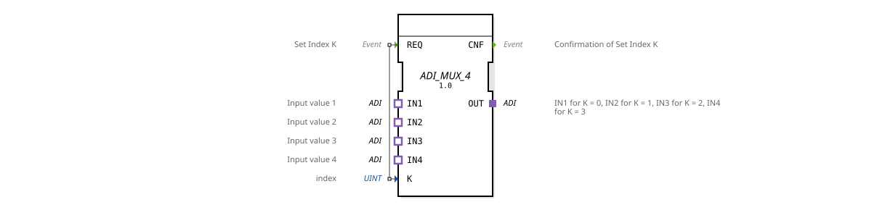

# ADI_MUX_4

* * * * * * * * * *
## Introduction

The function block **ADI_MUX_4** is a generic multiplexer that selects one of four identical ADI input adapters (IN1…IN4) via the index **K** and routes it to the output adapter **OUT**. It enables dynamic signal routing without requiring data to flow through traditional variable inputs/outputs.
## Interface Structure

### **Event Inputs**

| Name | Type | Comment |
|------|-----|-----------|
| REQ | Event | Triggers the selection of index **K**. |

### **Event Outputs**

| Name | Type | Comment |
|------|-----|-----------|
| CNF | Event | Confirmation that the index **K** has been set and the corresponding input has been switched to the output. |

### **Data Inputs**

| Name | Type | Value Range | Comment |
|------|-----|--------------|-----------|
| K | UINT | 0 … 3 | Index for selecting the desired input adapter. |

### **Data Outputs**

*No traditional data outputs are available.* Output data is transmitted exclusively via the **OUT** adapter.

### **Adapters**

| Type | Name | Direction | Comment |
|-----|------|----------|-----------|
| Adapter (Socket) | IN1 | Input | Value for K = 0 |
Adapter (Socket) | IN2 | Input | Value for K = 1 |
Adapter (Socket) | IN3 | Input | Value for K = 2 |
Adapter (Socket) | IN4 | Input | Value for K = 3 |
Adapter (Plug) | OUT | Output | The selected value is provided here. |

*All adapters are of type `adapter::types::unidirectional::ADI` (unidirectional data connection).*

## Functionality

The function block operates in an event-driven manner:

1. An event at the **REQ** input triggers processing.
2. The current value of index **K** is evaluated (valid values 0 … 3).
3. According to the index, the data stream of the associated socket adapter (IN1 for K=0, IN2 for K=1, etc.) is routed to the plug adapter **OUT**.
4. After the switchover, the **CNF** event is output to signal completion.

An undefined index (K > 3) does not result in a valid connection – this behavior is implementation-dependent.

## Technical Features

- **Adapter-Based Data Transmission:** The function block (FB) has no conventional data outputs; the output data is provided exclusively via the **OUT** adapter.
- **Generic Type:** The FB is declared as a generic function block (`generic FB`) and can be used with different ADI adapter configurations.
- **Unidirectional:** Data exchange occurs only in one direction – from the sockets (inputs) to the plug (output).

## State Overview

Since the FB does not have an explicit state machine in its XML definition, its behavior is implicit:

- **Inactive:** Waits for a REQ event.
- **Processing:** After the REQ, the index K is read, the switching is performed, and the **CNF** event is sent immediately. The FB then returns to the inactive state.

## Application Scenarios

- **Sensor Data Selection:** Multiple sensors (e.g., temperature, pressure, level) are connected via ADI adapters; a control system selects the currently required sensor using the index **K**.
- **Signal Routing:** In a modular controller, various signal sources can be dynamically routed to a common output.
- **Test and Simulation Environments:** Easy switching between real and simulated adapters at runtime.

## Comparison with Similar Components

- **ADI_MUX_2:** Simple multiplexer with only two inputs, correspondingly smaller index range (0-1).
- **Standard multiplexers (e.g., MUX4):** Usually use classic data I/Os instead of adapters. The ADI_MUX_4 integrates the adapter interface directly and can therefore be seamlessly integrated into adapter-based architectures.
- **Demultiplexers (e.g., DEMUX):** Distributes one input signal to multiple outputs – the opposite function.

## Conclusion

The **ADI_MUX_4** is a compact, generic multiplexer component with an adapter-based interface. It is particularly suitable for modular, adapter-oriented control systems where dynamic selection of data sources is required. Thanks to its clear structure and simple event handling, it is easy to parameterize and extend.
